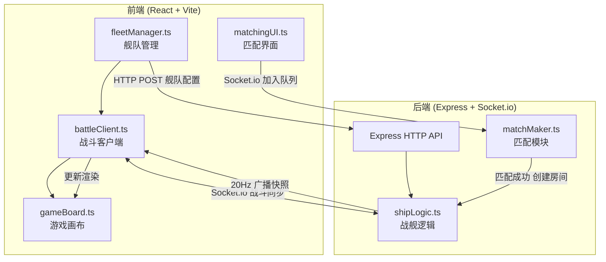
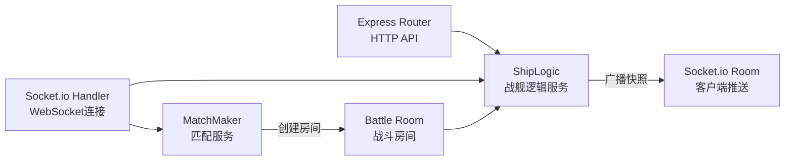

## 1. 架构设计



## 2. 技术说明

- 前端：React@18 + TypeScript + TailwindCSS@3 + Vite
- 初始化工具：vite-init（react-express-ts模板）
- 后端：Express@4 + Socket.io + TypeScript
- 状态管理：Zustand（前端UI状态）
- 数据库：无（内存存储，匹配队列和战斗状态均为运行时数据）
- 实时通信：Socket.io（战斗状态同步、匹配通知）

## 3. 路由定义

| 路由 | 用途 |
|------|------|
| / | 舰队构建页面，选择战舰组建舰队 |
| /match | 匹配等待页面，显示雷达动画和匹配状态 |
| /battle | 战斗场景页面，Canvas星图+HUD |
| /result | 战斗结果页面，胜负判定和奖励 |

## 4. API定义

### 4.1 HTTP API

| 方法 | 路径 | 请求体 | 响应 | 用途 |
|------|------|--------|------|------|
| POST | /api/fleet | `{ ships: ShipType[] }` | `{ fleetId: string, power: number }` | 保存舰队配置 |

### 4.2 Socket.io 事件

| 事件名 | 方向 | 数据 | 用途 |
|--------|------|------|------|
| join-queue | Client→Server | `{ playerId, fleetId, power }` | 加入匹配队列 |
| leave-queue | Client→Server | `{ playerId }` | 离开匹配队列 |
| match-found | Server→Client | `{ roomId, opponent }` | 匹配成功通知 |
| battle-start | Server→Client | `{ ships, opponentShips }` | 战斗开始，初始化战舰 |
| command | Client→Server | `{ type: 'advance'|'focus'|'retreat'|'stop', targetId? }` | 玩家下达指令 |
| battle-update | Server→Client | `{ ships, projectiles, events[] }` | 20Hz战斗快照 |
| battle-end | Server→Client | `{ winner, rewards }` | 战斗结束 |

### 4.3 TypeScript类型定义

```typescript
type ShipType = 'scout' | 'frigate' | 'flagship';

interface ShipTemplate {
  type: ShipType;
  name: string;
  attack: number;
  defense: number;
  speed: number;
  range: number;
  powerMultiplier: number;
  hp: number;
}

interface BattleShip {
  id: string;
  type: ShipType;
  team: 'red' | 'blue';
  x: number;
  y: number;
  hp: number;
  maxHp: number;
  attack: number;
  defense: number;
  speed: number;
  range: number;
  cooldown: number;
  maxCooldown: number;
  targetId: string | null;
  state: 'idle' | 'moving' | 'attacking' | 'retreating';
}

interface Projectile {
  id: string;
  x: number;
  y: number;
  vx: number;
  vy: number;
  damage: number;
  team: 'red' | 'blue';
  ttl: number;
}

interface BattleSnapshot {
  ships: BattleShip[];
  projectiles: Projectile[];
  events: BattleEvent[];
  timeRemaining: number;
}

interface BattleEvent {
  type: 'destroy' | 'hit';
  shipId?: string;
  team?: 'red' | 'blue';
  x?: number;
  y?: number;
}

interface CommandPayload {
  type: 'advance' | 'focus' | 'retreat' | 'stop';
  targetId?: string;
}
```

## 5. 服务器架构图



## 6. 数据模型

### 6.1 运行时数据结构

本项目无持久化数据库，所有数据为运行时内存结构：

- **匹配队列**：`Map<string, QueueEntry>` — playerId → {fleetId, power, joinedAt}
- **战斗房间**：`Map<string, BattleRoom>` — roomId → {players[], ships[], projectiles[], startTime}
- **战舰模板**：`ShipTemplate[]` — 预设的三种战舰属性

### 6.2 战斗逻辑规则

- 战舰自动寻找射程内最近敌方目标
- 攻击冷却：侦察舰0.8s、护卫舰1.2s、旗舰2.0s
- 伤害公式：damage = max(1, attacker.attack - defender.defense * 0.3)
- 子弹飞行速度：600px/s
- 战舰移动：朝目标方向移动，进入射程后停止并开火
- 撤退指令：全体战舰向己方基地方向移动
- 集火指令：全体战舰优先攻击指定目标
