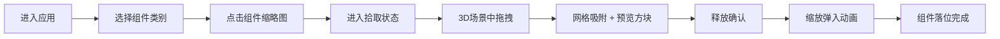
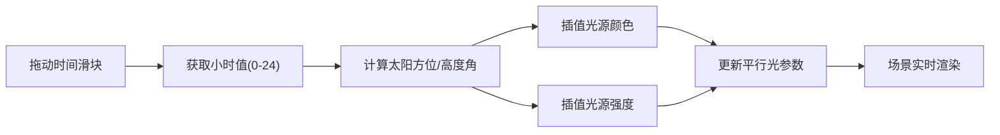
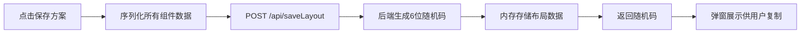

## 1. 产品概述

模块化空间布局与光照模拟工具是一款面向设计师和产品经理的Web端3D概念设计辅助工具。用户通过拖拽模块化组件快速搭建室内空间，实时调节不同时间段的自然光照效果，辅助前期概念设计评审。

- **核心价值**：降低物理模型制作成本，简化3D建模复杂度，提升概念设计沟通效率
- **目标用户**：室内设计师、建筑设计师、产品经理、空间规划师
- **应用场景**：室内空间概念设计、建筑方案前期评审、家具布局规划、商业空间展示

---

## 2. 核心功能

### 2.1 用户角色

| 角色 | 注册方式 | 核心权限 |
|------|----------|----------|
| 普通用户 | 无需注册 | 空间搭建、光照调节、方案保存/加载（使用本地ID） |

### 2.2 功能模块

1. **主工作区（Workspace）**：3D场景渲染、组件拖拽放置、2D俯视图辅助、时间显示
2. **组件库面板（Component Library）**：可折叠分类列表、组件缩略图网格、拾取状态指示
3. **工具栏（Toolbar）**：组件删除、撤销/重做、方案保存/加载入口
4. **光照模拟系统（Light Simulator）**：时间滑块控制、太阳位置计算、多光源动态调节
5. **方案管理系统**：布局数据序列化、后端API保存/加载、6位随机码生成

### 2.3 页面详情

| 页面名称 | 模块名称 | 功能描述 |
|----------|----------|----------|
| 主页面 | 3D工作区 | Three.js场景渲染、OrbitControls相机控制、组件拖拽交互、网格吸附 |
| 主页面 | 左侧组件库 | 四分类（墙体/家具/植物/装饰）、折叠展开、64x64缩略图网格、拾取高亮 |
| 主页面 | 顶部时间滑块 | 0-24小时刻度、太阳轨迹模拟、光源颜色/强度插值、阴影动态变化 |
| 主页面 | 底部信息栏 | 当前时间文字显示（HH:mm格式）、光照强度百分比 |
| 主页面 | 右下角2D俯视图 | 200x200px正投影视图、墙体轮廓线、家具占位框、拖拽同步高亮 |
| 主页面 | 顶部工具栏 | 选中删除、撤销（20步）、重做、保存方案、加载方案弹窗 |
| 主页面 | 方案模态框 | 保存成功展示6位码、输入随机码加载方案 |

---

## 3. 核心流程

### 3.1 空间搭建流程

用户进入应用后，从左侧组件库选择需要的墙体或家具组件，点击缩略图进入"拾取状态"，在3D场景的地面网格上拖拽移动（组件自动吸附0.5网格单位，显示白色半透明预览方块），确认释放后组件以0.3秒缩放弹入动画落位。可重复操作直至空间搭建完成。

### 3.2 光照调节流程

用户拖动顶部时间滑块（0-24小时），系统根据时间参数计算太阳方位角和高度角，实时调节平行光方向、颜色（暖橙→冷白→深蓝渐变）、环境光强度，并同步更新阴影长度与方向。

### 3.3 方案保存流程

用户点击"保存方案"按钮，系统收集当前所有组件的ID、位置、旋转、缩放数据序列化为JSON，通过POST请求发送至后端API，后端生成6位随机码作为索引存储于内存，并返回该码供用户记录。

---

## 4. 用户界面设计

### 4.1 设计风格

- **主色调**：深色科技风，主背景 #0f172a，面板背景 #1e293b，卡片背景 #334155
- **强调色**：天空蓝渐变 #38bdf8 → #3b82f6 → #2563eb，金黄高亮 #facc15
- **文字色**：浅灰 #cbd5e1，次要文字 #94a3b8
- **按钮样式**：高度36px，圆角8px，蓝色渐变背景，白色文字，悬停亮度×1.1，点击缩放0.95
- **字体**：无衬线现代字体（系统默认 + 适当字重层级），标题 600 字重，正文 400 字重
- **布局风格**：三栏式布局（左组件库 / 中3D场景 / 右下2D视图叠加），顶部工具栏+时间滑块
- **图标风格**：线性简洁图标（FontAwesome风格），配合细微阴影与悬停动效

### 4.2 页面设计概览

| 页面名称 | 模块名称 | UI 元素 |
|----------|----------|----------|
| 主页面 | 左侧组件库 (280px) | 折叠分类标题、3列网格缩略图(64x64, 圆角8px)、悬停背景变#475569+4px白阴影、拾取态#38bdf8边框 |
| 主页面 | 顶部工具栏 (60px) | 左：撤销/重做按钮；中：时间滑块(轨道400x6px, 渐变圆形按钮20px)；右：保存/加载/删除按钮 |
| 主页面 | 3D 主场景 | 地面网格、OrbitControls 旋转缩放、选中组件金黄高亮线+上浮5px、拖拽预览半透明白方块 |
| 主页面 | 左下角信息 | HH:mm 时间文字、光照百分比数字，半透明背景面板 |
| 主页面 | 右下角 2D 俯视图 (200x200px) | 圆角12px，#1e293b 背景，2px #334155 边框，#94a3b8 细线轮廓，拖拽态 #3b82f6 蓝色虚线框高亮 |
| 主页面 | 保存/加载模态框 | 居中弹窗、6位码展示（等宽字体、大字号）、输入框、确认/取消按钮 |

### 4.3 响应式设计

- **桌面优先**：默认 1280px+ 宽度完整展示所有面板
- **平板适配**：≤ 1024px 时组件库可完全折叠为图标列，2D 俯视图缩小为 160px
- **触控优化**：滑块、按钮最小触控区域 44x44px，3D 场景支持双指缩放旋转

### 4.4 3D 场景指导

- **环境**：深色空间感，地面带辅助网格（10x10 单位，主网格 1 单位，次网格 0.5 单位）
- **光照**：平行光（太阳光，带阴影投射）+ 半球光（环境光，天地色渐变）+ 夜间点光源补光
- **相机**：PerspectiveCamera 初始 fov=50，位置 (10, 10, 10)，看向原点；OrbitControls 启用阻尼
- **构图**：场景以原点为中心向外扩展，地面网格提供空间参考，组件放置区集中在可视范围内
- **交互动画**：放置时 scale 1→1.1→1 (0.3s ease-out-cubic)，选中时 translateY 0.05 单位，删除时 opacity 1→0 + scale 1→0.3 (300ms)
- **后处理**：启用抗锯齿，PCFSoftShadowMap 软阴影，适度阴影偏移减少 acne
- **资源**：程序化生成几何体（BoxGeometry 为主），无需外部模型资源，控制总三角形数量
