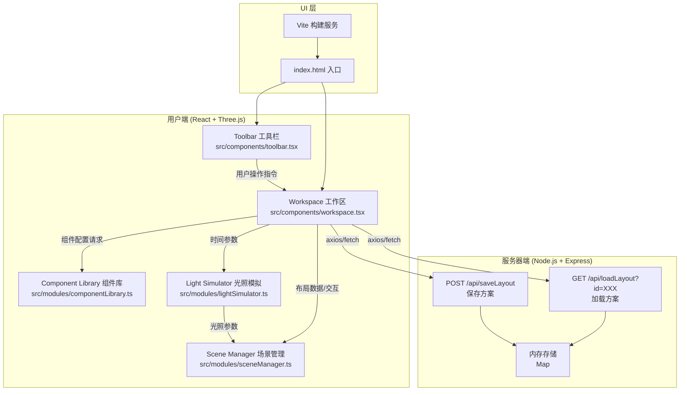

## 1. 架构设计



## 2. 技术栈说明

| 层级 | 技术选型 | 版本 | 用途 |
|------|----------|------|------|
| 前端框架 | React | ^18.2.0 | 组件化 UI 构建 |
| 3D 渲染 | Three.js | ^0.160.0 | WebGL 3D 引擎 |
| 3D React 封装 | @react-three/fiber | ^8.15.0 | Three.js 的 React 渲染器 |
| 3D 辅助库 | @react-three/drei | ^9.92.0 | 常用 R3F 组件封装（OrbitControls 等） |
| 语言 | TypeScript | ^5.3.0 | 静态类型检查 |
| 构建工具 | Vite | ^5.0.0 | 快速开发构建与 HMR |
| 后端框架 | Express | ^4.18.0 | RESTful API 服务 |
| 跨域中间件 | cors | ^2.8.5 | 前后端跨域支持 |
| ID 生成 | uuid | ^9.0.0 | 唯一 ID 生成（组件 ID、方案 ID） |
| 路由 | 无（单页） | - | 使用条件渲染切换模态框状态 |

## 3. 目录结构与职责

```
项目根目录/
├── package.json                          # 依赖管理 + 启动脚本
├── vite.config.js                        # Vite 配置（路径别名 + 代理）
├── tsconfig.json                         # TS 严格模式配置
├── index.html                            # 应用入口 HTML
├── server.js                             # Express 后端入口（同时 host API + 静态文件）
│
└── src/
    ├── main.tsx                          # React 应用挂载入口
    ├── App.tsx                           # 根组件（整合 Toolbar + Workspace）
    ├── types/
    │   └── index.ts                      # 全局类型定义（Component/Layout/LightConfig）
    │
    ├── modules/
    │   ├── sceneManager.ts               # 场景初始化 / 相机 / 渲染循环 / 对象管理
    │   ├── lightSimulator.ts             # 时间→光照参数计算 / 多光源配置
    │   └── componentLibrary.ts           # 墙体/家具/植物/装饰组件定义库
    │
    └── components/
        ├── workspace.tsx                 # 3D 工作区 + 2D 俯视图 + 拖拽交互
        └── toolbar.tsx                   # 顶部工具栏（滑块/按钮/模态框）
```

## 4. 核心类型定义

```typescript
// src/types/index.ts

export type ComponentCategory = 'walls' | 'furniture' | 'plants' | 'decorations';

export interface ComponentConfig {
  id: string;              // 组件模板 ID
  name: string;
  category: ComponentCategory;
  geometry: {
    type: 'box' | 'cylinder' | 'cone' | 'sphere';
    params: number[];      // 例如 box: [w, h, d]
  };
  material: {
    color: string;
    metalness?: number;
    roughness?: number;
    opacity?: number;
  };
  thumbnailColor: string;  // 缩略图代表色
  gridSize: [number, number, number]; // [w, h, d] 单位（用于网格吸附参考）
}

export interface PlacedComponent {
  id: string;              // 实例 ID（uuid）
  templateId: string;      // 对应 ComponentConfig.id
  position: [number, number, number];
  rotation: [number, number, number];
  scale: [number, number, number];
}

export interface LightConfig {
  sunPosition: [number, number, number];
  sunColor: string;
  sunIntensity: number;
  ambientColor: string;
  ambientIntensity: number;
  shadowMapSize: number;
}

export interface LayoutData {
  components: PlacedComponent[];
  createdAt: number;
  version: string;
}

export interface SaveResponse {
  success: boolean;
  layoutId: string;        // 6 位随机码
}

export interface LoadResponse {
  success: boolean;
  data?: LayoutData;
  error?: string;
}
```

## 5. 数据流与模块调用关系

```
用户交互 (DOM事件)
  ↓
[toolbar.tsx]  ── timeHour: number, actionType: string ──→  [workspace.tsx]
  ↓                                                          ↓
[workspace.tsx]                                             │
  ├── onDragStart → 生成预览 Mesh → 调用 sceneManager.addPreview()
  ├── onDragMove  → 计算网格吸附坐标 → sceneManager.updatePreview()
  ├── onDragEnd   → sceneManager.commitPreview() → 触发弹入动画
  ├── onSelect    → sceneManager.setSelected(id)
  ├── onDelete    → sceneManager.removeObject(id) → 删除动画
  ├── onUndo/Redo → 本地 history stack pop/push → sceneManager.rebuild()
  ├── onTimeChange→ lightSimulator.calc(hour) → sceneManager.updateLight()
  ├── onSave      → serialize() → POST /api/saveLayout
  └── onLoad      → GET /api/loadLayout → deserialize() → sceneManager.rebuild()

[componentLibrary.ts]
  └── getComponent(id) → ComponentConfig (被 workspace 拖拽时调用)

[lightSimulator.ts]
  └── calculateLightConfig(hour: number): LightConfig (插值颜色/位置/强度)

[sceneManager.ts]
  ├── init(canvas) → 初始化 Scene/Camera/Renderer/Controls/Lights
  ├── addPlacedComponent(cfg, pos, rot, scale) → 创建 Mesh 并添加
  ├── updatePreview(pos) → 平移预览 Mesh
  ├── commitPreview() → 移除预览、创建正式 Mesh、动画
  ├── setSelected(id) → 高亮线框 + 位置偏移
  ├── removeObject(id) → 淡出缩放动画后 dispose
  ├── updateLight(cfg) → 遍历光源更新 color/intensity/position
  ├── rebuild(components[]) → 清空后重建所有对象
  └── renderLoop() → requestAnimationFrame + controls.update()
```

## 6. 后端 API 定义

### 6.1 保存方案
```
POST /api/saveLayout
Content-Type: application/json

Request Body:
{
  "components": [
    {
      "id": "uuid-xxx",
      "templateId": "wall-basic",
      "position": [0, 0.5, 0],
      "rotation": [0, 0, 0],
      "scale": [1, 1, 1]
    }
  ]
}

Response: 200 OK
{
  "success": true,
  "layoutId": "A7K2X9"
}
```

### 6.2 加载方案
```
GET /api/loadLayout?id=A7K2X9

Response: 200 OK
{
  "success": true,
  "data": {
    "components": [...],
    "createdAt": 1719000000000,
    "version": "1.0"
  }
}

Response: 404 Not Found
{
  "success": false,
  "error": "Layout not found"
}
```

### 6.3 服务端核心逻辑
```javascript
// server.js (Node.js + Express)
// - 内存 Map: layouts = new Map<string, LayoutData>()
// - 6位随机码生成: Math.random().toString(36).slice(2, 8).toUpperCase()
// - Vite 开发模式下使用 middleware 同时 host API
```

## 7. 性能优化策略

| 优化项 | 具体实现 |
|--------|----------|
| 渲染帧率 | 启用 `pixelRatio = Math.min(window.devicePixelRatio, 2)`，PCFSoftShadowMap |
| 拖拽响应 | Raycaster 仅在 pointerdown/pointermove 时执行，结果复用，避免每帧计算 |
| 场景对象池 | 删除对象时缓存 geometry/material 供后续复用，避免频繁 GC |
| 2D 俯视图 | 独立 OrthographicCamera + 小 RenderTarget，降采样到 200x200，每 100ms 渲染一次而非每帧 |
| 动画实现 | 组件弹入/删除动画采用 requestAnimationFrame 本地插值，不依赖 React 重渲染 |
| 历史记录 | 深拷贝快照压缩（仅存差异），上限 20 步，超出自动丢弃最旧 |
| 光源数 | 最多 1 平行光 + 1 半球光 + 最多 4 点光源（夜间模式），避免实时阴影过多 |
| 缩略图 | 纯 CSS 渐变 + 色块表示，不渲染 mini-3D，节省加载时间 |

## 8. vite.config.js 关键配置
```javascript
// 路径别名: @ -> src/
// 开发代理: /api -> http://localhost:3001 (后端端口)
// 服务端: 同一进程同时启动 Vite(5173) 和 Express(3001)，开发模式下走 proxy
```
