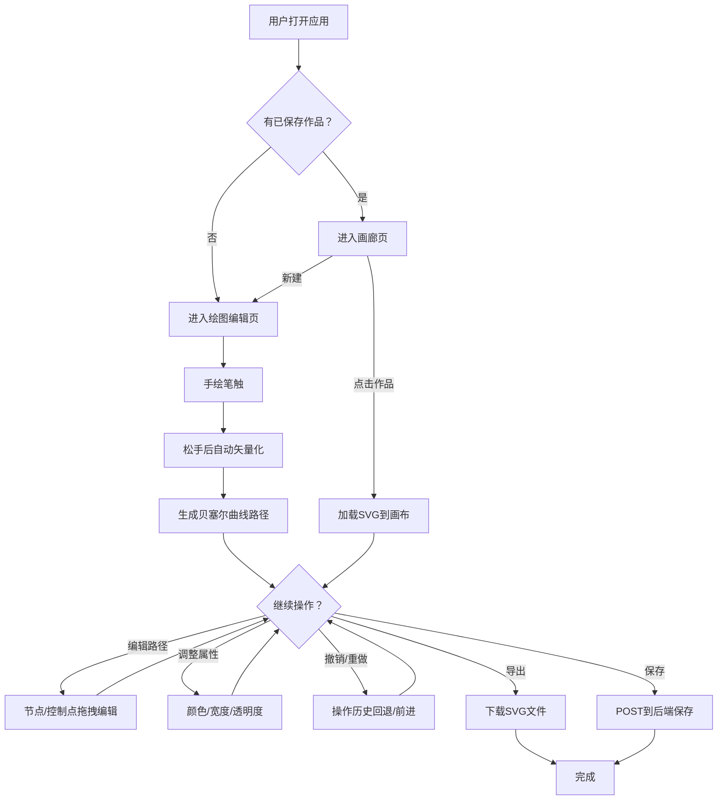

## 1. 产品概述

在线手绘草图智能矢量化与风格化编辑应用——让用户在画布上自由手绘，实时将笔触自动识别转化为平滑的贝塞尔曲线路径，支持路径节点编辑、多路径管理、风格化调整，并可导出SVG或保存到云端。目标用户为设计师和普通绘图爱好者。

## 2. 核心功能

### 2.1 用户角色

| 角色 | 注册方式 | 核心权限 |
|------|----------|----------|
| 普通用户 | 无需注册 | 创建、编辑、保存和导出手绘矢量作品 |

### 2.2 功能模块

1. **绘图编辑页**：手绘画布、工具栏、矢量化引擎、路径编辑、导出/保存
2. **作品画廊页**：已保存作品缩略图展示、点击进入编辑

### 2.3 页面详情

| 页面名称 | 模块名称 | 功能描述 |
|----------|----------|----------|
| 绘图编辑页 | 手绘画布 | Canvas画布支持手绘，松手后2秒内自动矢量化为贝塞尔曲线路径 |
| 绘图编辑页 | 工具栏 | 工具切换（手绘/选择/编辑）、颜色选择器、描边宽度滑块、透明度滑块、撤销/重做、导出/保存 |
| 绘图编辑页 | 路径编辑 | 点击路径显示节点和控制点，拖拽修改路径形状，支持移动/缩放/改色/改宽度/改透明度 |
| 绘图编辑页 | 多路径管理 | 独立管理多条路径，每条可单独操作 |
| 绘图编辑页 | 导出与保存 | 导出SVG下载到本地，保存到云端（POST到后端） |
| 作品画廊页 | 缩略图列表 | 从后端获取作品列表，240x180px卡片展示，点击进入编辑 |

## 3. 核心流程

用户进入应用→在画布上自由手绘→松手后自动矢量化为贝塞尔曲线路径→可选中路径进行节点编辑（拖拽节点/控制点）→可调整路径属性（颜色、描边宽度、透明度）→可撤销/重做操作→完成后导出SVG或保存到云端→可在画廊页查看已保存作品→点击作品进入编辑页继续修改。

## 4. 用户界面设计

### 4.1 设计风格

- 主色调：米白(#f8f9fa) + 深灰(#1e293b) + 蓝色(#3b82f6)
- 按钮风格：扁平化，悬停时向上平移2px动画(transition 0.2s ease)
- 字体：系统字体栈，工具栏图标24x24px SVG白色图标
- 布局风格：顶部工具栏 + 中央画布区，画布占页面宽度80%
- 图标风格：简洁线性SVG图标

### 4.2 页面设计概览

| 页面名称 | 模块名称 | UI元素 |
|----------|----------|--------|
| 绘图编辑页 | 顶部工具栏 | 高56px，深灰#1e293b背景，白色SVG图标24x24px，选中态蓝色#3b82f6圆角6px底色，右侧导出(下载箭头)和保存(云朵)按钮 |
| 绘图编辑页 | 画布区域 | 米白#f8f9fa背景，浅色网格点阵(#ddd，间距20px，点直径1px)，20px内边距，左下角缩放比例显示 |
| 绘图编辑页 | 颜色选择器 | 横向条状，12种预设色块(28x28px，圆角4px，间隔4px，边框1px solid #cbd5e1)，末尾彩虹渐变自定义拾色器 |
| 绘图编辑页 | 描边宽度滑块 | 圆形旋钮#1e293b，宽度条底色#cbd5e1，拖动时显示px浮标 |
| 绘图编辑页 | 透明度滑块 | 同描边宽度滑块样式 |
| 绘图编辑页 | 选中路径 | 蓝色虚线边框(2px #3b82f6)，四角缩放手柄(8x8px圆形，白色填充，2px #3b82f6边框) |
| 作品画廊页 | 缩略图卡片 | 240x180px，圆角8px，边框1px solid #e2e8f0，悬停阴影加深 |

### 4.3 响应式适配

- 桌面优先设计
- 浏览器宽度 < 768px 时：工具栏高度压缩至48px，图标缩小至20x20px，画布占容器宽度100%，颜色选择器变为可横向滚动列表（隐藏自定义拾色器）
- 触摸优化：支持pointer事件，手绘工具十字准星、选择工具默认箭头、编辑工具手型指针

### 4.4 鼠标指针样式

| 工具 | 指针样式 |
|------|----------|
| 手绘工具 | 十字准星 |
| 选择工具 | 默认箭头 |
| 编辑工具 | 手型 |
