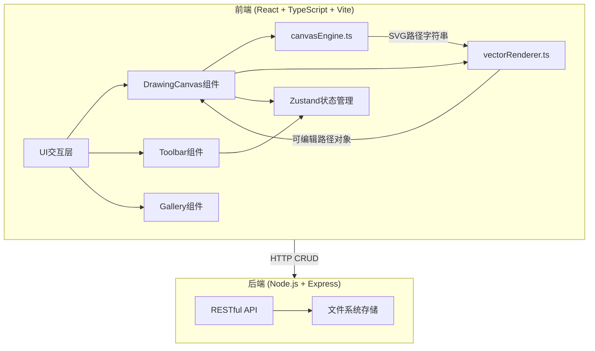
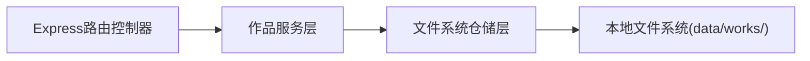
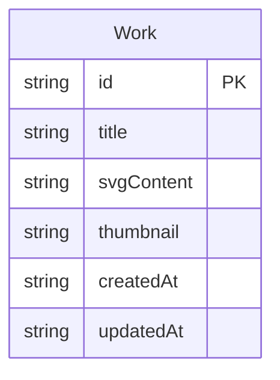

## 1. 架构设计



## 2. 技术说明

- 前端：React@18 + TypeScript + Vite + TailwindCSS@3 + Zustand
- 初始化工具：vite-init (react-express-ts模板)
- 后端：Express@4 + TypeScript (ESM格式)
- 数据库：无，使用本地文件系统存储SVG文本和元数据JSON

## 3. 路由定义

| 路由 | 用途 |
|------|------|
| / | 绘图编辑页，主画布和工具栏 |
| /gallery | 作品画廊页，展示已保存作品列表 |
| /edit/:id | 编辑已有作品，加载对应SVG到画布 |

## 4. API定义

### 4.1 TypeScript类型定义

```typescript
interface Work {
  id: string;
  title: string;
  svgContent: string;
  thumbnail: string;
  createdAt: string;
  updatedAt: string;
}

interface CreateWorkRequest {
  title: string;
  svgContent: string;
  thumbnail: string;
}

interface UpdateWorkRequest {
  title?: string;
  svgContent?: string;
  thumbnail?: string;
}
```

### 4.2 API端点

| 方法 | 路径 | 请求体 | 响应 | 说明 |
|------|------|--------|------|------|
| GET | /api/works | - | Work[] | 获取作品列表 |
| GET | /api/works/:id | - | Work | 获取单个作品 |
| POST | /api/works | CreateWorkRequest | Work | 创建新作品 |
| PUT | /api/works/:id | UpdateWorkRequest | Work | 更新作品 |
| DELETE | /api/works/:id | - | {success: boolean} | 删除作品 |

## 5. 服务端架构图



## 6. 数据模型

### 6.1 数据模型定义



### 6.2 数据定义

- 存储方式：每个作品保存为两个文件
  - `data/works/{id}.svg` — SVG文本内容
  - `data/works/{id}.json` — 元数据（id, title, thumbnail, createdAt, updatedAt）
- 列表接口从所有JSON文件聚合返回

## 7. 核心模块调用关系

```
用户交互 → DrawingCanvas组件
         → canvasEngine.ts (采集笔迹点集 → 贝塞尔拟合 → SVG路径字符串)
         → vectorRenderer.ts (解析SVG路径 → 可编辑路径对象 → SVG渲染 + 节点编辑接口)
         → Zustand Store (全局状态: 路径列表、当前工具、颜色、宽度、透明度、操作历史)
         → Toolbar组件 (工具切换、属性调整 → 更新Store)
         → 后端API (保存/加载作品)
```
