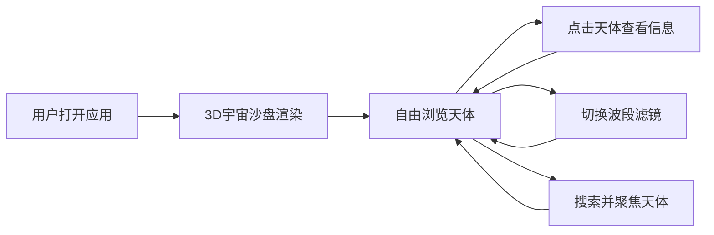

## 1. 产品概述
深空天体3D沙盘是一款为天文爱好者打造的沉浸式学习工具，通过粒子云渲染技术将著名深空天体以三维方式呈现，支持多波段滤镜切换与交互探索。
- 解决传统天文科普中静态图片无法展现天体三维结构和多波段差异的问题
- 为天文爱好者提供直观、互动的深空天体探索体验

## 2. 核心功能

### 2.1 功能模块
1. **天体浏览场景**：基于Three.js的3D粒子宇宙沙盘，包含8个著名深空天体与背景星空
2. **波段滤镜切换**：可见光、红外、X射线三种模式，粒子颜色与位置平滑过渡
3. **天体坐标指南针**：3D坐标轴指示器，辅助建立空间方位感
4. **搜索与聚焦**：支持天体名称搜索，选中后摄像机平滑聚焦到目标天体
5. **天体信息面板**：毛玻璃效果卡片，展示天体名称、距离、类型、大小等信息

### 2.2 功能详情
| 功能模块 | 子功能 | 功能描述 |
|-----------|-------------|---------------------|
| 天体浏览场景 | 3D粒子渲染 | 使用粒子系统模拟M31、M42、M45、M57等8个天体 |
| 天体浏览场景 | 背景星空 | 2000颗闪烁星点，太空渐变背景(#000011到#0a0a2e) |
| 天体浏览场景 | 视角控制 | 鼠标拖拽旋转(0.5度/像素)、缩放(0.5-20单位) |
| 天体浏览场景 | 点击交互 | 点击天体弹出信息面板 |
| 波段滤镜 | 模式切换 | 可见光(#ffffff)、红外(#ff4500)、X射线(#8a2be2) |
| 波段滤镜 | 过渡动画 | 1.5秒easeInOut平滑过渡，粒子颜色和位置变化 |
| 坐标指南针 | 3D坐标轴 | 红X/绿Y/蓝Z轴，长度60px，带箭头，发光效果 |
| 搜索聚焦 | 搜索输入 | 右下角半透明搜索框，支持关键字匹配 |
| 搜索聚焦 | 下拉建议 | 最多5项匹配结果，带缩略图图标 |
| 搜索聚焦 | 聚焦动画 | 0.8秒球形插值摄像机移动，自动缩放到合适距离 |
| 信息面板 | 毛玻璃卡片 | rgba(255,255,255,0.1)背景，8px模糊，16px圆角 |

## 3. 核心流程
用户打开应用后进入3D宇宙沙盘场景，可通过鼠标拖拽旋转缩放浏览全局；点击任一天体查看详情；通过顶部滤镜栏切换观测波段；通过右下角搜索框快速定位特定天体。

## 4. 用户界面设计
### 4.1 设计风格
- **主色调**：深空蓝紫渐变背景(#000011 → #0a0a2e)
- **点缀色**：天体色(M31淡蓝#4169e1, M42橙红#ff6347, M57绿色#00ff7f)，滤镜色(可见光白、红外橙、X射线紫)
- **字体**：monospace，标题24px颜色#e0e0ff，带微弱白色文字阴影
- **按钮风格**：圆角圆形滤镜按钮(40x40px)，高斯模糊半透明背景
- **整体风格**：深色太空主题，毛玻璃质感，统一圆角设计

### 4.2 页面设计
| 区域 | 位置 | UI元素 |
|-----------|-------------|-------------|
| 标题 | 左上角 | 深空天体沙盘，monospace 24px，#e0e0ff |
| 滤镜栏 | 右上角 | 3个圆形滤镜按钮，间距12px |
| 3D场景 | 全屏 | Canvas渲染，粒子天体 + 背景星空 |
| 指南针 | 左下角 | 3D坐标轴指示器 |
| 搜索框 | 右下角 | 200px宽半透明深色输入框 |
| 信息面板 | 天体能附近/居中 | 毛玻璃卡片，天体详细信息 |

### 4.3 响应式设计
- 桌面端：默认布局，滤镜栏横向展开
- 手机竖屏：滤镜栏折叠为汉堡菜单，点击展开垂直列表
- 触摸设备：支持双指缩放、单指旋转

### 4.4 3D场景设计
- **环境**：太空渐变背景，无HDRI
- **光照**：环境光 + 点光源模拟星光
- **摄像机**：透视相机，支持OrbitControls旋转缩放
- **粒子系统**：Points + BufferGeometry，每体约1500粒子，总粒子≤12000
- **动画**：滤镜切换1.5秒过渡，聚焦0.8秒球形插值，背景星点2-4秒闪烁周期
- **性能**：目标帧率≥45fps(1080p桌面浏览器)
