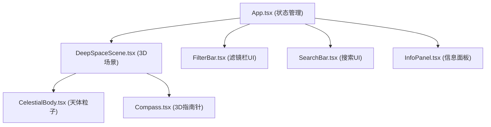

## 1. 架构设计


## 2. 技术选型
- **前端框架**：React@18 + TypeScript
- **构建工具**：Vite@5 + @vitejs/plugin-react
- **3D渲染**：three@^0.160, @react-three/fiber@^8, @react-three/drei@^9
- **状态管理**：React useState/useRef (轻量场景，无需额外状态库)
- **样式方案**：原生CSS + CSS Modules (避免额外依赖)
- **后端**：无，纯前端应用，天体数据内置

## 3. 文件结构
```
.
├── package.json
├── vite.config.js
├── tsconfig.json
├── index.html
└── src/
    ├── main.tsx          # React入口
    ├── App.tsx           # 主应用组件，状态管理
    ├── types.ts          # TypeScript类型定义
    ├── data/
    │   └── celestialBodies.ts  # 天体mock数据
    └── scene/
        ├── DeepSpaceScene.tsx  # 3D场景主组件
        ├── CelestialBody.tsx   # 单天体粒子组件
        ├── Compass.tsx         # 3D指南针
        ├── FilterBar.tsx       # 波段滤镜栏
        ├── SearchBar.tsx       # 搜索输入框
        └── InfoPanel.tsx       # 天体信息面板
```

## 4. 数据模型
### 4.1 天体数据类型
```typescript
interface CelestialBody {
  id: string;
  name: string;          // 名称，如"M31仙女座星系"
  alias: string[];       // 别名，用于搜索匹配
  type: string;          // 类型：星系/星云/星团/行星状星云
  distance: string;      // 距离，如"250万光年"
  size: string;          // 视大小或实际大小
  description: string;   // 简短描述
  position: [number, number, number];  // 3D场景中的位置
  baseColor: string;     // 可见光基础颜色
  particleCount: number; // 粒子数量
  shape: 'galaxy' | 'nebula' | 'cluster' | 'ring'; // 形状类型
  radius: number;        // 天体半径
  bandColors: {
    visible: string;
    infrared: string;
    xray: string;
  };
  bandExpansion: {
    visible: number;
    infrared: number;
    xray: number;
  };
}
```

## 5. 状态管理
- **App.tsx** 管理全局状态：
  - `selectedFilter: 'visible' | 'infrared' | 'xray'`：当前选中波段
  - `focusedBody: CelestialBody | null`：当前聚焦天体
  - `selectedBody: CelestialBody | null`：当前点击选中天体(显示信息面板)
- 状态通过props向下传递给子组件
- 子组件通过回调函数更新App状态
