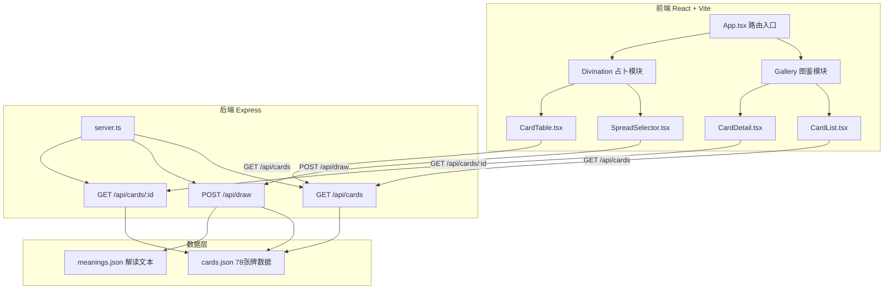
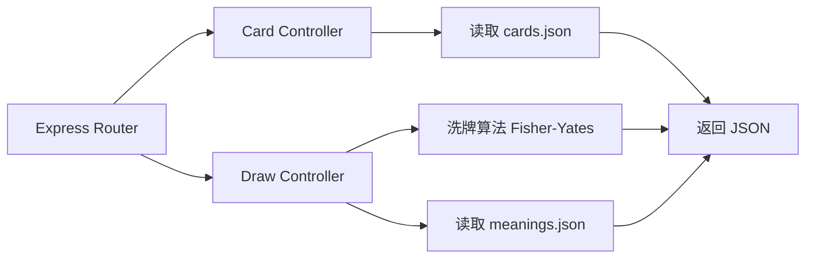

## 1. 架构设计



## 2. 技术说明
- 前端：React 18 + TypeScript + Tailwind CSS + Vite
- 初始化工具：vite-init（react-express-ts 模板）
- 后端：Express 4 + TypeScript + CORS
- 数据库：无数据库，使用 JSON 文件作为模拟数据源
- 状态管理：Zustand
- 拖拽库：@hello-pangea/dnd（react-beautiful-dnd 的维护分支，兼容 React 18+）
- 路由：react-router-dom v6

## 3. 路由定义
| 路由 | 用途 |
|------|------|
| / | 主页，展示应用入口与导航 |
| /gallery | 卡牌图鉴页，展示78张塔罗牌 |
| /divination | 占卜页，牌阵选择与抽牌 |

## 4. API 定义

### GET /api/cards
获取全部78张塔罗牌数据

```typescript
interface Card {
  id: string;
  name: string;
  type: "major" | "minor";
  suit?: string;
  upright: string;
  reversed: string;
  keywords: string[];
  zodiac?: string;
  image: string;
}

// Response
type CardsResponse = Card[];
```

### GET /api/cards/:id
获取单张牌详情

```typescript
// Response
type CardDetailResponse = Card;
```

### POST /api/draw
随机抽牌

```typescript
interface DrawRequest {
  spreadType: "three-card" | "celtic-cross" | "holy-triangle";
  count: number;
}

interface DrawnCard {
  id: string;
  position: number;
  positionName: string;
  isReversed: boolean;
}

// Response
type DrawResponse = DrawnCard[];
```

## 5. 服务器架构图



## 6. 数据模型

### 6.1 数据模型定义

```mermaid
erDiagram
    "Card" {
        string id PK
        string name
        string type
        string suit
        string upright
        string reversed
        string keywords
        string zodiac
        string image
    }
    "Meaning" {
        string cardId FK
        string position
        string description
        string advice
    }
    "Card ||--o| Meaning : "has""
```

### 6.2 数据定义

cards.json 存储所有78张塔罗牌基础数据：
- 大阿卡纳（22张）：id 0-21，type=major，包含 zodiac 字段
- 小阿卡纳（56张）：id 22-77，type=minor，包含 suit 字段（权杖、圣杯、宝剑、星币，各14张）

meanings.json 存储每张牌的详细解读文本：
- 每张牌包含正位解读、逆位解读、建议文本
