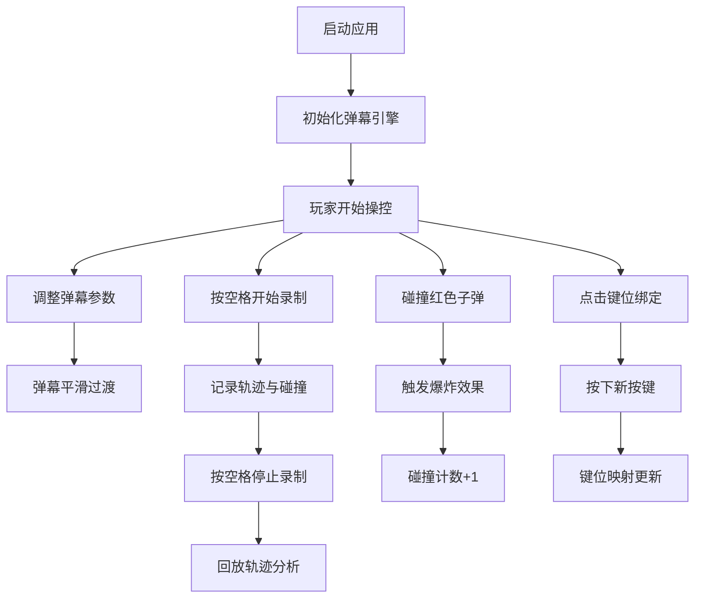

## 1. 产品概述
实时动态弹幕（Bullet Hell）模拟器，为弹幕游戏开发者提供可视化的实时编辑器，用于设计和调试弹幕模式、轨迹变化和碰撞检测效果。
- 解决问题：开发者在设计弹幕时缺少实时预览和参数调整工具，难以直观评估弹幕效果
- 目标用户：弹幕游戏开发者、独立游戏制作人、游戏设计爱好者
- 产品价值：大幅提升弹幕模式设计效率，提供即时可视化反馈，支持轨迹录制与回放分析

## 2. 核心功能

### 2.1 功能模块
1. **弹幕生成引擎**：8种预设弹幕形态，可调节密度、间隔、速度、大小、颜色
2. **操控与交互**：玩家角色移动、碰撞检测、爆炸粒子效果、屏幕闪红
3. **轨迹录制与回放**：录制60秒内移动轨迹和碰撞事件，支持多速度回放
4. **键位自定义**：支持WASD/方向键/空格的按键重绑定

### 2.2 页面详情
| 页面名称 | 模块名称 | 功能描述 |
|-----------|-------------|---------------------|
| 主页面 | 中央画布 | 800x600游戏画布，展示弹幕、玩家、粒子效果 |
| 主页面 | 左侧参数面板 | 弹幕形态选择、参数滑块、数字输入、颜色选择 |
| 主页面 | 右侧信息面板 | 存活时间、碰撞次数、录制状态显示 |
| 主页面 | 键位绑定区 | 按键映射按钮，支持自定义键位 |

## 3. 核心流程
用户打开应用后，默认弹幕形态自动开始发射。用户可通过WASD/方向键控制白色三角形移动，躲避红色子弹。通过左侧面板调整弹幕参数，弹幕会在1秒内平滑过渡。按空格键开始/停止录制，录制完成后可回放轨迹。点击键位绑定按钮可重新映射控制键。

## 4. 用户界面设计

### 4.1 设计风格
- **主色调**：深灰色(#1a1a2e)到暗紫色(#16213e)径向渐变背景
- **点缀色**：霓虹蓝色(#00d2ff)，悬停变为亮青色
- **面板样式**：深色半透明毛玻璃效果，圆角10px，内边距12px
- **字体**：采用Orbitron或类似科幻风格字体，数字使用等宽字体
- **按钮风格**：霓虹边框，悬停上浮2px，0.2秒缓出动画
- **滑块样式**：浅蓝色填充动画，带数字输入框和即时数值标签

### 4.2 页面设计概述
| 页面名称 | 模块名称 | UI元素 |
|-----------|-------------|-------------|
| 主页面 | 中央画布 | 径向渐变背景、半透明网格线(透明度0.1)、800x600游戏区域 |
| 主页面 | 左侧参数面板 | 下拉选择器(8种弹幕)、5组滑块+数字输入、10色调色盘、键位绑定按钮 |
| 主页面 | 右侧信息面板 | 存活时间(秒表样式)、碰撞次数(红色数字)、录制状态(红点闪烁)、回放控制 |
| 主页面 | 动画效果 | 参数变更时弹幕1秒平滑过渡、碰撞时爆炸粒子+屏幕闪红、滑块填充动画 |

### 4.3 响应式
- Desktop-first设计，屏幕宽度>900px时画布固定800x600
- 屏幕宽度<900px时，画布等比缩放至屏幕宽度的90%
- 面板在小屏幕下可折叠或垂直堆叠

## 5. 性能要求
- 弹幕数量≤50时：稳定60FPS
- 弹幕数量50-100时：≥45FPS
- 碰撞检测：空间哈希优化算法
- 子弹管理：对象池复用机制
