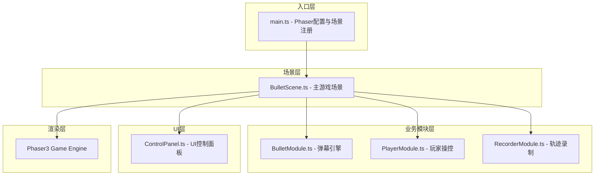

## 1. 架构设计



## 2. 技术描述
- **前端框架**：Phaser@3.60.0 + TypeScript + Vite
- **构建工具**：Vite 5.x
- **编程语言**：TypeScript (严格模式, target ES2020)
- **样式方案**：原生CSS + CSS变量，毛玻璃效果使用backdrop-filter
- **碰撞检测**：空间哈希(Spatial Hash)优化算法
- **对象管理**：子弹对象池减少GC开销
- **参数过渡**：线性插值(Lerp)实现1秒平滑过渡

## 3. 文件结构定义
```
project-root/
├── package.json          # 项目依赖与脚本
├── vite.config.js        # Vite构建配置
├── tsconfig.json         # TypeScript配置(严格模式)
├── index.html            # 入口HTML页面
└── src/
    ├── main.ts           # Phaser游戏配置入口
    ├── scenes/
    │   └── BulletScene.ts    # 主游戏场景
    ├── modules/
    │   ├── BulletModule.ts   # 弹幕引擎模块
    │   ├── PlayerModule.ts   # 玩家操控模块
    │   └── RecorderModule.ts # 轨迹录制模块
    └── ui/
        └── ControlPanel.ts   # UI控制面板模块
```

## 4. 核心数据类型定义

### 4.1 弹幕相关类型
```typescript
type BulletPattern = 'circle' | 'spiral' | 'fan' | 'wave' | 'homing' | 'split' | 'random' | 'cross';

interface BulletConfig {
  pattern: BulletPattern;
  density: number;      // 5-50
  interval: number;     // 0.1-1秒
  speed: number;        // 1-10
  size: number;         // 2-8像素
  color: string;        // 10色调色盘
}

interface Bullet {
  id: number;
  x: number;
  y: number;
  vx: number;
  vy: number;
  speed: number;
  size: number;
  color: string;
  pattern: BulletPattern;
  angle: number;
  life: number;
  isHoming: boolean;
  splitCount: number;
}
```

### 4.2 玩家相关类型
```typescript
interface PlayerState {
  x: number;
  y: number;
  alive: boolean;
  speed: number;        // 200像素/秒
  collisionCount: number;
  survivalTime: number;
}

interface KeyBinding {
  up: string;
  down: string;
  left: string;
  right: string;
  action: string;       // 空格
}
```

### 4.3 录制相关类型
```typescript
interface TrackPoint {
  timestamp: number;
  x: number;
  y: number;
}

interface CollisionEvent {
  timestamp: number;
  x: number;
  y: number;
}

interface Recording {
  duration: number;
  track: TrackPoint[];
  collisions: CollisionEvent[];
}
```

### 4.4 空间哈希
```typescript
interface SpatialHash {
  cellSize: number;
  grid: Map<string, Bullet[]>;
  clear(): void;
  insert(bullet: Bullet): void;
  query(x: number, y: number, radius: number): Bullet[];
}
```

## 5. 模块接口定义

### 5.1 BulletModule
```typescript
class BulletModule {
  constructor(scene: Phaser.Scene);
  setPattern(config: Partial<BulletConfig>): void;
  getBullets(): Bullet[];
  update(deltaTime: number, playerX: number, playerY: number): void;
  checkCollision(x: number, y: number, radius: number): boolean;
  destroy(): void;
}
```

### 5.2 PlayerModule
```typescript
class PlayerModule {
  constructor(scene: Phaser.Scene, binding: KeyBinding);
  get position(): { x: number; y: number };
  get alive(): boolean;
  get collisionCount(): number;
  get survivalTime(): number;
  setKeyBinding(binding: KeyBinding): void;
  update(deltaTime: number): void;
  triggerExplosion(x: number, y: number): void;
  reset(): void;
}
```

### 5.3 RecorderModule
```typescript
class RecorderModule {
  constructor();
  startRecord(): void;
  stopRecord(): void;
  replay(speed?: number): void;
  pauseReplay(): void;
  stopReplay(): void;
  setReplaySpeed(speed: number): void;
  isRecording(): boolean;
  isReplaying(): boolean;
  getRecordDuration(): number;
  getCurrentTrackPoint(): TrackPoint | null;
  getReplayCollisions(): CollisionEvent[];
  update(deltaTime: number, playerX: number, playerY: number, isColliding: boolean): void;
}
```

### 5.4 ControlPanel
```typescript
class ControlPanel {
  constructor(container: HTMLElement, callbacks: {
    onPatternChange: (config: Partial<BulletConfig>) => void;
    onKeyBindingChange: (binding: KeyBinding) => void;
    onReplaySpeedChange: (speed: number) => void;
    onStartReplay: () => void;
    onStopReplay: () => void;
  });
  updateInfo(survivalTime: number, collisionCount: number, isRecording: boolean, recordDuration: number): void;
  destroy(): void;
}
```

## 6. 性能优化策略

### 6.1 空间哈希碰撞检测
- 将画布划分为固定大小的网格单元(cellSize = 50px)
- 每帧将子弹插入对应的网格单元
- 碰撞检测时仅查询玩家所在位置附近的9个网格单元
- 时间复杂度从O(n)优化到O(1)平均情况

### 6.2 子弹对象池
- 预分配最大子弹数量(200个)的对象池
- 子弹超出边界或生命结束时回收到对象池
- 新子弹优先从对象池复用，避免频繁GC

### 6.3 参数平滑过渡
- 保存目标参数值和当前参数值
- 每帧使用lerp公式：current += (target - current) * delta * 2
- 实现1秒内接近目标值的平滑过渡效果

### 6.4 渲染优化
- 子弹使用Phaser的Graphics批量绘制
- 粒子效果复用粒子发射器
- 轨迹线使用渐变透明度的单一绘制调用
