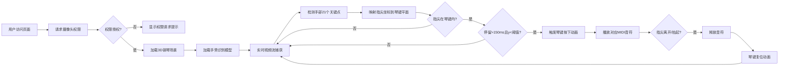

## 1. 产品概述
基于手势识别的虚拟乐器演奏实验项目，通过摄像头捕捉手部关键点，将手指运动实时映射到3D虚拟钢琴键盘上，让用户无需实体乐器即可体验音乐创作的乐趣。

- 解决痛点：音乐初学者缺乏实体乐器和快速上手的交互方式，降低音乐入门门槛
- 目标用户：音乐爱好者、初学者、教育场景下的师生
- 产品价值：提供沉浸式、无接触的音乐体验，使钢琴学习变得更加直观有趣

## 2. 核心功能

### 2.1 用户角色
| 角色 | 注册方式 | 核心权限 |
|------|----------|----------|
| 普通用户 | 无需注册，浏览器直接访问 | 使用虚拟钢琴演奏、调整设置 |

### 2.2 功能模块
1. **3D钢琴场景**：使用Three.js渲染24键半透明钢琴键盘，支持按键动画和视觉反馈
2. **手势识别模块**：集成MediaPipe Hands实时检测21个手部关键点，映射指尖坐标到琴键
3. **音频合成引擎**：使用Web Audio API生成钢琴音色，支持音符播放/释放和音量控制
4. **主界面**：深色爵士酒吧风格，居中显示钢琴键盘，实时展示手部关键点连线

### 2.3 页面详情
| 页面名称 | 模块名称 | 功能描述 |
|---------|---------|----------|
| 主演奏页面 | 钢琴键盘渲染 | 24个琴键（C2到B3），白键#f5f5f0、黑键#1a1a1a，带木纹纹理和反射效果 |
| 主演奏页面 | 手势检测 | 实时视频流捕捉，指尖坐标映射，150ms停留检测触发按键 |
| 主演奏页面 | 音频播放 | 钢琴音色合成（基频+3层泛音），音量随指尖压力变化 |
| 主演奏页面 | 视觉反馈 | 琴键按下塌陷8px、0.2秒缓出动画，底面绿色辉光#4ade80随敲击扩散 |

## 3. 核心流程

用户打开浏览器 → 允许摄像头权限 → 系统加载3D场景和手势识别模型 → 用户将手置于摄像头前 → 系统实时检测指尖位置 → 指尖悬停在琴键上超过150ms且达到按下阈值 → 触发琴键按下动画和对应音符 → 指尖离开或抬起 → 释放音符和琴键复位

## 4. 用户界面设计

### 4.1 设计风格
- **整体风格**：深色爵士酒吧氛围，神秘而优雅
- **主色调**：背景#0a0a0a，径向渐变光晕营造舞台感
- **强调色**：琴键辉光#4ade80（翡翠绿），营造爵士乐现场感
- **字体**：使用Playfair Display作为标题字体，体现爵士复古美学；Inter作为正文字体，保证可读性
- **动效**：琴键按下塌陷8px伴随0.2秒缓出动画，辉光随敲击扩散

### 4.2 页面设计概述
| 页面名称 | 模块名称 | UI元素 |
|---------|---------|--------|
| 主演奏页面 | 背景层 | #0a0a0a深色背景，径向渐变光晕从中心向外扩散，微弱噪点纹理增加质感 |
| 主演奏页面 | 手部关键点可视化 | 21个点以白色半透明线段连接，lineWidth 2，显示在琴键上方 |
| 主演奏页面 | 钢琴键盘区 | 居中布局，占视口高度60%，24个琴键按标准钢琴排列 |
| 主演奏页面 | 琴键样式 | 白键#f5f5f0带木纹纹理，黑键#1a1a1a，roughness 0.3, metalness 0.1 |
| 主演奏页面 | 琴键辉光 | 底面#4ade80辉光，按下时强度增加并向外扩散 |

### 4.3 响应式设计
- Desktop-first设计，针对桌面端优化
- 琴键区域根据视口大小自适应缩放，保持60%视口高度
- 视频流保持640x480原始比例，自适应容器宽度

### 4.4 3D场景指引
- **环境**：深色背景，点光源+环境光组合，突出琴键的反射效果
- **光照**：主光源模拟舞台聚光效果，环境光提供基础照明，点光源增强琴键金属质感
- **相机**：正交或透视相机，使琴键呈现最佳视觉比例
- **构图**：钢琴键盘居中，手部关键点连线叠加在键盘上方
- **后处理**：Bloom效果增强辉光，轻微色调映射营造电影感
- **性能优化**：合并几何体，使用实例化渲染，目标30FPS以上
