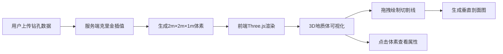

## 1. 产品概述

地质勘探数据三维可视化与剖面分析平台，为地质学家和工程师提供直观的地下结构3D可视化工具。解决传统二维钻井柱状图和等高线图难以直观感知三维空间分层关系和断层走向的问题，帮助地质从业者更高效地进行初步勘探分析。

- 目标用户：地质学家、勘探工程师、矿产开发人员
- 核心价值：将离散钻孔数据转换为连续3D地质体，支持任意角度剖面切割分析

## 2. 核心功能

### 2.1 用户角色

| 角色 | 注册方式 | 核心权限 |
|------|----------|----------|
| 专业用户 | 无需注册，直接使用 | 数据上传、3D可视化、剖面分析、数据导出 |

### 2.2 功能模块

1. **数据加载与预处理模块**：接收JSON格式钻孔数据，服务端空间插值和网格化处理，生成规则化三维体素数据
2. **三维地质体渲染模块**：使用Three.js渲染半透明地质体，不同层位使用渐变色区分，平滑插值避免锯齿
3. **剖面分析模块**：支持鼠标拖拽绘制切割线，自动生成垂直剖面图，显示各层位厚度和岩性标注
4. **交互控制模块**：场景旋转、缩放、平移、体素选择高亮、属性信息显示

### 2.3 页面详情

| 页面名称 | 模块名称 | 功能描述 |
|----------|----------|----------|
| 主视图 | 3D场景渲染 | 显示半透明地质体、坐标轴、网格辅助线，支持交互控制 |
| 主视图 | 左侧工具栏 | 数据上传、插值计算、剖面绘制、视图重置等功能按钮 |
| 主视图 | 信息面板 | 左上角显示选中体素的详细属性信息 |
| 主视图 | 剖面面板 | 右下角悬浮显示垂直剖面图 |

## 3. 核心流程

用户上传钻孔数据 → 服务端进行克里金插值计算 → 生成体素数据返回前端 → 前端渲染3D地质体 → 用户拖拽绘制切割线 → 系统生成剖面图 → 用户点击体素查看属性

## 4. 用户界面设计

### 4.1 设计风格

- 主背景色：#0a0a0a（深色科技感）
- 面板渐变：#1a1a1a 到 #2a2a2a
- 强调色：#00c8ff（交互元素）、#ffd700（切割线高亮）、#00ffff（选中边缘光）
- 文字主色：#f0f0f0
- 层位颜色：砂岩#d4a76a→#c8964e，页岩#5e4b3c→#3e2c21，石灰岩#c2b5a1→#a8947a
- 按钮效果：悬停放大1.05倍，点击缩回0.95倍，过渡0.2s
- 圆角：工具栏按钮6px，面板8px
- 字体：现代无衬线字体，大小层次分明

### 4.2 页面布局

| 区域 | 位置 | 尺寸 | 说明 |
|------|------|------|------|
| 3D场景 | 主视口 | 70%宽度 | 地质体渲染、交互控制 |
| 左侧工具栏 | 左侧固定 | 宽60px | 垂直排列36×36px图标按钮 |
| 信息面板 | 左上角 | 宽240px | 选中体素属性显示 |
| 剖面面板 | 右下角悬浮 | 420×320px | 半透明深灰背景，显示剖面图 |
| 响应式（<768px） | 顶部水平栏 | 高50px | 图标横向排列 |

### 4.3 交互设计

- 默认视角：俯视倾斜45度
- 鼠标左键：旋转场景（0.3s ease-out缓动）
- 鼠标中键：缩放场景
- 鼠标右键：平移场景
- 点击体素：发光边缘高亮（#00ffff，强度0.8）
- 拖拽绘制：亮黄色虚线切割线（#ffd700，线宽3px）

### 4.4 3D场景设计

- 环境：深色背景，配合方向光和环境光
- 灯光：环境光+方向光组合，突出地质体层次感
- 相机：透视相机，初始位置俯视45度
- 辅助元素：坐标轴指示器、浅灰色#444444水平网格
- 材质：半透明材质，不同层位使用渐变色彩映射
- 后处理：体素平滑插值，避免锯齿边缘

### 4.5 性能要求

- 渲染帧率：40FPS以上
- 页面加载：500×500×200体素时小于3s
- 插值计算：服务端耗时不超过2s

## 5. 响应式设计

- 桌面端（≥768px）：左侧固定垂直工具栏，主场景占70%宽度
- 移动端（<768px）：顶部水平工具栏，场景全屏显示，面板自适应缩放
- 触控优化：支持手势旋转、双指缩放
