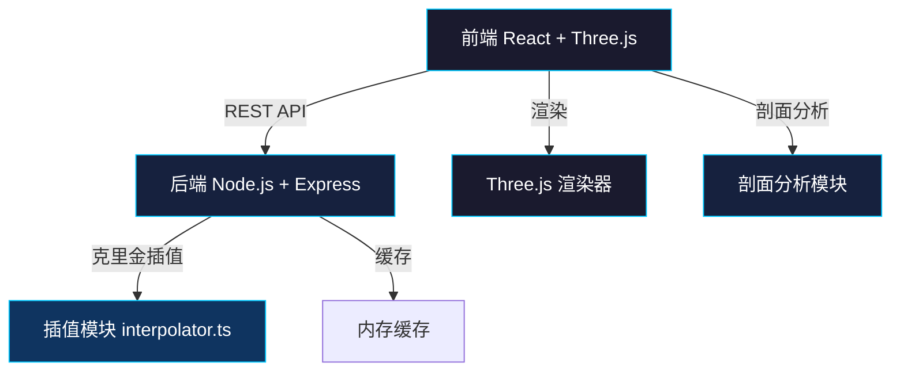
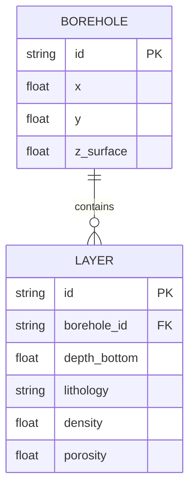
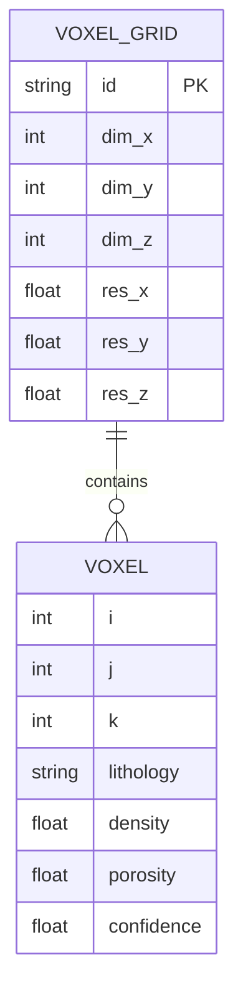

## 1. 架构设计



## 2. 技术描述

- **前端**：React@18 + TypeScript@5 + Three.js@0.160 + Vite@5
- **后端**：Node.js + Express@4 + CORS@2
- **构建工具**：Vite@5
- **状态管理**：React useState/useRef（轻量级应用）
- **样式方案**：原生 CSS + CSS 变量
- **插值算法**：克里金插值（Kriging）

## 3. 项目文件结构

```
├── package.json
├── index.html
├── vite.config.js
├── tsconfig.json
├── src/
│   ├── server/
│   │   ├── entry.js          # Express服务器入口
│   │   └── dataRouter.js     # 数据路由处理
│   ├── data/
│   │   └── interpolator.ts   # 克里金插值算法
│   ├── render/
│   │   ├── scene.ts          # Three.js场景初始化
│   │   └── bodyRenderer.ts   # 地质体渲染器
│   ├── profile/
│   │   └── profilePanel.ts   # 剖面分析面板
│   └── App.tsx               # 主应用组件
└── .trae/documents/
    ├── prd.md
    └── tech-arch.md
```

## 4. 路由定义

| 路由 | 方法 | 用途 |
|------|------|------|
| /upload | POST | 上传钻孔JSON数据 |
| /interpolate | GET | 触发插值计算，返回体素数据 |
| / | GET | 静态文件服务（前端页面） |

## 5. API 定义

### 5.1 钻孔数据上传 POST /upload

**请求体：**
```typescript
interface BoreholeData {
  id: string;
  x: number;      // 坐标x（米）
  y: number;      // 坐标y（米）
  z: number;      // 地表高程（米）
  layers: Layer[];
}

interface Layer {
  depth: number;  // 层底深度（米）
  lithology: string;  // 岩性：sandstone/shale/limestone
  density: number;    // 密度
  porosity: number;   // 孔隙度
}
```

**响应：**
```typescript
{
  success: boolean;
  message: string;
  dataId: string;
}
```

### 5.2 插值计算 GET /interpolate

**查询参数：**
- dataId: string
- resolutionX: number (默认2)
- resolutionY: number (默认2)
- resolutionZ: number (默认1)

**响应：**
```typescript
interface VoxelData {
  dimensions: {
    x: number;  // 体素数量x方向
    y: number;  // 体素数量y方向
    z: number;  // 体素数量z方向
  };
  resolution: {
    x: number;  // 体素分辨率x（米）
    y: number;  // 体素分辨率y（米）
    z: number;  // 体素分辨率z（米）
  };
  bounds: {
    minX: number;
    maxX: number;
    minY: number;
    maxY: number;
    minZ: number;
    maxZ: number;
  };
  voxels: Voxel[];
}

interface Voxel {
  i: number;      // x索引
  j: number;      // y索引
  k: number;      // z索引
  lithology: string;
  density: number;
  porosity: number;
  confidence: number;  // 插值置信度
}
```

## 6. 数据模型

### 6.1 钻孔数据模型



### 6.2 体素数据模型



## 7. 核心技术实现要点

### 7.1 克里金插值算法
- 使用普通克里金法（Ordinary Kriging）
- 变异函数模型：球状模型（Spherical Model）
- 搜索邻域：考虑最近的N个钻孔数据点
- 输出：每个体素的岩性概率、密度、孔隙度插值结果

### 7.2 Three.js 渲染优化
- 使用 InstancedMesh 批量渲染体素
- 半透明材质顺序渲染
- 视锥体剔除优化
- 层位颜色渐变映射

### 7.3 剖面切割算法
- 沿切割路径采样等距点
- 对每个采样点计算垂直剖面
- 插值生成连续剖面图像
- 标注层位厚度和岩性

### 7.4 交互控制
- OrbitControls 定制化配置
- 鼠标事件处理与状态管理
- Raycaster 体素拾取
- 缓动动画实现
