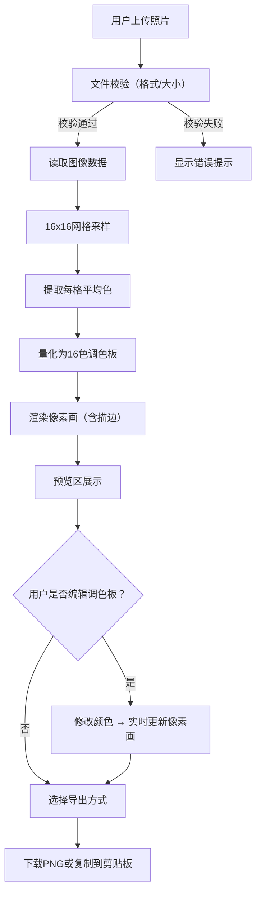

## 1. 产品概述

像素头像生成器是一款在线工具，帮助用户将普通照片快速转化为16x16或32x32像素风格的卡通头像。面向社交媒体用户、像素艺术爱好者和个人品牌打造者，解决手动绘制像素头像耗时费力的问题。

- 核心价值：一键上传照片 → 自动提取面部特征 → 生成像素风头像 → 手动微调色板 → 导出分享
- 目标市场：社交平台用户、独立游戏开发者、NFT创作者、论坛用户

## 2. 核心功能

### 2.1 用户角色

| 角色 | 注册方式 | 核心权限 |
|------|----------|----------|
| 普通用户 | 无需注册 | 上传照片、生成像素头像、编辑调色板、导出图片 |

### 2.2 功能模块

1. **主页**：上传区域、像素化预览区、调色板编辑区、导出面板

### 2.3 页面详情

| 页面名称 | 模块名称 | 功能描述 |
|----------|----------|----------|
| 主页 | 上传与预览模块 | 点击或拖拽上传照片（支持jpg/png，最大2MB），虚线边框和云朵图标提示，拖拽时放大和背景色#f0f9ff反馈 |
| 主页 | 像素化转换模块 | 按16x16网格采样，提取每格平均色，渲染像素块带1px深灰描边（#333333，透明度0.6），头部区域自动居中 |
| 主页 | 调色板编辑模块 | 右侧显示16色板，每色块32x32px圆角方块，点击弹出颜色拾取器，修改后像素画实时更新 |
| 主页 | 导出模块 | 支持下载PNG（128x128px或256x256px），支持复制到剪贴板，导出按钮点击有按压反馈 |

## 3. 核心流程

用户打开页面 → 在上传区点击或拖拽上传照片 → 系统自动在500ms内完成像素化转换 → 预览区展示像素头像（左侧像素画 + 右侧调色板）→ 用户可点击调色板色块修改颜色 → 像素画实时更新（0.2秒ease-out淡入淡出）→ 用户选择导出尺寸并下载或复制到剪贴板

## 4. 用户界面设计

### 4.1 设计风格

- 主色调：浅米色背景 #faf5eb，像素艺术复古感
- 辅助色：深灰描边 #333333（透明度0.6），拖拽高亮 #f0f9ff
- 按钮：圆角矩形，导出按钮有按压反馈（translate + shadow变化）
- 字体：像素风主题，标题使用等宽/像素风字体，正文使用清晰无衬线字体
- 布局：居中排版，上传区和预览区并排，预览区左侧像素画右侧调色板
- 图标：云朵上传图标，像素风装饰元素

### 4.2 页面设计概述

| 页面名称 | 模块名称 | UI元素 |
|----------|----------|--------|
| 主页 | 上传区域 | 虚线边框、云朵图标、拖拽放大动画、背景色变化#f0f9ff |
| 主页 | 像素画预览 | 左侧大预览区、像素块1px描边、0.2s淡入淡出过渡 |
| 主页 | 调色板编辑 | 右侧16色板、32x32px圆角色块、颜色拾取器弹窗 |
| 主页 | 导出面板 | 右下角导出按钮、尺寸选择（128/256px）、按压反馈 |

### 4.3 响应式设计

- 桌面优先设计，主操作区居中排版
- 上传区和预览区并排显示（宽屏）
- 窄屏时上下排列
- 触控优化：色块和按钮最小点击区域44x44px

### 4.4 动画与交互

- 拖拽上传：边框区域放大1.02倍，背景色渐变至#f0f9ff
- 像素画更新：0.2秒ease-out淡入淡出
- 导出按钮：点击时translate(1px, 1px)位移 + box-shadow收缩
- 色块hover：轻微放大1.1倍 + 边框高亮
