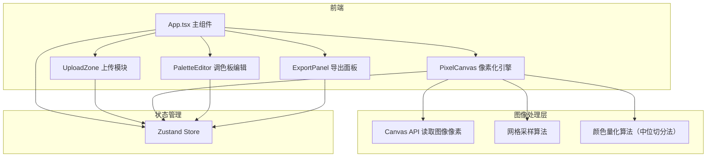

## 1. 架构设计



## 2. 技术说明

- 前端：React 18 + TypeScript + Tailwind CSS 3 + Vite
- 初始化工具：vite-init（react-ts模板）
- 状态管理：Zustand
- 后端：无（纯前端应用，所有图像处理在浏览器端完成）
- 数据库：无（无需持久化存储）
- 图像处理：使用浏览器原生Canvas API进行像素采样和颜色提取
- 动画：CSS transition + keyframes

## 3. 路由定义

| 路由 | 用途 |
|------|------|
| / | 主页，包含上传、预览、编辑、导出所有功能 |

本项目为单页应用，无需多路由。

## 4. 核心数据流

```
用户上传图片 → FileReader读取 → Canvas绘制 → 网格采样(16x16) → 
提取每格平均色 → 颜色量化为16色 → 存入Store → 渲染像素画 →
用户编辑调色板 → Store更新 → 像素画实时重绘 → 导出
```

### 4.1 状态定义（Zustand Store）

```typescript
interface PixelAvatarState {
  sourceImage: HTMLImageElement | null;
  pixelGrid: string[][];          // 16x16颜色网格
  palette: string[];              // 16色调色板
  gridSize: 16 | 32;             // 网格尺寸
  isProcessing: boolean;
  setSourceImage: (img: HTMLImageElement) => void;
  setPixelGrid: (grid: string[][]) => void;
  setPalette: (colors: string[]) => void;
  updatePaletteColor: (index: number, color: string) => void;
  setGridSize: (size: 16 | 32) => void;
}
```

### 4.2 像素化算法流程

1. 将上传图片绘制到隐藏Canvas
2. 按16x16网格将Canvas分割
3. 对每个网格区域取所有像素的RGB平均值作为该格主色
4. 使用中位切分法将提取的颜色量化为16色
5. 将每格颜色映射到最近的调色板颜色
6. 渲染像素画：每个色块绘制为正方形，带1px描边

## 5. 文件结构

```
├── index.html
├── package.json
├── vite.config.js
├── tsconfig.json
├── src/
│   ├── App.tsx                    # 主组件
│   ├── main.tsx                   # 入口
│   ├── index.css                  # 全局样式
│   ├── store/
│   │   └── usePixelAvatarStore.ts # Zustand状态管理
│   ├── upload/
│   │   └── UploadZone.tsx         # 上传区域组件
│   ├── pixelator/
│   │   └── PixelCanvas.tsx        # 像素化引擎与渲染
│   ├── palette/
│   │   └── PaletteEditor.tsx      # 调色板编辑组件
│   └── export/
│       └── ExportPanel.tsx        # 导出面板组件
```
