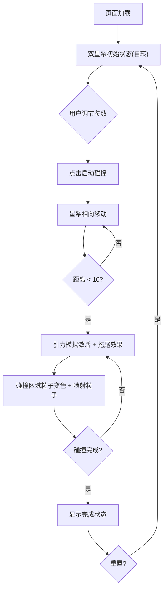

## 1. 产品概述

基于Three.js的星系碰撞与粒子系统动态模拟应用，让用户直观观察两个螺旋星系在引力作用下逐渐靠近、碰撞并产生恒星爆发的场景。面向天文爱好者、科学教育工作者及视觉艺术创作者，提供交互式宇宙碰撞模拟体验。

## 2. 核心功能

### 2.1 功能模块

1. **3D场景页面**：双螺旋星系粒子系统、引力碰撞模拟、喷射粒子效果、背景星空
2. **控制面板**：碰撞参数调节、播放控制、实时状态显示

### 2.2 页面详情

| 页面名称 | 模块名称 | 功能描述 |
|---------|---------|---------|
| 3D场景页面 | 双螺旋星系 | 两个螺旋星系(各10000粒子)初始位于场景两侧(±50单位)，围绕中心自转，粒子颜色从白色到蓝色渐变 |
| 3D场景页面 | 碰撞模拟 | 点击启动后星系沿x轴相向移动，距离<10时触发引力模拟，粒子产生拖尾轨迹(20帧历史) |
| 3D场景页面 | 碰撞效果 | 重叠区域粒子亮度+50%并变为橙红色(#ff6633)，产生500个喷射粒子从碰撞中心辐射，2秒衰减消失 |
| 3D场景页面 | 背景星空 | 2000个静态小星星粒子(0.5-1.5px随机)，深空黑背景(#0a0a1a) |
| 控制面板 | 参数控制 | 引力强度滑块(0.1-5.0)、碰撞速度滑块(0.1-2.0)、粒子大小滑块(1-5px) |
| 控制面板 | 播放控制 | 启动碰撞按钮、播放/暂停按钮、重置按钮 |
| 控制面板 | 状态显示 | 碰撞进度百分比(0%-100%)、粒子总数、渐变进度条(#4ade80→#f87171) |

## 3. 核心流程

用户进入页面后，看到两个螺旋星系在场景两侧缓慢自转。通过控制面板调节参数后点击"启动碰撞"，两个星系开始沿x轴相向移动。当距离小于10单位时，引力模拟激活，粒子加速靠近并产生拖尾效果。碰撞区域粒子亮度提升并变为橙红色，同时产生喷射粒子。碰撞完成后可重置场景重新模拟。

## 4. 用户界面设计

### 4.1 设计风格

- 主题色：深空黑(#0f172a)背景，蓝紫色(#6366f1)交互元素，白色文字
- 毛玻璃效果控制面板：rgba(15,23,42,0.8)背景，1px #334155边框，12px圆角
- 字体：JetBrains Mono(数据展示) + Space Grotesk(UI文字)
- 布局：全屏3D场景，左下角浮动控制面板
- 图标风格：线性极简图标

### 4.2 页面设计概览

| 页面名称 | 模块名称 | UI元素 |
|---------|---------|--------|
| 3D场景 | 星系显示 | 全屏Canvas，深空黑背景(#0a0a1a)，相机(0,30,80)看向原点 |
| 控制面板 | 参数滑块 | 蓝紫色滑块，数值右侧显示，标签白色 |
| 控制面板 | 按钮 | 蓝紫色背景(#6366f1)白色文字，hover高亮 |
| 控制面板 | 进度条 | 渐变从#4ade80到#f87171，显示百分比文字 |
| 控制面板 | 移动端 | 折叠为图标按钮，点击展开，过渡0.2s |

### 4.3 响应式设计

- 桌面端：控制面板固定左下角，全宽显示
- 移动端(<768px)：控制面板折叠为图标按钮，点击弹出半透明面板
- 所有UI元素过渡动画0.2秒

### 4.4 3D场景指引

- 环境：深空黑(#0a0a1a)纯色背景，无HDRI
- 光照：无额外光照，粒子自发光
- 相机：默认位置(0, 30, 80)看向原点，支持轨道控制(拖拽旋转+滚轮缩放)
- 焦点：两个螺旋星系和碰撞区域
- 交互：鼠标拖拽旋转、滚轮缩放
- 后处理：无额外后处理，保证60FPS性能
- 性能预算：25000+粒子时自动降低渲染采样间隔，交互延迟<100ms
