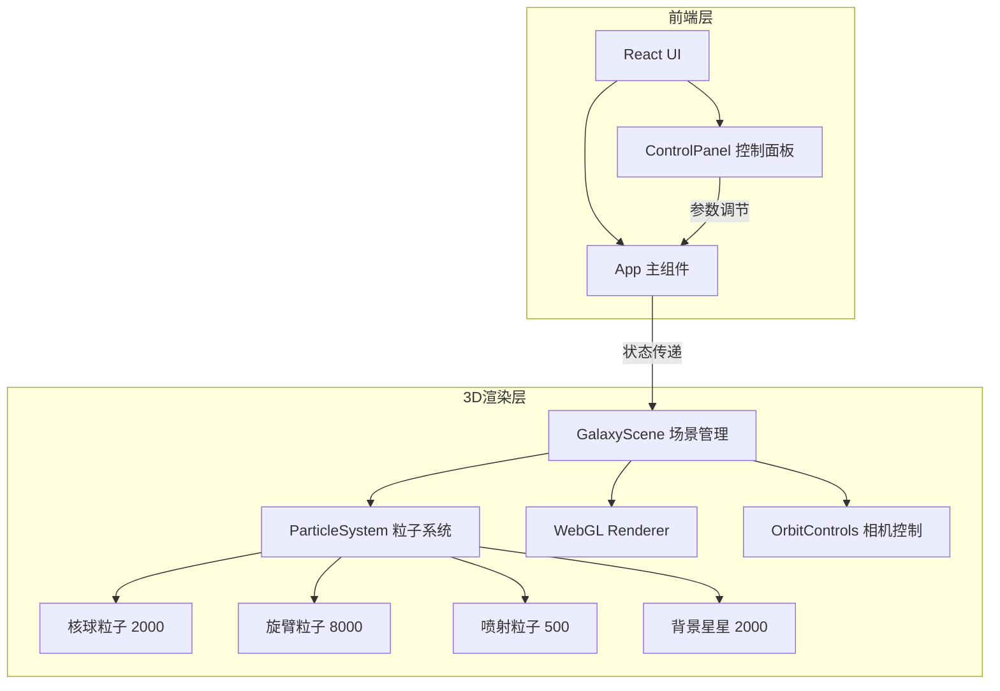

## 1. 架构设计



## 2. 技术说明

- 前端：React@18 + TypeScript + Vite
- 3D渲染：Three.js + @types/three
- 初始化工具：vite-init
- 状态管理：React useState/useRef（轻量级状态，无需Zustand）
- 后端：无

## 3. 路由定义

| 路由 | 用途 |
|------|------|
| / | 主页面，包含3D场景和控制面板 |

## 4. 文件结构

```
├── package.json
├── vite.config.js
├── tsconfig.json
├── index.html
└── src/
    ├── main.tsx
    ├── App.tsx
    ├── scene/
    │   ├── GalaxyScene.ts
    │   └── ParticleSystem.ts
    └── ui/
        └── ControlPanel.tsx
```

## 5. 核心类设计

### 5.1 ParticleSystem

```typescript
class ParticleSystem {
  geometry: THREE.BufferGeometry
  material: THREE.PointsMaterial
  points: THREE.Points
  positions: Float32Array
  velocities: Float32Array
  colors: Float32Array
  lifetimes: Float32Array
  positionHistory: Float32Array[] // 20帧位置历史
  particleCount: number
  galaxyCenter: THREE.Vector3

  constructor(center: THREE.Vector3, particleCount: number)
  createBulge(count: number): void      // 核球2000粒子
  createArms(count: number): void       // 旋臂8000粒子
  update(delta: number): void           // 更新粒子位置
  getColorByDistance(distance: number): THREE.Color  // 白→蓝渐变
  startCollision(velocity: THREE.Vector3): void      // 开始碰撞移动
  applyGravity(strength: number): void               // 应用引力
  createBurstParticles(center: THREE.Vector3, count: number): void  // 喷射粒子
  updateTrail(): void                   // 更新拖尾轨迹
}
```

### 5.2 GalaxyScene

```typescript
class GalaxyScene {
  scene: THREE.Scene
  camera: THREE.PerspectiveCamera
  renderer: THREE.WebGLRenderer
  controls: OrbitControls
  galaxy1: ParticleSystem
  galaxy2: ParticleSystem
  burstParticles: ParticleSystem
  backgroundStars: ParticleSystem
  isColliding: boolean
  collisionProgress: number

  constructor(container: HTMLElement)
  init(): void
  animate(): void
  startCollision(speed: number, gravity: number): void
  updateCollision(): void
  reset(): void
  resize(): void
  dispose(): void
}
```

## 6. 性能策略

- 粒子总数超过25000时，每2帧渲染一次（降低采样间隔）
- 使用BufferGeometry + Float32Array实现高效粒子更新
- 拖尾效果使用LineSegments而非每帧创建新对象
- 相机远平面设为1000，减少不可见粒子计算
- 使用requestAnimationFrame确保与显示器刷新率同步
