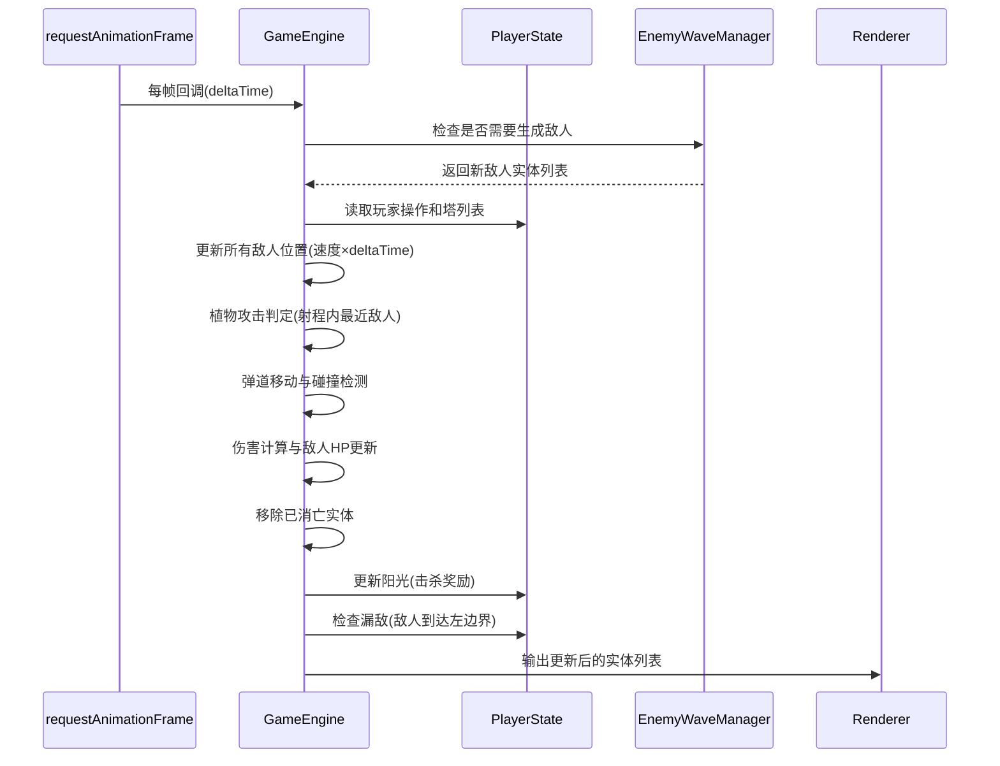

## 1. 架构设计

```mermaid
graph TD
    "React App (App.tsx)" --> "GameEngine.ts"
    "GameEngine.ts" --> "PlayerState.ts"
    "GameEngine.ts" --> "EnemyWaveManager.ts"
    "GameEngine.ts" --> "Renderer.tsx"
    "PlayerState.ts" --> "Renderer.tsx"
    "EnemyWaveManager.ts" --> "GameEngine.ts"
    "GameEngine.ts" --> "Entity类型定义"
    
    subgraph "数据流"
        "用户操作" --> "PlayerState"
        "PlayerState" --> "GameEngine"
        "EnemyWaveManager" --> "GameEngine"
        "GameEngine" --> "Renderer"
    end
```

## 2. 技术说明

- 前端：React@18 + TypeScript + Vite + CSS Modules
- 状态管理：Zustand（管理游戏全局状态）
- 构建工具：Vite
- 无后端，所有逻辑在客户端完成
- 游戏循环：requestAnimationFrame驱动，目标≥45fps

## 3. 路由定义

| 路由 | 用途 |
|------|------|
| / | 游戏主界面（单页应用，无需路由） |

## 4. 文件结构与调用关系

```
project/
├── index.html                    # 入口HTML，加载div#root
├── package.json                  # 依赖与脚本
├── tsconfig.json                 # TypeScript严格模式配置
├── vite.config.ts                # Vite+React插件配置
├── src/
│   ├── main.tsx                  # React DOM挂载入口
│   ├── App.tsx                   # 顶层组件，初始化游戏引擎
│   ├── types.ts                  # 所有类型定义（Entity, Plant, Enemy, Projectile等）
│   ├── GameEngine.ts             # 核心游戏循环与ECS系统
│   │   # 职责：每帧更新实体位置、碰撞检测、伤害计算
│   │   # 数据流向：从PlayerState读取操作 → 输出实体列表给Renderer
│   │   # 调用：PlayerState, EnemyWaveManager, Renderer
│   ├── PlayerState.ts            # 玩家状态管理（Zustand store）
│   │   # 职责：管理阳光、已购买塔列表、当前波次
│   │   # 方法：addTower, removeTower, deductSunlight, addSunlight
│   │   # 被调用：GameEngine, App组件
│   ├── EnemyWaveManager.ts       # 敌人波次管理
│   │   # 职责：根据波次公式生成敌人队列，控制生成间隔和属性
│   │   # 数据流向：向GameEngine推送新敌人实体
│   │   # 被调用：GameEngine
│   ├── Renderer.tsx              # 渲染层组件
│   │   # 职责：将实体列表渲染为DOM，CSS Grid 20x10布局
│   │   # 数据流向：接收GameEngine输出的实体状态
│   │   # 调用：types.ts中的类型
│   ├── components/
│   │   ├── GameCanvas.tsx        # 游戏网格画布组件
│   │   ├── PlantCard.tsx         # 植物卡片选择组件
│   │   ├── PlantEntity.tsx       # 植物渲染实体组件
│   │   ├── EnemyEntity.tsx       # 敌人渲染实体组件
│   │   ├── Projectile.tsx        # 弹道渲染组件
│   │   ├── WaveOverlay.tsx       # 波次过渡画面组件
│   │   ├── GameOverPanel.tsx     # 游戏结算面板组件
│   │   ├── SunlightDisplay.tsx   # 阳光点数显示组件
│   │   └── WaveInfo.tsx          # 波次与漏敌信息组件
│   ├── hooks/
│   │   └── useGameLoop.ts        # requestAnimationFrame游戏循环Hook
│   ├── styles/
│   │   └── game.css              # 丛林风格主题全局样式
│   └── utils/
│       └── animations.ts         # 粒子动画和视觉效果工具函数
```

## 5. 核心类型定义

```typescript
// Entity 基础类型
interface Entity {
  id: string;
  x: number;       // 网格坐标或像素坐标
  y: number;
  type: 'plant' | 'enemy' | 'projectile';
}

// 植物塔
interface Plant extends Entity {
  type: 'plant';
  level: 1 | 2 | 3;
  attackPower: number;
  range: number;       // 格数
  attackSpeed: number;  // 秒
  lastAttackTime: number;
  gridX: number;
  gridY: number;
}

// 敌人
interface Enemy extends Entity {
  type: 'enemy';
  variant: 'normal' | 'shield' | 'fast';
  hp: number;
  maxHp: number;
  speed: number;       // px/s
  shieldActive: boolean;
  shieldCooldown: number;
  hitFlashTime: number;
  dead: boolean;
  deathTime: number;
}

// 弹道
interface Projectile extends Entity {
  type: 'projectile';
  targetId: string;
  damage: number;
  startX: number;
  startY: number;
  startTime: number;
  duration: number;    // 飞行时间0.2s
}

// 碎片效果
interface Particle {
  id: string;
  x: number;
  y: number;
  vx: number;
  vy: number;
  createdAt: number;
  duration: number;
  color: string;
}
```

## 6. 游戏循环架构



## 7. 性能策略

- 使用requestAnimationFrame驱动游戏循环
- 仅在实体位置或状态变化时更新对应DOM元素
- 避免整列表重渲染，使用key定位单个实体
- CSS transform代替top/left实现动画（GPU加速）
- 粒子效果使用CSS animation减少JS计算
- 20个植物+30个敌人同时存在时保持≥45fps
