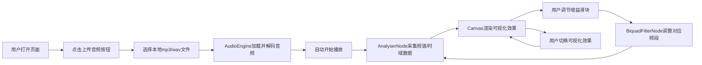

## 1. 产品概述

浏览器端交互式音乐可视化与混音效果预览工具，为音乐爱好者、音频工程师和视觉创作者提供实时音频可视化分析与混音调节的体验平台。

- 主要用途：上传本地音频文件，实时展示多种音频可视化效果，并通过低中高频增益滑块模拟混音效果
- 目标用户：音乐爱好者、音频学习者、视觉设计师、教育场景演示者
- 核心价值：在浏览器中无需安装软件即可体验专业级的音频分析与可视化效果

## 2. 核心特性

### 2.1 功能模块

1. **音频播放控制模块**：文件上传、播放/暂停、进度条显示、时间显示
2. **频谱柱状图模块**：64频段垂直柱状频谱显示，蓝红渐变色
3. **圆形粒子扩散模块**：128个粒子环绕扩散，HSL色彩循环动画
4. **波形曲线模块**：时域波形显示，含镜像立体效果
5. **混音控制模块**：低/中/高频三段增益调节，范围-20dB~+20dB
6. **效果切换模块**：三种可视化效果快速切换

### 2.2 页面详情

| 页面名称 | 模块名称 | 功能描述 |
|-----------|-------------|---------------------|
| 主界面 | 音频播放控制 | 支持mp3/wav格式上传，自动播放，显示进度条与当前时间，支持暂停/继续 |
| 主界面 | 频谱柱状图 | 64根垂直柱状条，高度随音量变化，底部蓝色渐变顶部红色，间隔2px |
| 主界面 | 圆形粒子扩散 | 128个粒子从圆心扩散，半径3-8px，透明度0.3-1.0，HSL色相循环 |
| 主界面 | 波形曲线 | 时域波形曲线3px白线(0.8透明度)，叠加半透明镜像浅蓝色曲线 |
| 主界面 | 混音增益控制 | 低频(0-200Hz)/中频(200-2000Hz)/高频(2000Hz+)三段滑块，范围-20dB~+20dB |
| 主界面 | 效果切换按钮 | 圆形图标按钮切换三种可视化效果，选中态高亮蓝色 |

## 3. 核心流程

用户打开页面 → 点击"上传音频"按钮选择本地文件 → 系统自动加载解码音频 → 开始播放并实时渲染可视化 → 用户调节增益滑块 → 频谱和可视化效果实时响应变化 → 用户点击效果切换按钮 → 切换不同可视化样式

## 4. 用户界面设计

### 4.1 设计风格

- **主色调**：深色主题，背景为径向渐变从#0a0a1a到#1a1a2e
- **强调色**：蓝色#3b82f6，悬停态#2563eb
- **辅助色**：HSL彩虹色用于粒子效果，蓝红渐变用于频谱柱状
- **毛玻璃效果**：控制面板使用backdrop-filter: blur(10px)半透明暗色背景
- **按钮样式**：上传按钮圆角设计，0.2秒颜色过渡动画；滑块圆形拖拽头带阴影
- **字体**：现代无衬线字体，数字使用等宽字体显示
- **布局风格**：Flex布局，Canvas画布占70%宽度（最小高度600px），控制面板占30%宽度，整体居中无滚动
- **Canvas边框**：四角蓝色发光光晕效果

### 4.2 页面设计概览

| 页面名称 | 模块名称 | UI元素 |
|-----------|-------------|-------------|
| 主界面 | Canvas可视化区 | 70%宽度，最小600px高度，蓝色光晕边框，深色径向渐变背景 |
| 主界面 | 顶部效果切换区 | 三个圆形图标按钮（柱状/圆圈/波浪），选中高亮#3b82f6 |
| 主界面 | 右侧控制面板 | 毛玻璃背景(30%宽)，上传按钮+三个增益滑块+进度条区域 |
| 主界面 | 增益滑块区域 | 水平滑块，轨道#4a4a6a，白色圆形按钮，下方数值显示 |
| 主界面 | 进度条区域 | #3b82f6进度条，圆形拖拽头带阴影，时间数值显示 |

### 4.3 响应式设计

- 桌面优先设计，Canvas区域最小600px高度
- 视口宽度不足时，优先保证控制面板可读性
- 禁止页面滚动条，所有内容自适应视口大小

### 4.4 性能目标

- 频谱数据更新频率≥30fps，目标60fps
- 单核CPU占用率≤15%
- Canvas渲染优化，避免不必要的重绘
