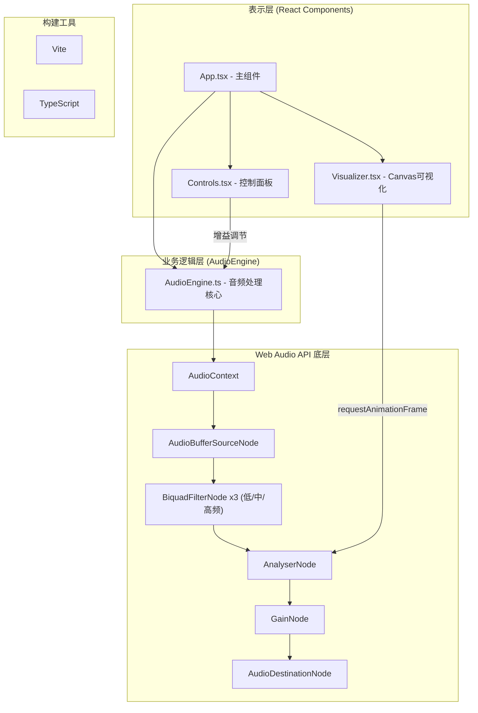
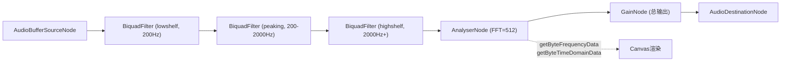

## 1. 架构设计



## 2. 技术说明

- **前端框架**：React 18 + TypeScript (严格模式)
- **构建工具**：Vite + @vitejs/plugin-react
- **音频处理**：Web Audio API
  - AudioBufferSourceNode：音频源播放
  - BiquadFilterNode (lowshelf/peaking/highshelf)：三段均衡器
  - AnalyserNode：FFT频谱与时域数据采集
  - GainNode：总音量控制
- **可视化渲染**：Canvas 2D API + requestAnimationFrame
- **样式方案**：CSS-in-JS (styled-components无依赖，使用inline style + CSS class)

## 3. 项目文件结构

| 文件路径 | 职责说明 |
|-------|---------|
| `package.json` | 依赖管理与启动脚本配置 |
| `vite.config.js` | Vite构建配置，启用React插件 |
| `tsconfig.json` | TypeScript严格模式配置 |
| `index.html` | 入口HTML，深色渐变背景，无默认边距 |
| `src/App.tsx` | 主组件，管理全局状态(播放状态、增益值、效果选择等)，布局Flex容器 |
| `src/AudioEngine.ts` | 音频处理类，封装Web Audio API节点，提供加载解码、播放控制、增益控制、数据采集接口 |
| `src/Visualizer.tsx` | Canvas渲染组件，根据effectType绘制频谱柱状图/圆形粒子/波形曲线，响应增益变化 |
| `src/Controls.tsx` | 用户控制面板，文件上传、增益滑块(低中高)、播放控制、进度条、效果切换按钮 |

## 4. 核心数据类型定义

```typescript
// 可视化效果类型
type VisualizerType = 'bars' | 'particles' | 'waveform';

// 增益控制参数
interface GainSettings {
  low: number;    // 低频增益 dB (-20 ~ +20)
  mid: number;    // 中频增益 dB (-20 ~ +20)
  high: number;   // 高频增益 dB (-20 ~ +20)
}

// 音频播放状态
interface PlaybackState {
  isPlaying: boolean;
  currentTime: number;
  duration: number;
}

// AudioEngine类接口
class AudioEngine {
  audioContext: AudioContext;
  loadAudioFile(file: File): Promise<void>;
  play(): void;
  pause(): void;
  seek(time: number): void;
  setGain(band: 'low' | 'mid' | 'high', value: number): void;
  getFrequencyData(): Uint8Array;
  getTimeDomainData(): Uint8Array;
  dispose(): void;
}
```

## 5. 音频处理链路



### 关键参数配置：
- **AnalyserNode.fftSize**：512（产生256个频域bin，取前128/64个用于可视化）
- **AnalyserNode.smoothingTimeConstant**：0.8（平滑过渡，视觉更流畅）
- **低频滤波器**：type = 'lowshelf', frequency = 200Hz
- **中频滤波器**：type = 'peaking', frequency = 1000Hz, Q = 0.7
- **高频滤波器**：type = 'highshelf', frequency = 2000Hz

## 6. Canvas渲染性能优化

1. **requestAnimationFrame驱动**：60fps同步刷新
2. **缓冲区复用**：Uint8Array缓冲区复用，避免频繁GC
3. **分层绘制**：背景静态层 + 动态前景层
4. **清除优化**：使用clearRect而非fillRect清除画布
5. **粒子对象池**：圆形粒子效果使用对象池复用粒子对象
6. **降采样处理**：频谱256bin取64/128个用于展示，降低绘制量
