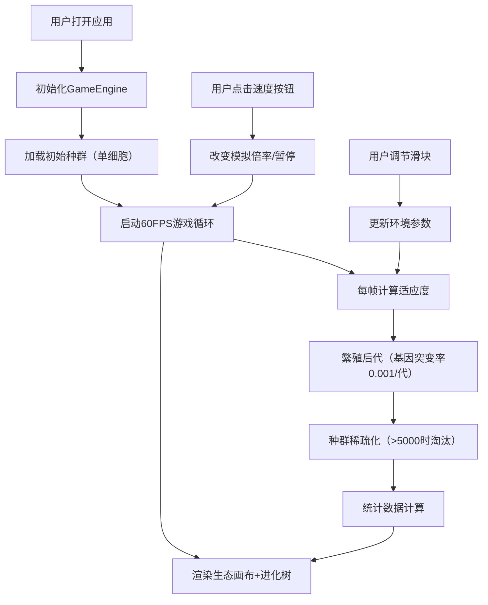

## 1. 产品概述
物种进化模拟器是一款基于地质与生物演化主题的养成类浏览器应用，让玩家通过调节环境参数（温度、湿度、辐射）和观察基因变异，推动虚拟生物从单细胞到多细胞的演化进程。
- 目标用户：对生物演化、模拟类游戏感兴趣的玩家；教育场景下的科普演示工具
- 产品价值：以可视化方式直观呈现自然选择、基因突变和物种适应的核心演化机制

## 2. 核心功能

### 2.1 用户角色
| 角色 | 注册方式 | 核心权限 |
|------|----------|----------|
| 玩家 | 无需注册，直接使用 | 调节环境参数、控制模拟速度、观察演化进程 |

### 2.2 功能模块
1. **主画布渲染区**：生态区背景、生物个体可视化、进化树示意图
2. **环境控制面板**：温度/湿度/辐射滑块、数值提示tooltip
3. **模拟控制区**：暂停/播放、加速倍率（1x/2x/5x/10x）、代数/速度显示
4. **统计信息面板**：种群数量、平均体型、平均寿命、基因多样性、演化代数
5. **最强个体展示**：当前代适应度最高个体的DNA片段摘要
6. **进化树可视化**：右下角进化树节点图，展示亲代子代关系

### 2.3 页面详情
| 页面名称 | 模块名称 | 功能描述 |
|----------|----------|----------|
| 主应用页 | 生态画布 | Canvas 2D绘制渐变生态背景、生物个体（圆形/椭圆，颜色随适应度渐变）、鼠标悬停浮窗显示DNA简况 |
| 主应用页 | 进化树区域 | 画布右下角50代以内节点连线图，节点大小随适应度缩放、连线粗细表示基因相似度 |
| 主应用页 | 环境控制 | 三个滑块（温度-10~50°C、湿度0~100%、辐射0~10Sv），拖拽高亮当前值，平滑过渡0.2s |
| 主应用页 | 速度控制 | 暂停/播放切换、四档加速按钮（激活变色反馈#22c55e）、代/秒显示 |
| 主应用页 | 统计面板 | 右侧固定面板，每10代刷新数据，含柱状图（180×30px），可滚动 |
| 主应用页 | 最强个体 | 显示当前代适应度最高个体的基因片段前64个碱基对简写 |

## 3. 核心流程
玩家打开应用后立即自动开始模拟，初始种群从单细胞生物起步。玩家可随时调节环境参数、暂停或加速模拟，观察种群如何通过自然选择和基因突变适应新环境，适应度高的个体存活繁殖率更高，每代产生带变异概率的子代。

## 4. 用户界面设计

### 4.1 设计风格
- **主色调**：深色科技风，背景 #0f172a（深蓝黑渐变），面板半透明毛玻璃 rgba(255,255,255,0.1) + backdrop-filter: blur(12px)
- **文字颜色**：正文 #e2e8f0，强调色 #38bdf8（亮蓝），激活按钮 #22c55e（绿色）
- **圆角阴影**：卡片圆角12px，内边距16px，阴影 0 4px 24px rgba(0,0,0,0.3)
- **字体**：系统无衬线 font-family: -apple-system, sans-serif
- **交互反馈**：hover/active时 transform: scale(1.05)，transition: all 0.2s ease-out

### 4.2 页面设计概述
| 页面名称 | 模块名称 | UI元素 |
|----------|----------|--------|
| 主应用页 | 布局容器 | 三栏布局：左控制面板300px / 中画布自适应 / 右统计面板320px；卡片1px边框rgba(255,255,255,0.2) |
| 主应用页 | 控制面板 | 滑块宽度240px，tooltip实时数值高亮；加速按钮组激活态#22c55e |
| 主应用页 | 画布区域 | 最小高度600px，渐变背景生态区随时间缓慢变色；生物个体大小10-40px |
| 主应用页 | 统计面板 | 柱状图180×30px，可垂直滚动，每10代淡入刷新 |
| 主应用页 | 响应式抽屉 | <1024px：上下抽屉式滑入；<640px：全屏模态+右下角浮动按钮（48px直径）切换 |

### 4.3 响应式设计
- Desktop-first策略，默认>1024px三栏并排
- 1024px断点：控制面板从上方抽屉滑入，统计面板从下方抽屉滑入，画布占满全屏
- 640px断点：所有面板改为全屏覆盖模态，通过右下角浮动圆形按钮（直径48px）切换显示
- 所有触摸操作支持手势：滑块拖拽、面板滑动关闭

### 4.4 Canvas场景指引
- **背景**：多层渐变（绿→蓝的方形生态区块），时间驱动色相缓慢偏移，营造动态环境感
- **生物个体**：圆形/椭圆，尺寸映射体型(10-40px)，颜色映射温度适应度（红→蓝渐变）
- **进化树**：节点树状布局，每代y轴偏移，节点大小映射适应度，连线粗细映射基因相似度
- **鼠标悬停**：生物个体浮窗（毛玻璃卡片）显示DNA简况、适应度、亲代信息
- **性能**：requestAnimationFrame驱动，每帧≤12ms计算，>5000个体自动稀疏化
