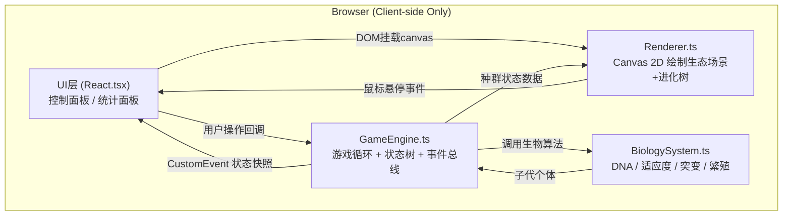
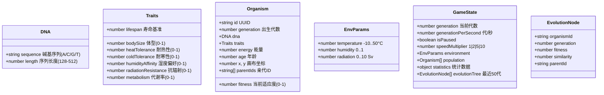

## 1. 架构设计



**调用关系与数据流向**：
1. `App.tsx` 装配 UI 组件，创建 GameEngine 实例，为 Renderer 提供 canvas ref
2. UI 组件（控制面板/统计面板）通过回调函数向 GameEngine 发送用户操作指令（设置环境参数、改变速度等）
3. GameEngine 每帧（固定逻辑帧，可变渲染帧）调用 BiologySystem 计算适应度、突变、繁殖，更新内部种群状态树
4. GameEngine 通过 CustomEvent（`engine:update`）向 UI 层发送状态快照（节流处理，避免React过度渲染）
5. GameEngine 提供公开的种群状态访问方法，Renderer 每帧读取并绘制 canvas
6. Renderer 处理鼠标事件，回调给 UI 显示 DNA 浮窗

---

## 2. 技术栈说明

| 分类 | 技术选型 | 说明 |
|------|----------|------|
| 框架 | React 18 + TypeScript | 函数式组件 + Hooks |
| 构建 | Vite 5.x + @vitejs/plugin-react | 热更新、ESM原生支持 |
| 状态 | 自定义EventTarget + useState/useEffect | 游戏状态集中在GameEngine，UI只订阅必要快照 |
| 渲染 | HTML5 Canvas 2D API | 高性能生态场景绘制 |
| 样式 | 原生 CSS + CSS Variables | 无第三方UI库，主题色统一定义 |
| 严格模式 | tsconfig strict + esModuleInterop | 类型安全 |

**package.json 关键依赖**：
```
react, react-dom, typescript, vite, @vitejs/plugin-react, @types/react, @types/react-dom
```

**启动脚本**：`npm run dev` → `vite`

---

## 3. 目录结构与文件职责

```
.
├── index.html                              入口HTML，挂载div#root，全屏样式
├── package.json                            依赖与脚本
├── vite.config.js                          Vite + React插件配置
├── tsconfig.json                           TypeScript严格模式配置
└── src/
    ├── main.tsx                            React入口（createRoot）
    ├── App.tsx                             主组件：三栏布局 + 引擎生命周期 + 响应式
    ├── types.ts                            共享类型定义（Organism, DNA, EnvParams, GameState）
    ├── BiologySystem.ts                    生物系统（DNA生成、适应度、突变、繁殖）
    ├── GameEngine.ts                       游戏引擎（60FPS循环、状态管理、事件派发）
    ├── Renderer.ts                         Canvas渲染（背景、生物、进化树、悬停浮窗）
    ├── components/
    │   ├── ControlPanel.tsx                左栏：环境滑块+速度控制
    │   ├── StatsPanel.tsx                  右栏：统计数据+柱状图+最强个体
    │   ├── OrganismTooltip.tsx             DNA浮窗组件
    │   ├── MobileDrawer.tsx                响应式抽屉/模态容器
    │   └── FloatingToggle.tsx              移动端浮动切换按钮
    └── styles/
        ├── global.css                      全局样式+CSS变量+响应式断点
        └── components.css                  各组件样式类
```

---

## 4. 核心数据模型（types.ts）



---

## 5. 模块核心算法与接口

### 5.1 BiologySystem.ts
| 方法 | 输入 | 输出 | 说明 |
|------|------|------|------|
| `generateInitialDNA()` | - | DNA | 生成128bp随机DNA(A/C/G/T) |
| `decodeDNA(dna)` | DNA | Traits | 将6个基因座映射为生物特质（每21bp窗口GC含量等编码） |
| `calcFitness(traits, env)` | Traits, EnvParams | number 0..1 | 多维度加权：温度匹配×0.35 + 湿度匹配×0.25 + 辐射抵抗×0.2 + 代谢效率×0.2 |
| `mutate(dna, rate=0.001)` | DNA, rate | DNA | 逐碱基概率突变：点突变(70%)/插入(15%)/缺失(15%) |
| `crossover(parentA, parentB)` | DNA, DNA | DNA | 随机单点交叉+基因重组生成子代DNA |
| `calcSimilarity(dnaA, dnaB)` | DNA, DNA | number 0..1 | 碱基对齐匹配率，用于进化树连线粗细 |
| `reproduce(parents, env)` | Organism[] | Organism | 有性繁殖：交叉+突变+解码+坐标继承偏移 |

### 5.2 GameEngine.ts
| 方法/事件 | 类型 | 说明 |
|-----------|------|------|
| `constructor(canvas)` | 构造 | 初始化种群(50个单细胞)、环境参数默认值(温度22°C/湿度50%/辐射0.5Sv) |
| `setEnvironment(params)` | 公开方法 | 设置环境参数，内部平滑过渡目标值 |
| `setSpeed(multiplier)` | 公开方法 | 1/2/5/10倍速或暂停(0) |
| `start() / stop()` | 公开方法 | 启动/停止 rAF 循环 |
| `getState()` | 公开方法 | 返回当前 GameState 快照 |
| `tick(deltaMs)` | 内部 | 固定逻辑步长推进16.67ms，累计到阈值触发1代演化 |
| `evolveGeneration()` | 内部 | 淘汰适应度<中位数×0.5的个体，剩余按适应度加权选择交配繁殖，维持种群规模 |
| `cullIfNeeded()` | 内部 | 种群>5000时随机淘汰10%适应度最低者 |
| `dispatchUpdate()` | 内部 | 派发 CustomEvent('engine:update', {detail: GameState})，UI组件监听 |
| `'engine:update'` | 事件 | 每代或用户操作触发（节流100ms） |

### 5.3 Renderer.ts
| 方法 | 说明 |
|------|------|
| `constructor(canvas, engine)` | 绑定canvas和engine引用，注册mousemove监听 |
| `render(time)` | 每帧入口：清屏→背景→生态网格→生物→进化树→浮窗 |
| `drawBackground(time)` | 渐变绿蓝方块网格，时间驱动色相偏移(+0.002/帧) |
| `drawOrganisms()` | 遍历种群：椭圆/圆，大小=10+traits.bodySize×30，hsl从红(280°)渐变到蓝(200°)映射温度适应 |
| `drawEvolutionTree()` | 右下角280×340px区域：每代y+=6，节点半径=2+fitness×6，连线宽=0.1+similarity×0.9 |
| `handleMouseMove(e)` | 命中检测：计算鼠标与生物圆碰撞，返回最近个体，触发onHover回调 |
| `destroy()` | 移除事件监听 |

---

## 6. UI 组件 Props 接口

```typescript
// ControlPanel.tsx
interface ControlPanelProps {
  engine: GameEngine;
  onEnvironmentChange: (p: Partial<EnvParams>) => void;
  onSpeedChange: (m: 0|1|2|5|10) => void;
  state: GameState;
  collapsed?: boolean;
  onToggleCollapse?: () => void;
}

// StatsPanel.tsx
interface StatsPanelProps {
  state: GameState;
  collapsed?: boolean;
  onToggleCollapse?: () => void;
}

// App.tsx 响应式状态
type LayoutMode = 'desktop' | 'tablet' | 'mobile';
// tablet: 抽屉式(上/下滑入); mobile: 全屏模态
```

---

## 7. 性能与质量保障

| 关注点 | 策略 |
|--------|------|
| 帧率稳定 | requestAnimationFrame + 固定逻辑步长(accumulator模式)，渲染与逻辑解耦 |
| 单帧耗时 | 适应度用for循环+临时变量避免GC，DNA数组复用TypedArray？不，字符串操作足够快 |
| 重绘优化 | Canvas脏区？不，整屏重绘足够快，生物数量>5000时自动稀疏化 |
| React渲染 | engine状态通过节流事件派发，UI组件只订阅必要字段，useMemo缓存派生统计 |
| 类型检查 | TypeScript strict模式，所有核心模块纯函数便于单元测试 |
| 冷启动 | 首屏立即生成50个初始个体，启动循环，不等待网络 |
