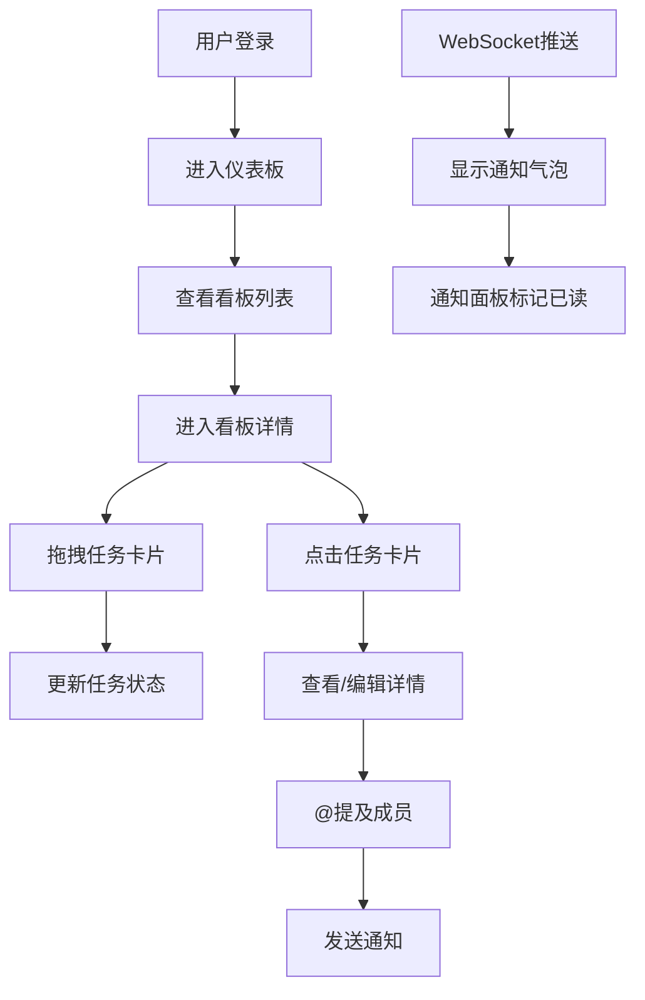

## 1. 产品概述

团队协作任务看板与即时反馈通知应用，帮助团队高效管理项目任务，通过可视化看板和实时通知提升协作效率。

- 主要用途：团队任务管理、进度跟踪、实时协作
- 目标用户：产品团队、开发团队、项目管理团队
- 核心价值：可视化任务流程、实时消息推送、提升团队沟通效率

## 2. 核心功能

### 2.1 用户角色

| 角色 | 登录方式 | 核心权限 |
|------|----------|----------|
| 普通用户 | 用户名登录（无密码） | 创建看板、管理任务、接收通知、@提及成员 |

### 2.2 功能模块

1. **登录页面**：用户登录入口，会话管理
2. **仪表板页面**：展示用户参与的所有看板，数据统计
3. **看板页面**：泳道管理、任务拖拽、实时更新
4. **任务详情**：模态框展示任务信息、评论、@提及
5. **通知系统**：实时推送、通知面板、已读标记

### 2.3 页面详情

| 页面名称 | 模块名称 | 功能描述 |
|----------|----------|----------|
| 登录页面 | 登录表单 | 输入用户名即可登录，后端存储会话 |
| 仪表板页面 | 看板卡片列表 | 展示看板名称、成员头像、最后更新时间、微型柱状图 |
| 看板页面 | 泳道列 | 默认3列：待办、进行中、已完成，显示任务计数 |
| 看板页面 | 任务卡片 | 拖拽排序、跨泳道移动、悬停效果 |
| 任务详情 | 模态框 | 任务标题、描述、负责人、截止时间、评论列表 |
| 任务详情 | @提及功能 | 输入@时弹出成员列表，选中后发送通知 |
| 通知系统 | 通知气泡 | 右下角滑入动画，4秒后自动消失 |
| 通知系统 | 通知面板 | 铃铛图标点击展开，显示最近10条未读通知 |

## 3. 核心流程

用户登录后进入仪表板，查看所有参与的看板。点击看板进入详情页，可以拖拽任务卡片调整状态，点击卡片查看详情并添加评论或@成员。当有新消息时，系统通过WebSocket实时推送通知。

## 4. 用户界面设计

### 4.1 设计风格

- 主色调：浅色主题，背景#f8fafc
- 导航栏：深色#1e293b，文字白色
- 强调色：蓝色#3b82f6（柱状图）、紫色#8b5cf6（@提及）、橙色#f97316（任务分配）
- 卡片：白色背景，圆角8px，内阴影
- 按钮/交互：0.2-0.3秒过渡动画，ease缓动
- 字体：现代无衬线字体，清晰的层级结构

### 4.2 页面设计概述

| 页面名称 | 模块名称 | UI元素 |
|----------|----------|--------|
| 登录页面 | 登录表单 | 居中卡片、输入框、登录按钮、平滑过渡 |
| 仪表板页面 | 看板卡片 | 网格布局、卡片悬停效果、recharts柱状图、成员头像组 |
| 看板页面 | 泳道布局 | 三列等宽flex布局、任务计数badge、卡片拖拽 |
| 看板页面 | 任务卡片 | 白色背景、阴影效果、transform动画、拖拽跟随 |
| 任务详情 | 模态框 | 半透明遮罩rgba(0,0,0,0.3)、宽520px、圆角12px、阴影 |
| 通知系统 | 通知气泡 | 从右滑入、白色背景、左侧彩色条、渐变动画 |
| 通知系统 | 通知面板 | 下拉展开、未读高亮、已读置灰#9ca3af |

### 4.3 响应式设计

- 桌面端（≥768px）：三列等宽泳道布局
- 移动端（<768px）：泳道垂直堆叠，卡片自适应宽度
- 触控优化：拖拽区域放大，点击目标不小于44px

## 5. 性能要求

- 拖拽操作帧率：不低于50fps
- WebSocket消息到UI渲染延迟：小于100ms
- 页面加载：首屏渲染时间<2s
- 动画流畅：所有过渡使用GPU加速（transform、opacity）
