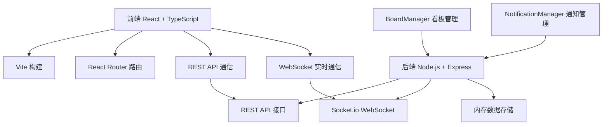
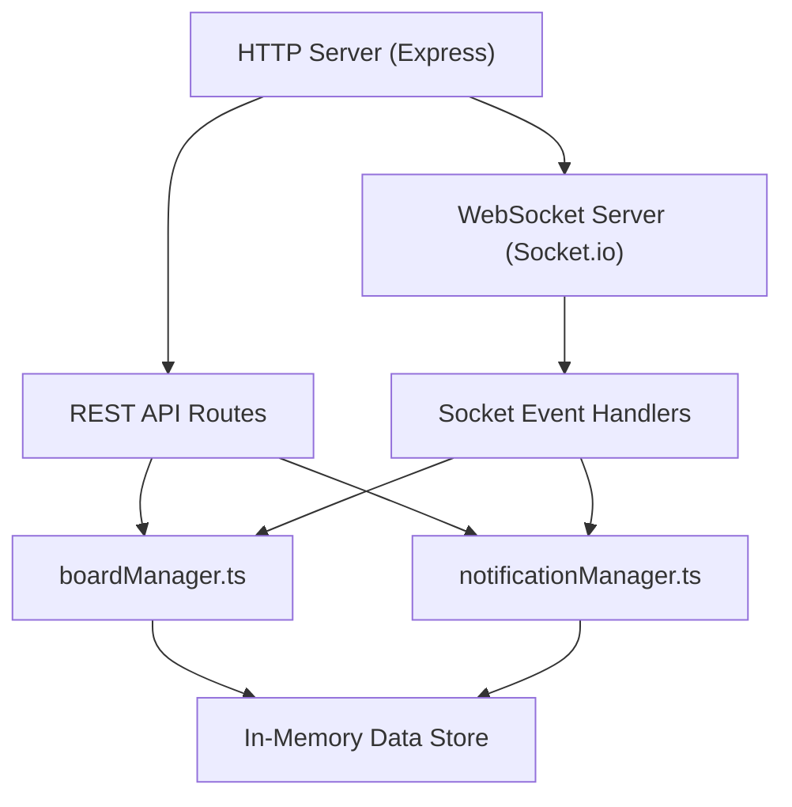
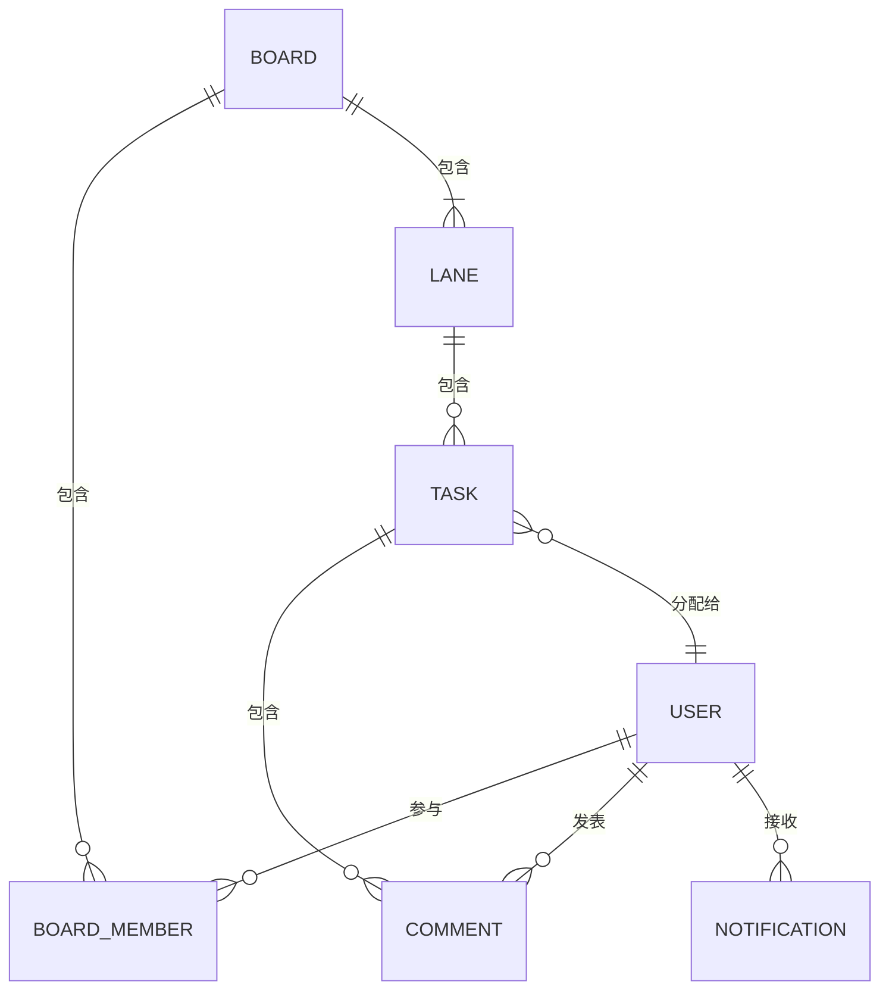

## 1. 架构设计



## 2. 技术描述

- 前端：React 18 + TypeScript + Vite 5
- 路由：react-router-dom 6
- 图表：recharts 2
- 实时通信：socket.io-client
- 后端：Node.js + Express 4 + TypeScript
- WebSocket：socket.io 4
- 状态管理：React Context + useState
- HTTP客户端：fetch API
- 唯一ID：uuid

## 3. 路由定义

| 路由 | 页面组件 | 用途 |
|------|----------|------|
| /login | LoginPage | 用户登录 |
| /dashboard | DashboardPage | 看板列表仪表板 |
| /board/:id | BoardPage | 看板详情页 |

## 4. API 定义

### 4.1 TypeScript 类型定义

```typescript
// 用户
interface User {
  id: string;
  username: string;
  avatar: string;
  online: boolean;
}

// 任务
interface Task {
  id: string;
  title: string;
  description: string;
  assignee: User | null;
  deadline: string | null;
  comments: Comment[];
  laneId: string;
  order: number;
  createdAt: string;
  updatedAt: string;
}

// 评论
interface Comment {
  id: string;
  content: string;
  author: User;
  mentions: string[];
  createdAt: string;
}

// 泳道
interface Lane {
  id: string;
  name: string;
  color: string;
  order: number;
}

// 看板
interface Board {
  id: string;
  name: string;
  members: User[];
  lanes: Lane[];
  tasks: Task[];
  createdAt: string;
  updatedAt: string;
}

// 通知
interface Notification {
  id: string;
  type: 'mention' | 'assignment';
  content: string;
  taskId: string;
  taskTitle: string;
  fromUser: User;
  toUserId: string;
  read: boolean;
  createdAt: string;
}
```

### 4.2 REST API 接口

| 方法 | 路径 | 说明 | 请求体 | 响应 |
|------|------|------|--------|------|
| POST | /api/login | 用户登录 | { username: string } | { user: User, sessionId: string } |
| GET | /api/users | 获取所有用户 | - | User[] |
| GET | /api/boards | 获取用户看板列表 | - | Board[] |
| POST | /api/boards | 创建看板 | { name: string, memberIds: string[] } | Board |
| GET | /api/boards/:id | 获取看板详情 | - | Board |
| PUT | /api/tasks/:id | 更新任务 | Partial<Task> | Task |
| POST | /api/tasks/:id/comments | 添加评论 | { content: string, mentions: string[] } | Task |
| GET | /api/notifications | 获取通知列表 | - | Notification[] |
| PUT | /api/notifications/:id/read | 标记已读 | - | Notification |

### 4.3 WebSocket 事件

| 事件名 | 方向 | 说明 | 数据 |
|--------|------|------|------|
| joinBoard | 客户端→服务端 | 订阅看板 | { boardId: string, userId: string } |
| leaveBoard | 客户端→服务端 | 取消订阅 | { boardId: string, userId: string } |
| taskUpdated | 服务端→客户端 | 任务更新 | Task |
| taskMoved | 服务端→客户端 | 任务移动 | { taskId: string, laneId: string, order: number } |
| notification | 服务端→客户端 | 新通知 | Notification |
| userPresence | 服务端→客户端 | 用户在线状态 | { userId: string, online: boolean } |

## 5. 服务器架构图



## 6. 数据模型

### 6.1 实体关系图



### 6.2 数据结构说明

应用使用内存存储，数据结构如下：

- **users**: Map<string, User> - 存储所有用户
- **boards**: Map<string, Board> - 存储所有看板
- **sessions**: Map<string, string> - 存储会话ID到用户ID映射
- **notifications**: Map<string, Notification[]> - 存储用户通知
- **boardSubscriptions**: Map<string, Set<string>> - 存储看板订阅的Socket ID

### 6.3 初始化数据

系统启动时自动创建以下演示数据：
- 5个测试用户（张三、李四、王五、赵六、钱七）
- 2个演示看板，每个包含3个默认泳道（待办、进行中、已完成）
- 每个看板包含6-8个演示任务，分布在不同泳道
