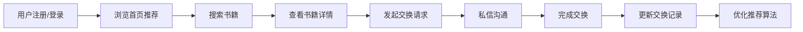

## 1. 产品概述

书换书 - 在线二手书交换与社区推荐平台，让用户可以发布闲置书籍、搜索附近可交换的书籍，并基于阅读偏好获得个性化推荐。

- 主要目的：解决闲置书籍资源浪费问题，通过社区化交换降低阅读成本，促进知识共享
- 目标用户：爱读书、有闲置书籍、希望低成本获取新书的读者群体
- 市场价值：连接书籍供需两端，打造有温度的阅读社区，减少资源浪费

## 2. 核心功能

### 2.1 用户角色

| 角色 | 注册方式 | 核心权限 |
|------|----------|----------|
| 普通用户 | 用户名+密码注册 | 发布书籍、搜索书籍、交换书籍、查看推荐、管理书架 |

### 2.2 功能模块

1. **首页**：个性化推荐、热门书籍、搜索入口、导航栏
2. **搜索页**：书籍搜索、筛选、卡片列表、详情模态框
3. **发布页**：书籍信息填写、封面上传、发布提交
4. **书架页**：个人书籍管理、交换记录、已换出标记
5. **登录/注册页**：用户认证、密码加密、JWT token管理

### 2.3 页面详情

| 页面名称 | 模块名称 | 功能描述 |
|----------|----------|----------|
| 首页 | 推荐模块 | 基于用户历史的个性化推荐（≥5本），横向滚动卡片 |
| 首页 | 热门模块 | 按交换次数排序的热门书籍展示 |
| 搜索页 | 搜索筛选 | 按书名、作者、类别、状态模糊搜索 |
| 搜索页 | 书籍卡片 | 两列网格展示，卡片240×320px，圆角16px |
| 搜索页 | 详情模态框 | 书籍详情、交换按钮、私信功能 |
| 发布页 | 表单模块 | 封面上传、书名、作者、ISBN、类别、状态、交换偏好 |
| 书架页 | 书籍网格 | 三列网格展示用户发布书籍，已交换灰色覆盖 |
| 书架页 | 交换记录 | 最近5条交换记录，时间降序排列 |
| 登录/注册 | 认证模块 | 用户名密码注册登录，bcrypt加密，JWT鉴权 |

## 3. 核心流程

用户浏览首页推荐 → 搜索感兴趣的书籍 → 查看书籍详情 → 发起交换请求 → 私信沟通 → 完成交换 → 更新交换记录 → 优化推荐算法

## 4. 用户界面设计

### 4.1 设计风格

- **主色调**：#f59e0b（琥珀色）、#fef3c7（浅琥珀色）
- **背景色**：#fffbeb（暖白色）
- **卡片背景**：白色 + 轻微阴影 `box-shadow: 0 2px 8px rgba(245,158,11,0.1)`
- **字体**：采用温暖友好的无衬线字体，标题16px font-semibold，正文13px
- **按钮风格**：圆角设计，悬停时背景加深0.1 opacity，点击时scale 0.95
- **交互效果**：卡片悬停上移6px，阴影扩大，封面zoom-in 1.05
- **图标风格**：使用lucide-react图标库，统一线性风格

### 4.2 页面设计概述

| 页面名称 | 模块名称 | UI元素 |
|----------|----------|--------|
| 首页 | 导航栏 | 高60px固定定位，logo圆形渐变，搜索框圆角20px，用户头像+通知铃铛 |
| 首页 | 推荐卡片 | 180×240px，横向滚动，滑动动画transition 0.3s |
| 搜索页 | 书籍卡片 | 240×320px，两列网格，封面占60%，底部书名/作者/状态标签 |
| 搜索页 | 状态标签 | 八种颜色对应不同状态 |
| 搜索页 | 详情模态框 | 半透明深色背景rgba(0,0,0,0.4)，内容居中，宽560px，底部弹出动画 |
| 搜索页 | 聊天气泡 | 右侧气泡列表，模拟私信功能 |
| 书架页 | 书籍网格 | 三列网格，已交换书籍灰色覆盖层+"已换出"标记 |
| 通用 | 骨架屏 | 灰条光影扫描效果，1.2秒循环 |
| 通用 | Toast提示 | 轻提示，持续3秒自动消失 |
| 通用 | 滚动条 | 宽6px，背景#fef3c7，滑块#f59e0b，圆角3px |

### 4.3 响应式设计

- **桌面端**（≥768px）：搜索两列网格，推荐横向滚动，聊天气泡在右侧
- **移动端**（<768px）：搜索单列网格，推荐垂直堆叠，聊天气泡移至底部标签页
- **触摸优化**：按钮最小44×44px可点击区域，减少悬停效果依赖

## 5. 性能要求

- 搜索响应时间：<500ms（模拟数据量≤100本）
- 首页推荐渲染：≤1秒（含骨架屏过渡）
- 页面切换：无卡顿，FPS稳定≥50
