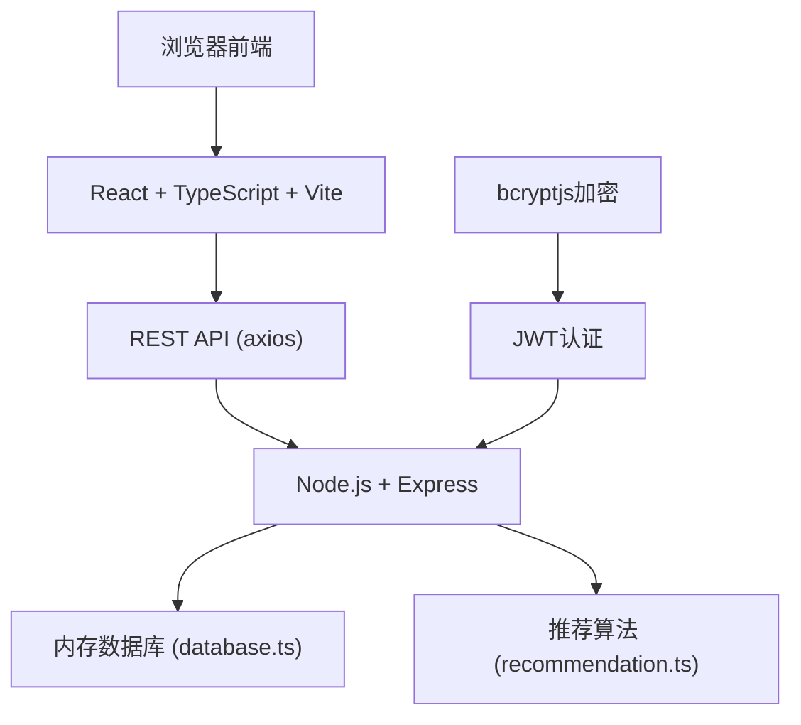
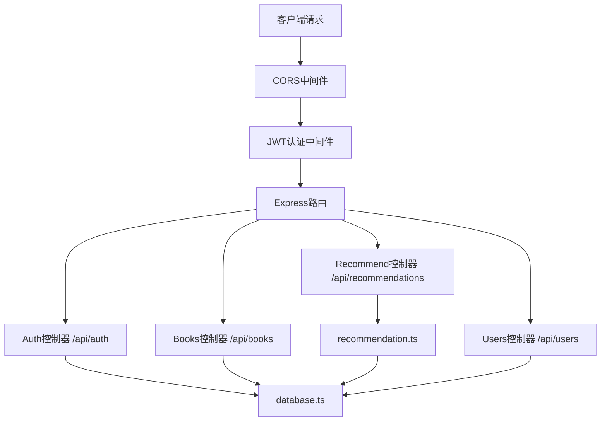
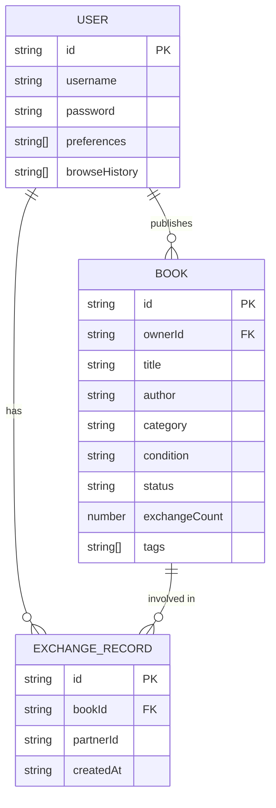

## 1. 架构设计



## 2. 技术描述

- **前端**：React@18 + TypeScript + Vite@5 + react-router-dom@6 + axios + zustand
- **后端**：Node.js + Express@4 + TypeScript
- **认证**：jsonwebtoken + bcryptjs
- **数据存储**：内存对象 + uuid（模拟数据库）
- **构建工具**：Vite，使用 @vitejs/plugin-react

## 3. 目录结构

```
.
├── package.json
├── vite.config.js
├── tsconfig.json
├── index.html
└── src/
    ├── frontend/
    │   ├── App.tsx              # 主路由和全局状态
    │   ├── BookManager.tsx      # 书籍管理模块
    │   ├── RecommendationEngine.tsx  # 推荐引擎
    │   ├── components/          # UI组件
    │   ├── pages/               # 页面组件
    │   ├── hooks/               # 自定义hooks
    │   ├── store/               # zustand状态管理
    │   ├── utils/               # 工具函数
    │   └── types/               # 类型定义
    └── backend/
        ├── server.ts            # Express服务器
        ├── database.ts          # 模拟数据库
        └── recommendation.ts    # 推荐算法
```

## 4. 路由定义

| 路由 | 页面 | 用途 |
|------|------|------|
| / | 首页 | 个性化推荐、热门书籍 |
| /search | 搜索页 | 书籍搜索、筛选、交换 |
| /publish | 发布页 | 发布闲置书籍 |
| /bookshelf | 书架页 | 个人书籍管理、交换记录 |
| /login | 登录页 | 用户登录 |
| /register | 注册页 | 用户注册 |

## 5. API 定义

### 5.1 类型定义

```typescript
interface User {
  id: string;
  username: string;
  password: string;
  avatar?: string;
  createdAt: string;
  preferences: string[];
  browseHistory: string[];
  exchangeHistory: ExchangeRecord[];
}

interface Book {
  id: string;
  ownerId: string;
  title: string;
  author: string;
  isbn?: string;
  category: '文学' | '科技' | '生活' | '教育' | '艺术';
  condition: '全新' | '九成新' | '有笔记';
  coverImage: string; // base64
  exchangePreference: string[];
  status: 'available' | 'exchanged';
  exchangeCount: number;
  createdAt: string;
  tags: string[];
}

interface ExchangeRecord {
  id: string;
  bookId: string;
  bookTitle: string;
  partnerId: string;
  partnerName: string;
  createdAt: string;
}

interface Message {
  id: string;
  senderId: string;
  receiverId: string;
  content: string;
  createdAt: string;
}
```

### 5.2 接口定义

| 方法 | 路径 | 描述 | 请求体 | 响应 |
|------|------|------|--------|------|
| POST | /api/auth/register | 用户注册 | {username, password} | {user, token} |
| POST | /api/auth/login | 用户登录 | {username, password} | {user, token} |
| GET | /api/books | 获取书籍列表 | query: {keyword, category, condition} | Book[] |
| POST | /api/books | 发布书籍 | {title, author, ...} | Book |
| GET | /api/books/:id | 获取书籍详情 | - | Book |
| PUT | /api/books/:id/exchange | 发起交换 | {targetUserId} | {success} |
| GET | /api/recommendations | 获取推荐 | - | Book[] |
| GET | /api/users/me | 获取当前用户 | - | User |
| GET | /api/users/books | 获取用户书籍 | - | Book[] |
| GET | /api/users/exchanges | 获取交换记录 | - | ExchangeRecord[] |

## 6. 服务器架构



## 7. 数据模型

### 7.1 ER图



### 7.2 模拟数据库初始化

```typescript
// database.ts - 初始化模拟数据
const mockUsers: User[] = [
  {
    id: uuid(),
    username: 'booklover',
    password: bcrypt.hashSync('123456', 8),
    preferences: ['文学', '艺术'],
    browseHistory: [],
    exchangeHistory: []
  }
];

const mockBooks: Book[] = [
  // 100本模拟书籍数据，涵盖各个类别
];
```

## 8. 推荐算法设计

1. **基于用户偏好**：优先推荐用户偏好类别中的书籍
2. **过滤已交换**：排除用户已交换过的书籍
3. **标签匹配**：计算用户浏览历史标签与书籍标签的相似度
4. **热门兜底**：数据不足时按exchangeCount降序推荐热门书籍
5. **多样性保证**：确保推荐结果覆盖至少3个不同类别
