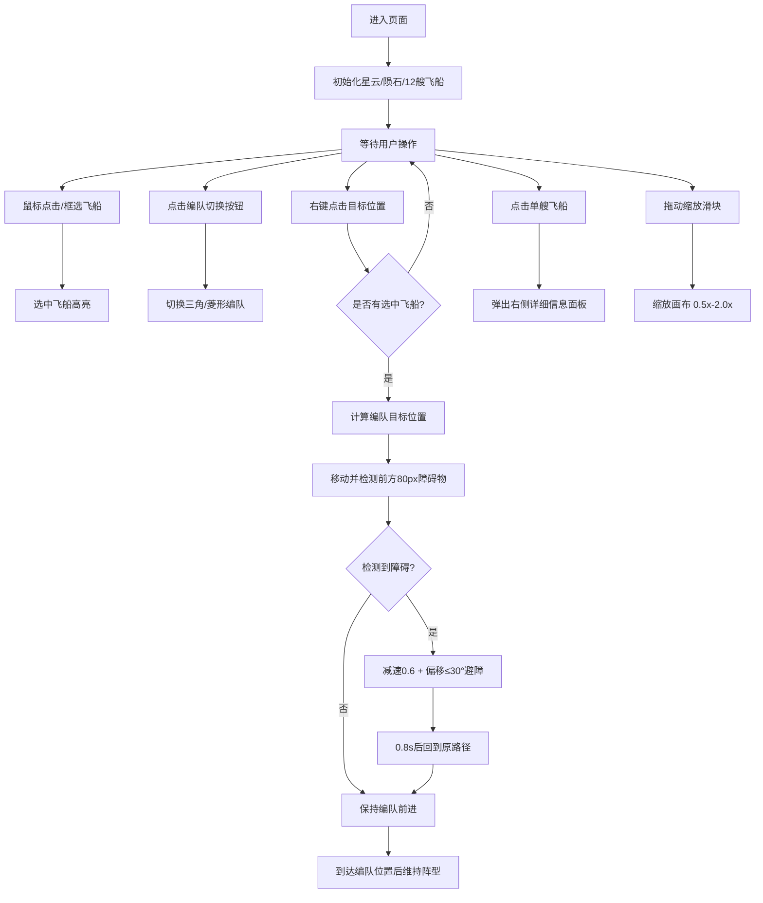

## 1. 产品概述

太空舰队模拟器是一个基于 Canvas 的实时策略模拟应用，解决太空策略游戏中舰队移动生硬、缺乏真实编队逻辑和障碍回避能力的问题。目标用户为太空策略游戏爱好者、游戏开发者和模拟场景演示用户。

该产品通过细腻的编队算法、智能避障系统和沉浸式星云粒子效果，提供高保真的舰队指挥体验，可作为游戏原型、教学演示或交互展示工具使用。

## 2. 核心功能

### 2.1 用户角色
| 角色 | 注册方式 | 核心权限 |
|------|---------|---------|
| 普通用户 | 无需注册，直接使用 | 指挥舰队、切换编队、调整视角、查看飞船详情 |

### 2.2 功能模块
1. **主模拟画布**：星云粒子背景、陨石障碍物、舰队编队移动与碰撞躲避
2. **编队控制系统**：三角/菱形编队切换、鼠标框选/点选、右键移动命令
3. **状态显示系统**：血条/护盾条悬浮显示、飞船详细信息面板、FPS/统计信息控制台
4. **视角控制系统**：右下角缩放滑块（0.5x - 2.0x）

### 2.3 页面详情
| 页面名称 | 模块名称 | 功能描述 |
|---------|---------|---------|
| 主模拟页 | 星云粒子背景 | 300个粒子 sin 波动动画，营造太空氛围 |
| 主模拟页 | 陨石障碍物 | 10-20个随机大小陨石，缓慢旋转，半透明呈现 |
| 主模拟页 | 舰队编队渲染 | 三角形飞船，方向指向移动方向，护盾颜色动态变化 |
| 主模拟页 | 编队切换按钮 | 左下角 40x40px 圆角按钮，三角/菱形切换，0.2s 过渡动画 |
| 主模拟页 | 信息控制台 | 右上角半透明面板，显示选中数量/编队类型/FPS |
| 主模拟页 | 缩放滑块 | 右下角 0.5x-2.0x 缩放控制 |
| 主模拟页 | 飞船详细面板 | 右侧 300px 面板，显示名称/生命/护盾/速度等级/坐标 |
| 主模拟页 | 血条护盾条 | 飞船上方 48px 宽血条（绿→红渐变）+ 4px 护盾条（蓝色） |

## 3. 核心流程

用户打开页面后，画布自动初始化星云背景、陨石障碍物和 12 艘初始飞船。用户可通过鼠标框选或点击选择飞船，在左下角切换编队形状，然后右键点击目标位置，被选中的飞船将以编队形式移动并智能躲避障碍物。点击任意飞船可查看详细属性。

## 4. 用户界面设计

### 4.1 设计风格
- **主背景色**：深空蓝紫色 `#0f172a`
- **文字颜色**：浅灰色 `#e2e8f0`
- **强调色**：蓝紫色 `#6366f1`
- **按钮样式**：圆角矩形，选中态 `#4f46e5`，未选中 `#e2e8f0`，0.2s 颜色渐变
- **字体**：优先使用系统现代无衬线字体，数字使用等宽字体提升科技感
- **布局风格**：全屏 Canvas 为主体，UI 控件悬浮于四角，卡片式圆角面板
- **视觉氛围**：深空科幻风，半透明模糊面板，粒子星云流动感，飞船受伤微闪烁动画

### 4.2 页面设计概述
| 页面名称 | 模块名称 | UI 元素 |
|---------|---------|---------|
| 主模拟页 | 画布主体 | 全屏 Canvas，深空渐变背景，粒子星云流动 |
| 主模拟页 | 飞船渲染 | 等边三角形（边长20px），指向移动方向，护盾>50%用#38bdf8，<50%用#f97316，受伤闪烁#ef4444 0.1s |
| 主模拟页 | 陨石渲染 | 直径40-120px不规则圆，#7c8a9d 半透明，0.02rad/帧旋转 |
| 主模拟页 | 编队切换按钮 | 左下角两个40x40px圆角按钮，三角/菱形图标，0.2s过渡 |
| 主模拟页 | 信息控制台 | 右上角，rgba(15,23,42,0.7)背景，圆角8px，backdrop-filter: blur(4px) |
| 主模拟页 | 缩放滑块 | 右下角，轨道200x6px圆角3px #334155，滑块头直径20px #6366f1 |
| 主模拟页 | 详细信息面板 | 屏幕右侧，宽300px，#1e293b背景，圆角12px |
| 主模拟页 | 选择框 | 鼠标拖动产生虚线矩形框 |

### 4.3 响应式
- Desktop-first 设计，最小支持 1024x768 分辨率
- Canvas 自动适配窗口尺寸变化（resize 事件监听）
- UI 控件位置固定在视口四角，不随缩放变化
- 血条/护盾条尺寸固定像素，不受画布缩放影响

### 4.4 性能指标
- 12艘飞船同时移动+避障：FPS ≥ 50
- 粒子系统 300 个粒子：FPS 下降 ≤ 5
- 四叉树优化碰撞检测，复杂度 O(n log n)
- Float32Array 存储粒子位置/颜色，减少 GC 开销
