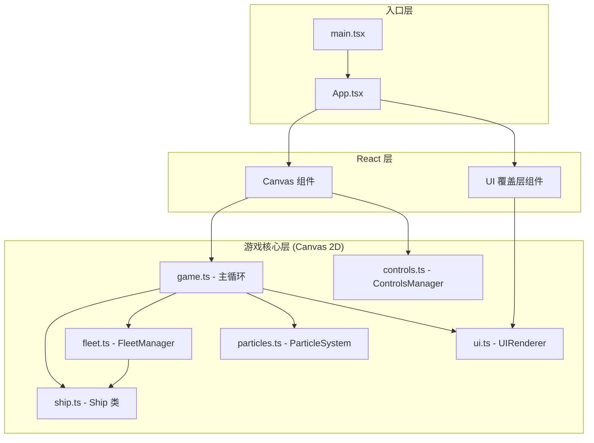

## 1. 架构设计



## 2. 技术描述
- **前端框架**：React@18 + TypeScript
- **构建工具**：Vite@5，build target es2020，sourcemap true
- **渲染引擎**：原生 Canvas 2D API（高性能游戏循环，非 React 组件渲染）
- **状态管理**：Canvas 内部使用类实例状态管理，React 层仅管理 UI 覆盖层状态
- **碰撞优化**：四叉树（Quadtree）空间分区，降低碰撞检测复杂度
- **性能优化**：
  - 粒子数据使用 Float32Array 顺序存储，减少 GC
  - requestAnimationFrame 驱动，deltaTime 归一化运动
  - 惰性矩阵变换，脏标记更新
- **依赖**：react, react-dom, typescript, vite, @types/react, @types/react-dom（无额外 UI 库，纯 Canvas + DOM）

## 3. 路由定义
| 路由 | 用途 |
|------|------|
| / | 主模拟画布（单页应用，无多路由） |

## 4. 核心数据模型

### 4.1 Ship 类
```typescript
class Ship {
  id: string
  name: string
  x: number
  y: number
  vx: number
  vy: number
  targetX: number
  targetY: number
  speed: number = 200
  hp: number = 100
  maxHp: number = 100
  shield: number = 50
  maxShield: number = 50
  shieldRegen: number = 0.5
  formationIndex: number
  selected: boolean
  angle: number
  avoidTimer: number = 0
  avoidAngle: number = 0
  hitFlashTimer: number = 0
  speedLevel: 1|2|3|4|5 = 3

  update(dt: number, obstacles: Obstacle[])
  render(ctx: CanvasRenderingContext2D, scale: number)
  takeDamage(dmg: number)
}
```

### 4.2 Obstacle 接口
```typescript
interface Obstacle {
  x: number
  y: number
  radius: number
  rotation: number
  rotationSpeed: number
  vertices: number[]
}
```

### 4.3 FormationType 枚举
```typescript
enum FormationType {
  TRIANGLE = 'triangle',
  DIAMOND = 'diamond'
}
```

### 4.4 FleetManager 类
```typescript
class FleetManager {
  formationType: FormationType
  spacing: number = 80
  quadtree: Quadtree

  setFormation(type: FormationType)
  computeFormationPositions(centerX: number, centerY: number, count: number): {x:number,y:number}[]
  detectObstaclesAhead(ship: Ship, obstacles: Obstacle[], range: number): Obstacle | null
  computeAvoidancePath(ship: Ship, obstacle: Obstacle): { vx: number, vy: number }
}
```

### 4.5 ParticleSystem 类
```typescript
class ParticleSystem {
  count: number = 300
  positions: Float32Array  // [x0,y0,x1,y1,...]
  baseY: Float32Array      // sin 基准 y
  colors: Float32Array     // [r0,g0,b0,a0,...]
  sizes: Float32Array      // 每个粒子大小
  phases: Float32Array     // sin 相位
  periods: Float32Array    // sin 周期

  init()
  update(dt: number)
  render(ctx: CanvasRenderingContext2D, scale: number)
}
```

## 5. 文件组织

```
auto186/
├── package.json
├── vite.config.js
├── tsconfig.json
├── index.html
└── src/
    ├── main.tsx          # React 入口
    ├── App.tsx           # 主组件，整合 Canvas + DOM UI
    ├── game.ts           # 游戏主循环（update + render）
    ├── fleet.ts          # 编队逻辑 + 四叉树碰撞
    ├── ship.ts           # 飞船实体
    ├── controls.ts       # 输入管理
    ├── ui.ts             # UI 面板 Canvas 渲染
    └── particles.ts      # 星云粒子系统
```

## 6. 关键算法说明

### 6.1 编队位置计算
- **三角形编队**：按行排列，第 n 行容纳 n+1 艘，居中对齐
- **菱形编队**：先增后减，上下对称，形成菱形轮廓
- 目标位置 = 中心 + 偏移量 × spacing

### 6.2 四叉树 (Quadtree)
- 区域划分为 4 个子节点，超过阈值则分裂
- 障碍物插入对应区域节点
- 查询时仅检测重叠区域节点，减少 O(n²) 到 O(n log n)

### 6.3 碰撞躲避算法
```
检测前方80px射线与障碍物圆的相交
→ 命中则：
  - 速度 *= 0.6（减速系数）
  - 速度方向 += ±30°（偏向障碍物外侧，不超过30度）
  - 启动 0.8s 避障计时器（线性插值平滑过渡）
→ 未命中则恢复原编队目标方向
```

### 6.4 平滑运动插值
- 使用 `lerp(current, target, alpha)` 线性插值
- 避障动作：`alpha = 1 - Math.pow(0.001, dt / 0.8)` 近似指数缓动
