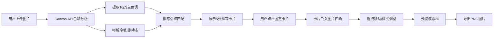

## 1. 产品概述

电影台词与诗句灵感生成器是一款浏览器端Web应用，帮助用户为照片智能匹配贴合意境的经典电影台词和古诗词。用户上传图片后，系统自动分析色彩特征和构图调性，从内置台词库和诗词库中推荐最匹配的内容，支持自定义样式调整后导出为精美图文。

- **核心问题**：手动搜索贴合照片意境的文案费时费力，缺乏灵感启发
- **目标用户**：社交媒体内容创作者、摄影爱好者、社区论坛用户
- **产品价值**：1秒智能分析+一键生成图文，大幅提升内容创作效率

## 2. 核心功能

### 2.1 用户角色
| 角色 | 注册方式 | 核心权限 |
|------|---------|---------|
| 普通用户 | 无需注册，浏览器直接使用 | 上传图片、获取推荐、调整样式、导出图片 |

### 2.2 功能模块
1. **首页（主工作区）**：图片上传区域、分析结果展示、推荐卡片列表、画布编辑器、导出功能

### 2.3 页面详情
| 页面名称 | 模块名称 | 功能描述 |
|---------|---------|----------|
| 首页 | 图片上传区 | 虚线边框拖拽上传，支持JPG/PNG，拖拽高亮蓝色，圆角16px |
| 首页 | 色彩分析面板 | Top3主色调色块展示（图片左上角），暖/冷色调标签，静/动态标签 |
| 首页 | 推荐卡片列表 | 3句台词卡片（白色背景）+ 2句诗句卡片（米黄色背景），水平排列，按匹配度排序 |
| 首页 | 画布编辑器 | 图片显示+已固定卡片，支持拖拽移动、飞入动画、边界限制 |
| 首页 | 样式调节面板 | 浮层弹出，字体大小滑块（12-48px，默认24px）、颜色色盘（6预设色+自定义） |
| 首页 | 导出功能 | 绿色圆形下载按钮、预览模态框、确认下载PNG |

## 3. 核心流程

用户操作主流程：上传图片 → 系统自动分析色彩与构图 → 智能推荐台词/诗句 → 用户点击固定卡片 → 拖拽调整位置/样式 → 预览并导出PNG

## 4. 用户界面设计

### 4.1 设计风格
- **主色调**：柔和蓝灰系（#5b7a99, #7a95b0, #a8bdd1）
- **背景色**：浅灰色（#f5f5f5）
- **卡片色**：台词卡白色、诗句卡米黄色（#faf3e0）
- **按钮色**：导出按钮绿色（#4caf50），悬停加深
- **圆角规范**：上传区20px、卡片12px、面板16px
- **字体**：系统字体栈 -apple-system, BlinkMacSystemFont, "Segoe UI", Roboto, sans-serif
- **布局**：卡片式分层设计，阴影营造层次感
- **动效**：卡片飞入0.3s ease-out，悬停过渡0.2s，拖拽放大1.1倍

### 4.2 页面设计概述
| 页面名称 | 模块名称 | UI元素 |
|---------|---------|--------|
| 首页 | 上传区 | 居中600×400px白色卡片，虚线边框、圆角20px、阴影、居中提示文案 |
| 首页 | 分析标签 | 图片左上角色块组+标签徽章，蓝灰背景白色文字 |
| 首页 | 推荐列表 | 水平滚动容器，5张宽150px卡片，间距16px，阴影+圆角12px |
| 首页 | 画布区域 | 图片为底，卡片absolute定位，支持拖拽，半透明遮罩 |
| 首页 | 调节面板 | 悬浮于画布上方，半透明黑底（rgba(0,0,0,0.7)），圆角16px |
| 首页 | 导出按钮 | 固定右上角，圆形绿色，阴影，下载图标居中 |

### 4.3 响应式设计
- **桌面端（≥1024px）**：上传区宽600px，推荐列表横向排列
- **平板端（768-1023px）**：上传区宽90%，推荐列表可横向滚动
- **手机端（<768px）**：上传区宽95%，推荐列表可横向滚动，触控拖拽优化

### 4.4 性能约束
- 图片分析（色彩提取+构图判断）：≤ 1秒
- 推荐匹配计算：≤ 0.5秒
- 拖拽与导出操作：稳定 60fps
