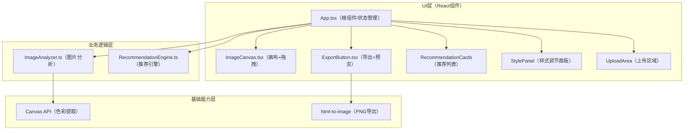

## 1. 架构设计



## 2. 技术选型说明
- **前端框架**：React 18 + TypeScript 5（严格模式）
- **构建工具**：Vite 5 + @vitejs/plugin-react
- **状态管理**：React useState/useReducer（轻量级，无需额外库）
- **图片导出**：html-to-image
- **图标**：lucide-react
- **样式方案**：CSS Modules + 全局CSS变量
- **无需后端**：纯浏览器端运行，所有数据本地处理

## 3. 目录结构

```
src/
├── App.tsx                  # 根组件，全局状态管理
├── main.tsx                 # 应用入口
├── index.css                # 全局样式与CSS变量
├── ImageAnalyzer.ts         # 图片分析模块（色彩+构图）
├── RecommendationEngine.ts  # 推荐引擎（台词库+匹配）
├── types.ts                 # TypeScript类型定义
└── components/
    ├── ImageCanvas.tsx      # 画布组件（图片+已固定卡片）
    ├── ExportButton.tsx     # 导出组件（按钮+预览模态框）
    ├── UploadArea.tsx       # 上传区域组件
    ├── RecommendationList.tsx  # 推荐卡片列表
    └── StylePanel.tsx       # 样式调节面板
```

## 4. 数据模型与类型定义

```typescript
// 图片分析结果
interface ImageAnalysis {
  topColors: string[];      // Top3主色值，十六进制
  isWarm: boolean;          // 暖色调?
  isStatic: boolean;        // 静态构图?
  brightness: number;       // 平均亮度 0-255
  contrast: number;         // 对比度
}

// 推荐条目
interface RecommendationItem {
  id: string;
  type: 'quote' | 'poem';   // 台词 or 诗句
  content: string;          // 内容
  author?: string;          // 出处/作者
  tags: string[];           // 标签：warm/cold, static/dynamic
  matchScore: number;       // 匹配得分（用于排序）
}

// 已固定卡片
interface PinnedCard {
  id: string;
  content: string;
  author?: string;
  type: 'quote' | 'poem';
  x: number;                // 相对图片左上角 X 坐标（px）
  y: number;                // 相对图片左上角 Y 坐标（px）
  fontSize: number;         // 字体大小 px
  color: string;            // 文字颜色
}
```

## 5. 核心模块数据流

### 5.1 图片上传→分析→推荐 流程
```
用户上传 → App.tsx 接收 File → 转 dataURL
  → ImageAnalyzer.analyze(dataURL)
    → Canvas API 像素采样 → 量化聚类 → Top3颜色
    → 计算RGB均值 → 判断冷暖
    → 计算亮度方差 → 判断静/动态
  → 返回 ImageAnalysis
  → RecommendationEngine.recommend(analysis)
    → 匹配标签加权评分 → 排序取前5
  → 返回 RecommendationItem[]
  → App.tsx 更新推荐列表状态
```

### 5.2 卡片固定→拖拽→导出 流程
```
点击"固定" → App.tsx 生成 PinnedCard（随机四角位置）
  → 传入 ImageCanvas 渲染
  → 用户拖拽卡片 → onPositionChange 回调
  → App.tsx 更新坐标
  → 用户点击卡片 → 弹出 StylePanel
  → 调整字体/颜色 → onStyleChange 回调
  → 点击导出 → ExportButton 调用 html-to-image
  → 预览模态框 → 确认下载
```
