## 1. 产品概述
交互式时间轴故事可视化工具，帮助创作者在浏览器中创建、编辑和分享多线叙事的时间轴故事。解决现有工具缺乏分支叙事能力和动态内容嵌入的痛点，支持复杂事件的时间交错关系呈现。

- **核心问题**：现有时间轴工具多为线性结构，无法呈现多线叙事；静态排版限制动态内容展示
- **目标用户**：内容创作者、历史研究者、项目管理者、故事讲述者
- **市场价值**：填补交互式多线叙事时间轴工具的空白，提供专业级的故事可视化体验

## 2. 核心功能

### 2.1 用户角色
| 角色 | 注册方式 | 核心权限 |
|------|----------|----------|
| 创作者 | 无需注册（本地存储） | 创建、编辑、导出、分享故事 |
| 浏览者 | 无需注册 | 查看分享的交互式时间轴 |

### 2.2 功能模块
1. **故事列表页**：故事卡片列表、创建新故事、删除故事
2. **时间轴编辑页**：SVG 时间轴渲染、节点/卡片管理、拖拽排序、主题切换
3. **分享只读页**：只读模式查看完整交互时间轴、缩放浏览

### 2.3 页面详情
| 页面名称 | 模块名称 | 功能描述 |
|----------|----------|----------|
| 故事列表页 | 故事列表 | 显示封面缩略图 60x60px、故事名称、创建日期 |
| 故事列表页 | 创建表单 | 输入故事名称、选择主时间轴比例尺（年/月/日） |
| 时间轴编辑页 | 时间轴画布 | SVG 绘制主线（4px 深蓝色 #1a365d 实线）和分支线（3px 虚线，粉色 #d53f8c 或绿色 #38a169） |
| 时间轴编辑页 | 节点管理 | 添加主节点、添加分支节点（自动继承父节点时间）、删除节点 |
| 时间轴编辑页 | 卡片管理 | 每个节点 2-4 个事件卡片（圆角 12px）、主节点卡片默认展开、分支节点卡片默认收缩悬停展开 |
| 时间轴编辑页 | 拖拽排序 | 卡片拖拽排序、时间自动重排、半透明克隆体、0.2s 弹性回位动画 |
| 时间轴编辑页 | 编辑弹窗 | 毛玻璃背景 12px 模糊、70% 深色遮罩、编辑标题/描述/视频/图片轮播 |
| 时间轴编辑页 | 工具栏 | 添加节点、添加分支、主题切换、导出 JSON、分享按钮（浮动阴影 0 2px 8px rgba(0,0,0,0.1)） |
| 时间轴编辑页 | 主题系统 | 古典羊皮纸、赛博霓虹、极简白三套主题、0.4s 渐变过渡 |
| 分享页 | 只读浏览 | 完整交互体验（点击、展开、缩放）、不可编辑 |

## 3. 核心流程

用户创建故事的主要流程：进入首页 → 点击创建新故事 → 填写名称和比例尺 → 进入编辑页 → 添加时间节点 → 添加事件卡片 → 编辑卡片内容 → 拖拽调整顺序 → 切换主题预览 → 导出或分享。

```mermaid
flowchart LR
    A["进入首页"] --> B["查看故事列表"]
    B --> C["点击创建新故事"]
    C --> D["填写故事信息<br/>名称+比例尺"]
    D --> E["进入时间轴编辑页"]
    E --> F["添加时间节点"]
    F --> G["添加事件卡片"]
    G --> H["双击编辑卡片内容"]
    H --> I["保存卡片"]
    I --> J["拖拽排序调整"]
    J --> K["切换主题预览"]
    K --> L["导出 JSON / 生成分享链接"]
    L --> M["分享给其他用户"]
    M --> N["浏览者访问分享链接<br/>只读查看"]
```

## 4. 界面设计

### 4.1 设计风格
- **整体风格**：卡片式布局，现代简洁与专业质感并重
- **主色调**：根据主题动态切换，默认深蓝 #1a365d 作为品牌色
- **按钮风格**：圆角 8px，悬停有轻微缩放和阴影变化
- **字体**：system-ui 无衬线字体，层级分明（标题 600，正文 400）
- **图标**：lucide-react 线性图标，与文本同色

### 4.2 页面设计概览

| 页面名称 | 模块名称 | UI 元素 |
|----------|----------|----------|
| 故事列表页 | 左侧故事列表 | 垂直排列卡片、封面图 60x60px、悬停高亮、创建按钮固定底部 |
| 故事列表页 | 空状态 | 居中引导文案、大号图标、创建按钮 |
| 时间轴编辑页 | 顶部工具栏 | 固定定位、浮动阴影、按钮组水平排列、主题切换下拉 |
| 时间轴编辑页 | 时间轴区域 | 横向滚动容器、SVG 背景、节点圆形标记、发光阴影动画 |
| 时间轴编辑页 | 事件卡片 | 圆角 12px、阴影层次、展开/收缩动画 0.3s ease-out |
| 时间轴编辑页 | 编辑弹窗 | 毛玻璃 backdrop-filter: blur(12px)、70% 遮罩、表单分区 |
| 分享页 | 时间轴展示 | 与编辑页相同视觉、移除编辑控件、添加分享标识 |

### 4.3 动画与交互
- **卡片展开/收缩**：CSS transform + opacity，0.3s ease-out
- **主题切换**：所有颜色属性 transition 0.4s ease
- **拖拽排序**：半透明克隆体、0.2s 弹性回位（cubic-bezier(0.34, 1.56, 0.64, 1)）
- **分支高亮**：发光阴影动画 box-shadow 脉冲 2s 循环
- **页面切换**：淡入淡出 0.3s

### 4.4 响应式设计
- **桌面端（>768px）**：左侧故事列表侧边栏 + 右侧时间轴编辑区
- **移动端（<768px）**：侧边栏折叠为底部导航标签（图标 + 文字），时间轴改为垂直滚动
- **触摸优化**：增大点击区域（最小 44x44px），长按触发拖拽

## 5. 性能要求
- 拖拽排序帧率 ≥ 50fps
- 卡片展开/收缩动画无卡顿（CSS transform/opacity 驱动）
- 首次加载时间 < 2s
- 时间轴支持至少 50 个节点流畅滚动
