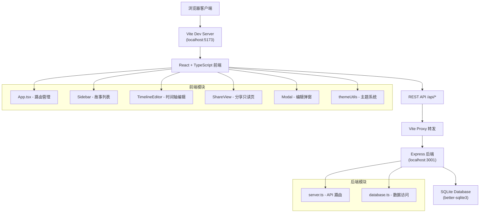
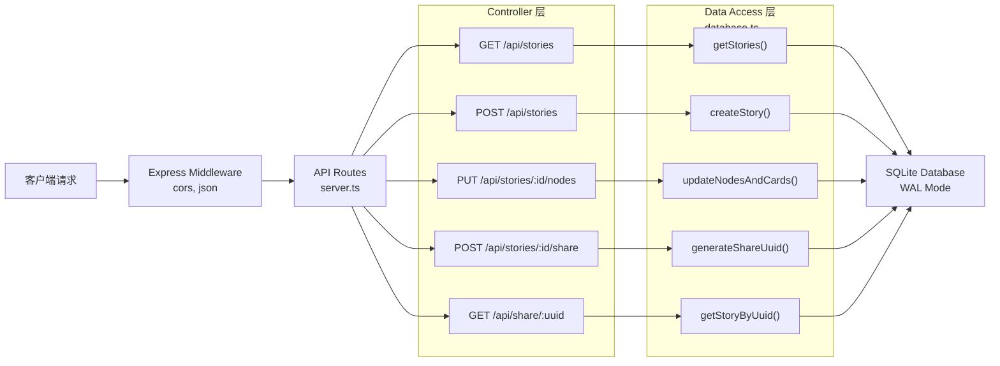
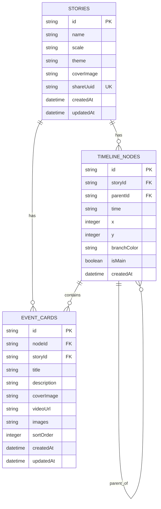

## 1. 架构设计



## 2. 技术栈描述

- **前端框架**：React 18 + TypeScript 5 + Vite 5
- **路由管理**：react-router-dom 6
- **状态管理**：React Hooks (useState, useEffect, useContext)
- **图标库**：lucide-react
- **Markdown 渲染**：marked
- **拖拽排序**：@dnd-kit/core + @dnd-kit/sortable (替代 react-beautiful-dnd，更好的性能和维护)
- **HTTP 客户端**：原生 fetch API
- **后端框架**：Express 4
- **数据库**：SQLite (better-sqlite3)，WAL 模式
- **跨域处理**：cors 中间件
- **UUID 生成**：uuid 库
- **构建工具**：Vite 5，代理 /api 到后端 3001 端口

## 3. 路由定义

| 路由 | 页面组件 | 用途 |
|------|----------|------|
| / | StoryList | 故事列表首页，展示所有故事卡片 |
| /story/:id | TimelineEditor | 时间轴编辑页，可编辑指定故事 |
| /share/:uuid | ShareView | 只读分享页，通过 UUID 访问 |

## 4. API 定义

### 类型定义
```typescript
// 故事
interface Story {
  id: string;
  name: string;
  scale: 'year' | 'month' | 'day';
  theme: 'parchment' | 'cyberpunk' | 'minimal';
  coverImage?: string;
  createdAt: string;
  updatedAt: string;
  shareUuid?: string;
}

// 时间节点
interface TimelineNode {
  id: string;
  storyId: string;
  parentId?: string;
  time: string;
  x: number;
  y: number;
  branchColor?: 'pink' | 'green';
  isMain: boolean;
  createdAt: string;
}

// 事件卡片
interface EventCard {
  id: string;
  nodeId: string;
  storyId: string;
  title: string;
  description: string;
  coverImage?: string;
  videoUrl?: string;
  images: string[];
  sortOrder: number;
  createdAt: string;
  updatedAt: string;
}

// 主题配置
interface Theme {
  name: string;
  bg: string;
  bgSecondary: string;
  text: string;
  textSecondary: string;
  accent: string;
  cardBg: string;
  cardBorder: string;
  timelineMain: string;
  timelineBranchPink: string;
  timelineBranchGreen: string;
}
```

### REST API 端点
| 方法 | 路径 | 描述 | 请求体 | 响应 |
|------|------|------|--------|------|
| GET | /api/stories | 获取所有故事列表 | - | Story[] |
| POST | /api/stories | 创建新故事 | { name: string, scale: 'year'\|'month'\|'day' } | Story |
| GET | /api/stories/:id | 获取单个故事详情 | - | Story |
| PUT | /api/stories/:id | 更新故事信息 | Partial<Story> | Story |
| DELETE | /api/stories/:id | 删除故事 | - | { success: boolean } |
| GET | /api/stories/:id/nodes | 获取故事的所有节点和卡片 | - | { nodes: TimelineNode[], cards: EventCard[] } |
| PUT | /api/stories/:id/nodes | 批量更新节点和卡片 | { nodes: TimelineNode[], cards: EventCard[] } | { success: boolean } |
| POST | /api/stories/:id/share | 生成分享 UUID | - | { uuid: string, shareUrl: string } |
| GET | /api/share/:uuid | 通过 UUID 获取故事数据 | - | { story: Story, nodes: TimelineNode[], cards: EventCard[] } |

## 5. 后端架构图



## 6. 数据模型

### 6.1 数据模型定义 (ER 图)



### 6.2 数据库 DDL

```sql
-- 启用 WAL 模式
PRAGMA journal_mode = WAL;
PRAGMA synchronous = NORMAL;

-- 故事表
CREATE TABLE IF NOT EXISTS stories (
  id TEXT PRIMARY KEY,
  name TEXT NOT NULL,
  scale TEXT NOT NULL CHECK(scale IN ('year', 'month', 'day')),
  theme TEXT NOT NULL DEFAULT 'minimal' CHECK(theme IN ('parchment', 'cyberpunk', 'minimal')),
  coverImage TEXT,
  shareUuid TEXT UNIQUE,
  createdAt TEXT NOT NULL DEFAULT CURRENT_TIMESTAMP,
  updatedAt TEXT NOT NULL DEFAULT CURRENT_TIMESTAMP
);

-- 时间节点表
CREATE TABLE IF NOT EXISTS timeline_nodes (
  id TEXT PRIMARY KEY,
  storyId TEXT NOT NULL REFERENCES stories(id) ON DELETE CASCADE,
  parentId TEXT REFERENCES timeline_nodes(id) ON DELETE CASCADE,
  time TEXT NOT NULL,
  x INTEGER NOT NULL DEFAULT 0,
  y INTEGER NOT NULL DEFAULT 0,
  branchColor TEXT CHECK(branchColor IN ('pink', 'green')),
  isMain INTEGER NOT NULL DEFAULT 1,
  createdAt TEXT NOT NULL DEFAULT CURRENT_TIMESTAMP,
  FOREIGN KEY (storyId) REFERENCES stories(id) ON DELETE CASCADE
);

-- 事件卡片表
CREATE TABLE IF NOT EXISTS event_cards (
  id TEXT PRIMARY KEY,
  nodeId TEXT NOT NULL REFERENCES timeline_nodes(id) ON DELETE CASCADE,
  storyId TEXT NOT NULL REFERENCES stories(id) ON DELETE CASCADE,
  title TEXT NOT NULL,
  description TEXT NOT NULL DEFAULT '',
  coverImage TEXT,
  videoUrl TEXT,
  images TEXT NOT NULL DEFAULT '[]',
  sortOrder INTEGER NOT NULL DEFAULT 0,
  createdAt TEXT NOT NULL DEFAULT CURRENT_TIMESTAMP,
  updatedAt TEXT NOT NULL DEFAULT CURRENT_TIMESTAMP
);

-- 索引
CREATE INDEX IF NOT EXISTS idx_nodes_storyId ON timeline_nodes(storyId);
CREATE INDEX IF NOT EXISTS idx_cards_nodeId ON event_cards(nodeId);
CREATE INDEX IF NOT EXISTS idx_cards_storyId ON event_cards(storyId);
CREATE INDEX IF NOT EXISTS idx_stories_shareUuid ON stories(shareUuid);
```

## 7. 项目结构

```
auto20/
├── .trae/documents/
│   ├── PRD.md
│   └── TECH_ARCH.md
├── server/
│   ├── server.ts          # Express API 服务
│   └── database.ts        # SQLite 数据访问层
├── src/
│   ├── components/
│   │   ├── Sidebar.tsx        # 左侧故事列表
│   │   ├── TimelineEditor.tsx # 时间轴编辑核心组件
│   │   ├── ShareView.tsx      # 分享只读页
│   │   ├── Modal.tsx          # 编辑弹窗
│   │   ├── EventCard.tsx      # 事件卡片组件
│   │   ├── TimelineCanvas.tsx # SVG 时间轴渲染
│   │   └── Toolbar.tsx        # 顶部工具栏
│   ├── pages/
│   │   └── StoryList.tsx      # 故事列表页
│   ├── utils/
│   │   ├── themeUtils.ts      # 主题配置和切换
│   │   ├── api.ts             # API 调用封装
│   │   └── timeUtils.ts       # 时间轴比例尺计算
│   ├── types/
│   │   └── index.ts           # 全局类型定义
│   ├── App.tsx                # 主应用和路由
│   ├── main.tsx               # 入口文件
│   └── index.css              # 全局样式和 CSS 变量
├── package.json
├── vite.config.js
├── tsconfig.json
└── index.html
```

## 8. 前端状态管理

- **App 层**：管理当前故事 ID、故事列表数据、路由切换
- **TimelineEditor 层**：管理节点和卡片数据、拖拽状态、编辑弹窗状态、当前主题
- **Context**：使用 ThemeContext 提供主题数据给所有子组件
- **性能优化**：
  - 使用 React.memo 优化卡片渲染
  - 拖拽使用 CSS transform 而非 DOM 重排
  - 时间轴 SVG 使用 useRef 避免不必要的重绘
