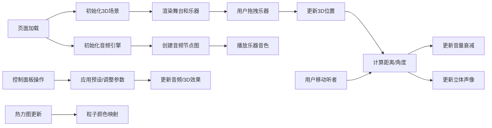

## 1. 产品概述

基于空间音频定位的虚拟乐器合奏模拟器，让用户在浏览器中体验交响乐团不同乐器在三维空间中的声源定位效果，帮助音乐教育者或音频爱好者直观理解立体声定位和声场分布。

- **目标用户**：音乐教育工作者、音频工程师、音乐爱好者、学生
- **核心价值**：通过可视化3D交互和空间音频技术，直观呈现声学定位原理，降低立体声和声场知识的学习门槛

## 2. 核心功能

### 2.1 功能模块

1. **3D舞台场景**：半透明圆形舞台、日落渐变背景、木质纹理地面
2. **空间音频系统**：基于Web Audio API的声源定位、距离衰减、立体声像、卷积混响
3. **乐器交互系统**：6种可拖拽乐器图标、拖尾光晕、弹性缓冲动画
4. **听者定位系统**：可移动听者点、平滑过渡动画、实时重新计算音频参数
5. **声场热力图**：500个粒子实时显示音量分布、蓝红渐变色彩映射
6. **控制面板**：预设布局、全局音量、混响强度、重置功能

### 2.2 页面详情

| 页面名称 | 模块名称 | 功能描述 |
|----------|----------|----------|
| 主页面 | 3D舞台场景 | 半径8单位半透明圆形舞台，暖橙到深红日落渐变背景，木质褐色纹理地面 |
| 主页面 | 乐器交互 | 6种乐器（小提琴、大提琴、长笛、小号、钢琴、定音鼓）可拖拽，拖拽时有淡黄色拖尾光晕和0.3秒弹性缓冲，到位后播放对应MIDI音阶 |
| 主页面 | 听者定位 | 舞台中心金色脉冲小圆点（发光半径0.5单位），点击舞台任意位置0.5秒平滑移动，实时更新所有乐器音量和声像 |
| 主页面 | 声场热力图 | 500个粒子Points材质，颜色根据叠加音量从蓝(-40dB)到红(0dB)渐变，每秒更新，0.2秒淡入过渡 |
| 主页面 | 控制面板 | 右侧280px宽度磨砂玻璃面板，包含预设布局按钮、全局音量滑条(-20到0dB)、混响强度滑条(0-100%)、重置按钮 |

## 3. 核心流程

用户打开页面 → 3D舞台和乐器渲染完成 → 音频上下文初始化 → 用户拖拽乐器到舞台任意位置 → 乐器播放对应音色 → 实时计算距离衰减和声像定位 → 用户可移动听者位置 → 声场热力图实时更新 → 通过控制面板调整参数或应用预设布局

## 4. 用户界面设计

### 4.1 设计风格

- **色彩系统**：深色主题，背景#1a1a2e，控件#16213e，文字#e0e0e0，高亮#e94560，滑块渐变#0f3460→#e94560
- **视觉效果**：磨砂玻璃面板（backdrop-filter: blur），日落渐变背景，金色发光听者点，乐器拖尾光晕
- **字体**：使用Inter字体，标题16px加粗，正文14px，标签12px
- **交互反馈**：按钮点击0.15秒缩放动画，滑块渐变填充，click高频脉冲音效
- **圆角规范**：所有控件边框圆角12px

### 4.2 页面设计概览

| 页面名称 | 模块名称 | UI元素 |
|----------|----------|--------|
| 主页面 | 3D舞台 | 居中圆形舞台（半径8单位），木质纹理地面，半透明边缘，日落径向渐变背景 |
| 主页面 | 乐器图标 | 彩色球体+2D乐器图标叠加，每种乐器独特颜色：小提琴(#ff6b6b)、大提琴(#ee5a24)、长笛(#48dbfb)、小号(#feca57)、钢琴(#c8d6e5)、定音鼓(#5f27cd) |
| 主页面 | 听者点 | 金色(#ffd700)脉冲发光圆点，呼吸动画效果 |
| 主页面 | 热力图 | 半透明粒子云，悬浮于舞台上方1-2单位高度 |
| 主页面 | 控制面板 | 右侧贴边280px宽度，半透明磨砂玻璃效果，按钮和滑块垂直排列 |

### 4.3 响应式设计

- **桌面端优先**：控制面板固定右侧280px，3D场景占据剩余空间
- **触控优化**：拖拽区域扩大，确保移动端可操作
- **最小支持宽度**：1024px，低于此宽度显示提示信息

### 4.4 3D场景设计

- **环境**：暖色日落渐变背景（#ff7e5f → #feb47b → #8e2de2），无外部HDRI
- **光照**：AmbientLight(0xffffff, 0.6) + DirectionalLight(0xffffff, 0.8)从45度角照射，PointLight(0xffd700, 1, 20)跟随听者点
- **相机**：PerspectiveCamera(fov=60, aspect=window.innerWidth/(window.innerWidth-280), near=0.1, far=1000)，位置(0, 12, 15)，lookAt(0, 0, 0)
- **后处理**：轻微Bloom效果增强发光，FXAA抗锯齿
- **性能预算**：Draw calls < 50，粒子数500，热力图更新≥30fps

### 4.5 动画规范

- **乐器拖拽**：淡黄色拖尾光晕（TrailRenderer），0.3秒弹性缓动(easeOutElastic(1, .5))
- **听者移动**：0.5秒平滑线性过渡，音量同步渐变避免咔哒声
- **预设布局应用**：乐器依次延迟0.1秒开始移动，贝塞尔曲线路径，总时长0.5秒
- **热力图粒子**：0.2秒淡入过渡(opacity 0→1)，颜色平滑插值
- **按钮交互**：mousedown时scale(0.95)，mouseup时scale(1.05)→scale(1)，总时长0.15秒
