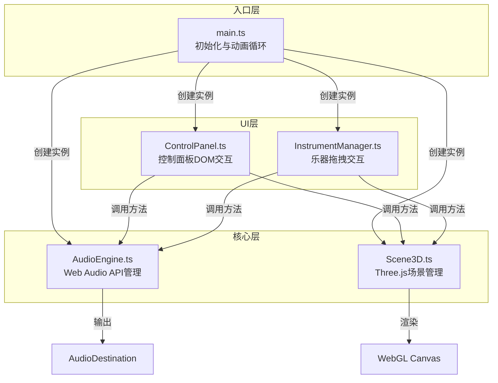
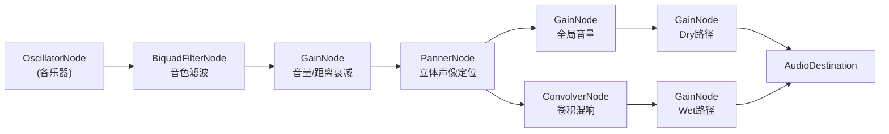

## 1. 架构设计



## 2. 技术描述

- **前端框架**：原生TypeScript + Three.js（无React/Vue，按用户指定架构）
- **构建工具**：Vite 5.x
- **3D引擎**：Three.js 0.160.x
- **音频API**：Web Audio API（原生）
- **编程语言**：TypeScript 5.x（严格模式）

### 核心技术选型理由
1. **Three.js**：成熟的WebGL封装，提供Points粒子系统、3D变换、射线检测等所需功能
2. **Web Audio API**：原生支持PannerNode空间定位、ConvolverNode卷积混响、BiquadFilterNode音色滤波
3. **TypeScript严格模式**：确保类型安全，减少运行时错误
4. **模块化架构**：视音频核心与UI控制分离，符合用户指定的文件结构

## 3. 文件结构定义

```
auto21/
├── package.json
├── vite.config.js
├── tsconfig.json
├── index.html
└── src/
    ├── core/
    │   ├── AudioEngine.ts      # 音频引擎核心
    │   └── Scene3D.ts          # 3D场景核心
    ├── ui/
    │   ├── ControlPanel.ts     # 控制面板UI
    │   └── InstrumentManager.ts # 乐器拖拽管理
    └── main.ts                 # 应用入口
```

### 模块职责说明

| 文件 | 职责 | 对外API |
|------|------|---------|
| `AudioEngine.ts` | 管理AudioContext、音频节点图、MIDI播放、空间音频计算 | `init()`, `playNote()`, `updatePosition()`, `setGlobalVolume()`, `setReverb()`, `setListenerPosition()`, `getVolumeAtPoint()` |
| `Scene3D.ts` | 管理Three.js场景、舞台、相机、灯光、乐器3D对象、热力图粒子 | `init()`, `addInstrument()`, `moveInstrument()`, `updateHeatmap()`, `moveListener()`, `getStagePointFromScreen()`, `render()` |
| `ControlPanel.ts` | 创建DOM控制面板、监听用户交互、调用核心模块方法 | `init()`, `onPresetChange()`, `onVolumeChange()`, `onReverbChange()`, `onReset()` |
| `InstrumentManager.ts` | 监听指针事件、计算3D投影坐标、处理拖拽逻辑 | `init()`, `handlePointerDown()`, `handlePointerMove()`, `handlePointerUp()` |
| `main.ts` | 初始化所有模块、建立跨模块引用、启动requestAnimationFrame循环 | - |

## 4. 数据模型定义

### 4.1 乐器类型定义

```typescript
interface Instrument {
  id: string;
  name: 'violin' | 'cello' | 'flute' | 'trumpet' | 'piano' | 'timpani';
  color: number;
  position: THREE.Vector3;
  midiNotes: number[];
  baseFrequency: number;
  filterType: BiquadFilterType;
  filterFrequency: number;
  filterQ: number;
}

interface InstrumentAudioState {
  oscillator: OscillatorNode;
  gainNode: GainNode;
  pannerNode: PannerNode;
  filterNode: BiquadFilterNode;
  isPlaying: boolean;
}

interface ListenerState {
  position: THREE.Vector3;
  targetPosition: THREE.Vector3;
  isMoving: boolean;
}

interface HeatmapParticle {
  position: THREE.Vector3;
  targetColor: THREE.Color;
  currentColor: THREE.Color;
  fadeInProgress: number;
}
```

### 4.2 预设布局定义

```typescript
interface PresetLayout {
  name: string;
  description: string;
  positions: Record<string, THREE.Vector3>;
}

const PRESET_LAYOUTS: PresetLayout[] = [
  {
    name: '圆形包围',
    description: '乐器围绕听者呈圆形排列',
    positions: { /* 各乐器极坐标位置 */ }
  },
  {
    name: '扇形展开',
    description: '经典交响乐团扇形布局',
    positions: { /* ... */ }
  },
  {
    name: '一字排开',
    description: '乐器沿直线排列',
    positions: { /* ... */ }
  },
  {
    name: '左右声道',
    description: '乐器分置左右两侧',
    positions: { /* ... */ }
  },
  {
    name: '远近层次',
    description: '按音量大小前后排列',
    positions: { /* ... */ }
  }
];
```

## 5. 音频节点图



### 音频处理流程说明
1. **振荡器**：根据乐器类型使用不同波形（sine/sawtooth/square/triangle）
2. **滤波器**：BiquadFilterNode模拟乐器音色特性（lowpass/bandpass/highpass）
3. **距离衰减**：GainNode根据距离线性衰减，最远处-30dB
4. **声像定位**：PannerNode使用equal-power定位算法，角度精度0.5度
5. **混响处理**：ConvolverNode使用8秒脉冲响应，wet/dry比例可调

## 6. 关键技术实现

### 6.1 空间音频计算

```typescript
// 距离衰减计算（线性，最远8单位时-30dB）
function calculateDistanceAttenuation(distance: number, maxDistance: number): number {
  const normalizedDistance = Math.min(distance / maxDistance, 1);
  const attenuationDb = -30 * normalizedDistance;
  return Math.pow(10, attenuationDb / 20);
}

// 立体声像计算（equal-power panning）
function calculateStereoPan(angle: number): { left: number; right: number } {
  const radians = (angle * Math.PI) / 180;
  const left = Math.cos(radians / 2 + Math.PI / 4);
  const right = Math.sin(radians / 2 + Math.PI / 4);
  return { left, right };
}
```

### 6.2 拖拽投影计算

```typescript
// 屏幕坐标投影到舞台平面（y=0.5）
function screenToStage(screenX: number, screenY: number, camera: THREE.Camera, raycaster: THREE.Raycaster): THREE.Vector3 | null {
  const ndc = new THREE.Vector2(
    (screenX / window.innerWidth) * 2 - 1,
    -(screenY / window.innerHeight) * 2 + 1
  );
  raycaster.setFromCamera(ndc, camera);
  const plane = new THREE.Plane(new THREE.Vector3(0, 1, 0), -0.5);
  const point = new THREE.Vector3();
  raycaster.ray.intersectPlane(plane, point);
  return point;
}
```

### 6.3 贝塞尔曲线运动

```typescript
// 三次贝塞尔曲线插值
function bezierInterpolate(p0: THREE.Vector3, p1: THREE.Vector3, p2: THREE.Vector3, p3: THREE.Vector3, t: number): THREE.Vector3 {
  const mt = 1 - t;
  const mt2 = mt * mt;
  const mt3 = mt2 * mt;
  const t2 = t * t;
  const t3 = t2 * t;
  
  return new THREE.Vector3(
    mt3 * p0.x + 3 * mt2 * t * p1.x + 3 * mt * t2 * p2.x + t3 * p3.x,
    mt3 * p0.y + 3 * mt2 * t * p1.y + 3 * mt * t2 * p2.y + t3 * p3.y,
    mt3 * p0.z + 3 * mt2 * t * p1.z + 3 * mt * t2 * p2.z + t3 * p3.z
  );
}
```

### 6.4 脉冲响应生成

```typescript
// 生成8秒指数衰减脉冲响应
function generateImpulseResponse(audioContext: AudioContext, duration: number = 8, decay: number = 2.0): AudioBuffer {
  const sampleRate = audioContext.sampleRate;
  const length = sampleRate * duration;
  const impulse = audioContext.createBuffer(2, length, sampleRate);
  
  for (let channel = 0; channel < 2; channel++) {
    const channelData = impulse.getChannelData(channel);
    for (let i = 0; i < length; i++) {
      const envelope = Math.exp(-i / (sampleRate * decay));
      channelData[i] = (Math.random() * 2 - 1) * envelope;
    }
  }
  
  return impulse;
}
```

## 7. 性能优化策略

1. **热力图更新**：使用BufferGeometry减少draw call，每帧仅更新颜色属性
2. **音频节点复用**：初始化时创建所有音频节点，运行时仅更新参数
3. **射线检测优化**：拖拽时仅对被拖拽物体进行射线检测
4. **requestAnimationFrame**：统一动画循环，避免多次定时器
5. **离屏计算**：热力图音量计算使用TypedArray加速

## 8. 类型安全规范

- 所有模块接口使用TypeScript类型定义
- 启用`strict: true`、`noImplicitAny: true`
- Three.js对象使用具体类型而非`any`
- 音频节点参数使用类型守卫确保有效值范围

## 9. 构建与运行

- **开发命令**：`npm run dev`
- **构建命令**：`npm run build`
- **依赖安装**：`npm install three @types/three typescript vite`
