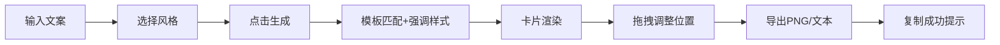

## 1. 产品概述

地摊文学风格文案生成与卡片排版工具，让用户快速生成带有复古印刷质感的短文案卡片，可直接复制分享。

- 主要用途：生成具有复古视觉风格的吸睛文案卡片，用于社交分享、营销推广等场景
- 目标用户：内容创作者、社交媒体运营者、营销人员、普通用户
- 产品价值：降低创意门槛，一键生成具有视觉冲击力的复古风格文案卡片

## 2. 核心功能

### 2.1 用户角色

| 角色 | 注册方式 | 核心权限 |
|------|----------|----------|
| 普通用户 | 无需注册 | 使用全部文案生成、风格切换、卡片导出功能 |

### 2.2 功能模块

1. **主页面**：文案编辑面板、卡片预览区、风格切换、快捷短语
2. **文案生成模块**：模板匹配、随机强调样式、快捷短语填充
3. **卡片渲染模块**：4种复古风格、Canvas/CSS绘制、拖拽交互
4. **导出模块**：PNG图片导出、纯文本复制、复制成功提示

### 2.3 页面详情

| 页面名称 | 模块名称 | 功能描述 |
|----------|----------|----------|
| 主页面 | 文案输入区 | 100字以内文本输入，字数统计，生成按钮 |
| 主页面 | 快捷短语区 | 5个随机短语按钮，点击自动填充并生成 |
| 主页面 | 风格选择区 | 4种复古风格缩略图，点击切换，实时预览 |
| 主页面 | 卡片预览区 | 木质桌面背景，卡片可拖拽，底部操作按钮 |
| 主页面 | 导出功能区 | 复制为PNG图片、复制纯文本按钮 |

## 3. 核心流程

用户在输入框输入文案 → 选择复古风格（可选）→ 点击生成按钮 → 系统匹配模板并添加随机强调样式 → 卡片实时渲染 → 用户可拖拽调整位置 → 点击导出按钮复制图片或文本 → 显示复制成功提示

## 4. 用户界面设计

### 4.1 设计风格

- **主色调**：做旧纸张暖色调 #f5e6c8，木质桌面浅棕色渐变
- **配色方案**：
  - 旧报纸：米黄底 #f5e6c8、黑体、红色报头线 #c41e3a
  - 打字机：米白底 #faf8f0、等宽字体、墨渍纹理
  - 手写体：信纸底 #fff9e6、连笔字体、墨水晕染
  - 江湖告示：黄底 #ffd93d、黑框、手绘装饰、印章
- **按钮样式**：圆角标签，选中时缩放0.95并边框高亮
- **字体选择**：
  - 标题：特殊装饰字体（各风格不同）
  - 正文：黑体、等宽字体、手写字体等
- **布局风格**：左右分栏布局，卡片式设计，阴影和透视效果
- **动效**：按钮hover放大0.2秒过渡，卡片拖拽60fps流畅度

### 4.2 页面设计概述

| 页面名称 | 模块名称 | UI元素 |
|----------|----------|--------|
| 主页面 | 编辑面板 | 宽度320px，阴影细边框，居中对齐，输入框+风格按钮 |
| 主页面 | 预览区域 | 木质桌面背景，卡片居中带透视阴影，最小宽度500px |
| 主页面 | 风格按钮 | 圆角标签排列，选中缩放0.95加边框高亮 |
| 主页面 | 操作按钮 | 卡片下方两个图标按钮，hover放大过渡 |
| 主页面 | 提示浮层 | "已复制"淡入淡出，1.5秒消失 |

### 4.3 响应式

- 桌面端（≥768px）：左右布局，编辑面板320px，预览区自适应
- 移动端（<768px）：上下布局，编辑面板在上，预览区在下宽度100%
- 触摸优化：按钮最小尺寸44px，拖拽支持触摸事件

### 4.4 性能要求

- 文案生成和卡片重绘响应时间 ≤ 200ms
- 卡片拖拽保持 60fps 流畅度
