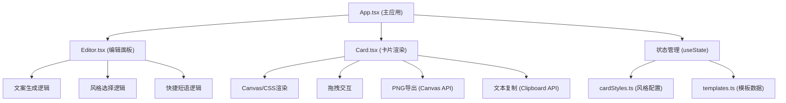

## 1. 架构设计



## 2. 技术描述

- **前端框架**：React 18 + TypeScript 5
- **构建工具**：Vite 5 + @vitejs/plugin-react
- **状态管理**：React useState (轻量级，无需额外状态管理库)
- **样式方案**：CSS Modules + 内联样式 (用于动态风格切换)
- **导出技术**：Canvas API (html2canvas可选，优先原生实现)
- **字体方案**：Web Fonts + 系统字体回退
- **图标库**：lucide-react

## 3. 目录结构

```
├── package.json
├── vite.config.js
├── tsconfig.json
├── index.html
└── src/
    ├── App.tsx              # 主应用组件
    ├── main.tsx             # 入口文件
    ├── index.css            # 全局样式
    ├── components/
    │   ├── Editor.tsx       # 文案编辑面板
    │   └── Card.tsx         # 卡片渲染组件
    ├── styles/
    │   └── cardStyles.ts    # 风格样式配置
    ├── data/
    │   ├── templates.ts     # 20条地摊文学模板
    │   └── phrases.ts       # 30条快捷短语
    └── utils/
        └── generator.ts     # 文案生成工具函数
```

## 4. 核心类型定义

```typescript
// 风格类型
export type CardStyle = 'newspaper' | 'typewriter' | 'handwritten' | 'poster';

// 强调样式类型
export type EmphasisType = 'bold' | 'underline' | 'red';

// 风格配置接口
export interface CardStyleConfig {
  name: string;
  backgroundColor: string;
  titleFont: string;
  contentFont: string;
  titleColor: string;
  contentColor: string;
  accentColor: string;
  borderStyle: string;
  texture: string;
  decorations: Decoration[];
}

// 生成结果接口
export interface GeneratedContent {
  title: string;
  content: string;
  emphasis: EmphasisSpan[];
}

// 强调区间接口
export interface EmphasisSpan {
  start: number;
  end: number;
  type: EmphasisType;
}
```

## 5. 核心模块说明

### 5.1 文案生成模块 (generator.ts)
- `generateContent(input: string): GeneratedContent`
  - 随机选择模板拼接标题和正文
  - 随机添加最多3处强调样式
  - 性能要求：≤ 50ms

### 5.2 卡片渲染模块 (Card.tsx)
- 使用 CSS 变量动态切换风格
- Canvas 绘制纹理和装饰元素
- 拖拽使用 `transform: translate()` 实现，保证60fps
- 导出使用 Canvas API 的 `toDataURL()`

### 5.3 状态管理 (App.tsx)
- `inputText`: 用户输入文案
- `selectedStyle`: 当前选中风格
- `generatedContent`: 生成的文案内容
- `cardPosition`: 卡片拖拽位置
- `showToast`: 复制提示状态

## 6. 性能优化

1. **卡片重绘**：使用 CSS 变量切换风格，避免重渲染
2. **拖拽性能**：使用 `requestAnimationFrame` + `transform`
3. **图片导出**：使用离屏 Canvas，避免阻塞主线程
4. **防抖**：输入框防抖处理，避免频繁生成
