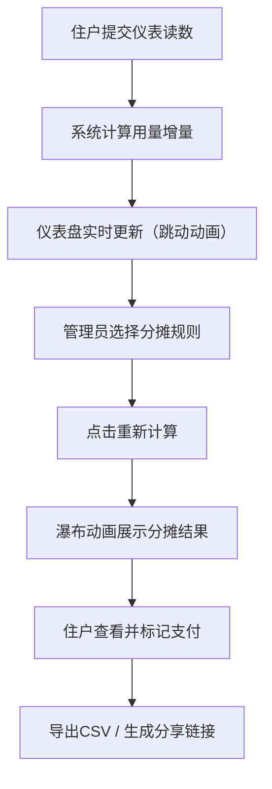
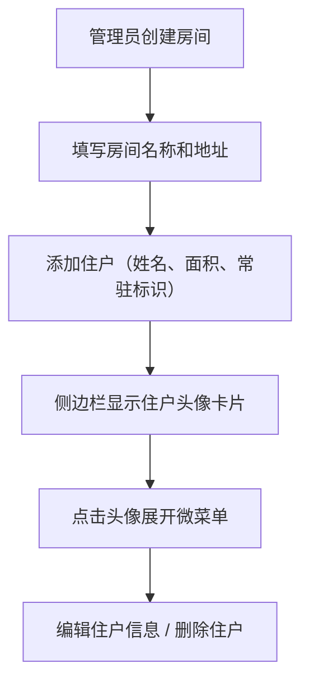

## 1. 产品概述

家庭能源使用记录与智能分摊费用跟踪应用，面向合租社区/公寓住户，解决公共水电燃气费用的记录、计算和分摊难题。通过自动化的仪表抄表、多种分摊规则和清晰的报表展示，消除人工计算错误和住户间的费用争议。

- 目标用户：合租公寓住户、房东/管理员
- 核心价值：将繁琐的分摊计算自动化，提供透明的费用明细，减少住户间的费用纠纷

## 2. 核心功能

### 2.1 用户角色

| 角色 | 注册方式 | 核心权限 |
|------|----------|----------|
| 管理员（房东） | 默认创建 | 创建房间、添加/编辑/删除住户、设置分摊规则、导出账单 |
| 住户 | 由管理员添加 | 提交仪表读数、查看账单明细、标记已支付、导出CSV |

### 2.2 功能模块

1. **仪表盘页面**：本月能源概览卡片（电/燃气/水）、支付状态环形图、最近三次抄表记录
2. **账单详情页面**：选定月份的各项能源消耗数值、分摊规则说明、每户应付金额列表、条形图
3. **抄表记录页面**：仪表读数输入表单、用量增量自动计算、历史记录列表
4. **历史趋势页面**：12个月用量和费用折线图、悬浮数据点详情

### 2.3 页面详情

| 页面名称 | 模块名称 | 功能描述 |
|----------|----------|----------|
| 仪表盘 | 能源概览卡片 | 三列卡片展示电/燃气/水用量、费用预估、同比变化箭头 |
| 仪表盘 | 支付状态环形图 | 展示已支付/未支付住户比例 |
| 仪表盘 | 最近抄表记录 | 最近三次抄表记录列表，点击跳转详情 |
| 账单详情 | 能源消耗表格 | 各项能源消耗数值、单价、小计 |
| 账单详情 | 分摊计算区 | 选择分摊规则、重新计算按钮、瀑布动画展示每户金额 |
| 账单详情 | 条形图 | 每户应付金额条形图，从下往上填充动画 |
| 账单详情 | 导出与分享 | CSV导出按钮、生成只读分享链接（7天有效） |
| 抄表记录 | 读数输入表单 | 电表/燃气表/水表/采暖用量输入，自动计算增量 |
| 抄表记录 | 历史记录 | 历史抄表记录列表，含用量增量 |
| 历史趋势 | 折线图 | 12个月总用量和总费用走势，平滑曲线，悬浮显示详情 |
| 侧边栏 | 住户列表 | 圆角头像卡片（姓名缩写+颜色标签），点击展开编辑/删除菜单 |

## 3. 核心流程

### 抄表与分摊流程

1. 住户在抄表页面输入当前仪表读数（电表、燃气表、水表、采暖用量）
2. 系统自动计算与上次读数的差值，作为本次用量
3. 仪表盘卡片以数字跳动动画（0.3秒）更新最新数据
4. 管理员在账单详情页选择分摊规则（按人头/按面积/按用量）
5. 点击"重新计算"按钮，系统按选定规则计算每户应付金额
6. 分摊结果以瀑布逐行动画（0.5秒）展示，条形图从下往上填充
7. 住户可标记已支付，导出CSV或生成分享链接

### 用户管理流程

## 4. 用户界面设计

### 4.1 设计风格

- 主色调：浅蓝灰（#f0f4f8）背景，深蓝（#1e3a5f）主色，暖橙（#f6ad55）强调色
- 按钮风格：圆角8px，涟漪水波动画（0.2秒），悬停透明度变化10%
- 字体：系统无衬线字体（-apple-system, BlinkMacSystemFont, Segoe UI, sans-serif）
- 布局：桌面端主内容区与侧边栏2:1并排，平板侧边栏折叠抽屉，手机单列堆叠
- 卡片：纯白圆角卡片，浅灰阴影（box-shadow: 0 4px 12px rgba(0,0,0,0.08)），圆角8px
- 图标：lucide-react 图标库

### 4.2 页面设计概述

| 页面名称 | 模块名称 | UI元素 |
|----------|----------|--------|
| 仪表盘 | 能源卡片 | 三列布局，顶部图标+用量数字（跳动动画），底部费用预估+对比箭头（红升绿降） |
| 仪表盘 | 环形图 | Chart.js Doughnut，已支付深蓝/未支付暖橙 |
| 仪表盘 | 抄表记录列表 | 紧凑列表，日期+用量+增量标签 |
| 账单详情 | 分摊表格 | 表格行瀑布动画（0.5秒逐行），条形图从下往上填充 |
| 账单详情 | 导出按钮 | 暖橙按钮+涟漪动画，分享链接带有效期提示 |
| 抄表表单 | 输入框组 | 四组仪表输入，增量实时显示，提交按钮涟漪动画 |
| 历史趋势 | 折线图 | 平滑曲线，悬浮显示数值+环形占比小图 |
| 侧边栏 | 住户卡片 | 圆角头像（名字首字母+纯色背景），点击展开微菜单，从左到右滑入（0.3秒 ease-out） |

### 4.3 响应式设计

- 桌面端（>1024px）：主内容区与侧边栏2:1并排
- 平板端（768-1024px）：侧边栏收缩为可折叠抽屉
- 手机端（<768px）：仪表盘卡片堆叠单列，按钮和输入框放大，侧边栏全屏抽屉

### 4.4 动画规范

- 按钮涟漪：0.2秒水波扩散
- 弹窗/卡片切换：从左到右滑入，0.3秒 ease-out
- 仪表数字更新：0.3秒数字跳动
- 分摊瀑布：0.5秒逐行展示
- 条形图：从下往上填充动画
- 悬停效果：背景色透明度变化10%
