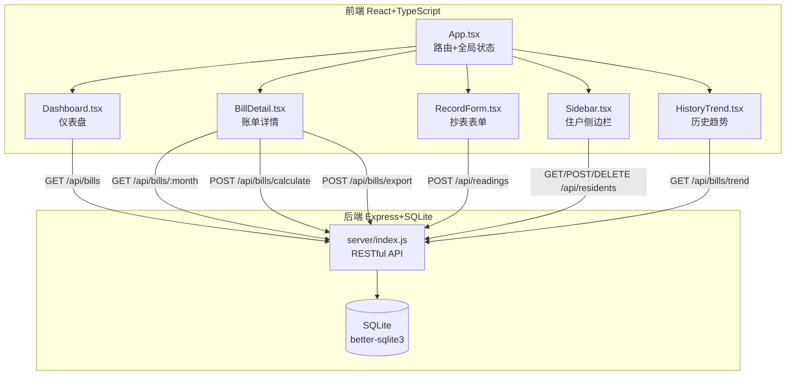
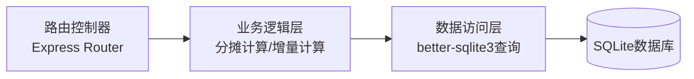
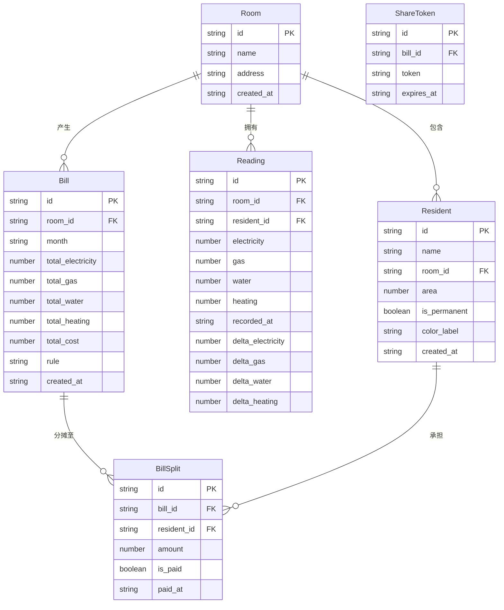

## 1. 架构设计



## 2. 技术说明

- 前端：React 18 + TypeScript + Vite + TailwindCSS + Zustand
- 初始化工具：vite-init（react-express-ts 模板）
- 后端：Express 4 + better-sqlite3
- 数据库：SQLite（文件存储）
- 图表：chart.js + react-chartjs-2
- 日期处理：dayjs
- 图标：lucide-react
- 状态管理：zustand

## 3. 路由定义

| 路由 | 用途 |
|------|------|
| / | 仪表盘页面：能源概览卡片、支付状态环形图、最近抄表记录 |
| /bill/:month | 账单详情页面：指定月份的能源消耗、分摊明细、条形图 |
| /record | 抄表记录页面：仪表读数输入表单、历史记录列表 |
| /history | 历史趋势页面：12个月用量和费用折线图 |
| /share/:token | 只读分享页面：查看当月分摊结果（无需登录） |

## 4. API 定义

### 4.1 住户管理

```typescript
interface Resident {
  id: string;
  name: string;
  room_id: string;
  area: number;
  is_permanent: boolean;
  color_label: string;
  created_at: string;
}

GET    /api/residents           -> Resident[]
POST   /api/residents           -> Resident
PUT    /api/residents/:id       -> Resident
DELETE /api/residents/:id       -> { success: boolean }
```

### 4.2 房间管理

```typescript
interface Room {
  id: string;
  name: string;
  address: string;
  created_at: string;
}

GET    /api/rooms              -> Room[]
POST   /api/rooms              -> Room
PUT    /api/rooms/:id          -> Room
DELETE /api/rooms/:id          -> { success: boolean }
```

### 4.3 抄表记录

```typescript
interface Reading {
  id: string;
  room_id: string;
  resident_id: string;
  electricity: number;
  gas: number;
  water: number;
  heating: number;
  recorded_at: string;
  delta_electricity: number;
  delta_gas: number;
  delta_water: number;
  delta_heating: number;
}

GET    /api/readings            -> Reading[]
GET    /api/readings/latest     -> Reading | null
POST   /api/readings            -> Reading
DELETE /api/readings/:id        -> { success: boolean }
```

### 4.4 账单与分摊

```typescript
interface Bill {
  id: string;
  room_id: string;
  month: string;
  total_electricity: number;
  total_gas: number;
  total_water: number;
  total_heating: number;
  total_cost: number;
  rule: 'per_capita' | 'by_area' | 'by_usage';
  created_at: string;
}

interface BillSplit {
  id: string;
  bill_id: string;
  resident_id: string;
  amount: number;
  is_paid: boolean;
  paid_at: string | null;
}

GET    /api/bills                -> Bill[]
GET    /api/bills/:month         -> Bill & { splits: BillSplit[] }
POST   /api/bills/calculate      -> Bill & { splits: BillSplit[] }
PUT    /api/bills/splits/:id     -> BillSplit（标记已支付）
POST   /api/bills/export/:month  -> CSV文件下载
GET    /api/bills/trend          -> { months: string[], costs: number[], usages: number[] }
POST   /api/share                -> { token: string, expires_at: string }
GET    /api/share/:token         -> Bill & { splits: BillSplit[] }
```

## 5. 服务端架构图



## 6. 数据模型

### 6.1 数据模型定义



### 6.2 数据定义语言

```sql
CREATE TABLE IF NOT EXISTS rooms (
  id TEXT PRIMARY KEY,
  name TEXT NOT NULL,
  address TEXT NOT NULL,
  created_at TEXT NOT NULL DEFAULT (datetime('now'))
);

CREATE TABLE IF NOT EXISTS residents (
  id TEXT PRIMARY KEY,
  name TEXT NOT NULL,
  room_id TEXT NOT NULL REFERENCES rooms(id) ON DELETE CASCADE,
  area REAL NOT NULL DEFAULT 0,
  is_permanent INTEGER NOT NULL DEFAULT 1,
  color_label TEXT NOT NULL DEFAULT '#1e3a5f',
  created_at TEXT NOT NULL DEFAULT (datetime('now'))
);

CREATE TABLE IF NOT EXISTS readings (
  id TEXT PRIMARY KEY,
  room_id TEXT NOT NULL REFERENCES rooms(id) ON DELETE CASCADE,
  resident_id TEXT NOT NULL REFERENCES residents(id) ON DELETE SET NULL,
  electricity REAL NOT NULL DEFAULT 0,
  gas REAL NOT NULL DEFAULT 0,
  water REAL NOT NULL DEFAULT 0,
  heating REAL NOT NULL DEFAULT 0,
  recorded_at TEXT NOT NULL DEFAULT (datetime('now')),
  delta_electricity REAL NOT NULL DEFAULT 0,
  delta_gas REAL NOT NULL DEFAULT 0,
  delta_water REAL NOT NULL DEFAULT 0,
  delta_heating REAL NOT NULL DEFAULT 0
);

CREATE TABLE IF NOT EXISTS bills (
  id TEXT PRIMARY KEY,
  room_id TEXT NOT NULL REFERENCES rooms(id) ON DELETE CASCADE,
  month TEXT NOT NULL,
  total_electricity REAL NOT NULL DEFAULT 0,
  total_gas REAL NOT NULL DEFAULT 0,
  total_water REAL NOT NULL DEFAULT 0,
  total_heating REAL NOT NULL DEFAULT 0,
  total_cost REAL NOT NULL DEFAULT 0,
  rule TEXT NOT NULL DEFAULT 'per_capita',
  created_at TEXT NOT NULL DEFAULT (datetime('now')),
  UNIQUE(room_id, month)
);

CREATE TABLE IF NOT EXISTS bill_splits (
  id TEXT PRIMARY KEY,
  bill_id TEXT NOT NULL REFERENCES bills(id) ON DELETE CASCADE,
  resident_id TEXT NOT NULL REFERENCES residents(id) ON DELETE CASCADE,
  amount REAL NOT NULL DEFAULT 0,
  is_paid INTEGER NOT NULL DEFAULT 0,
  paid_at TEXT
);

CREATE TABLE IF NOT EXISTS share_tokens (
  id TEXT PRIMARY KEY,
  bill_id TEXT NOT NULL REFERENCES bills(id) ON DELETE CASCADE,
  token TEXT NOT NULL UNIQUE,
  expires_at TEXT NOT NULL
);

CREATE INDEX IF NOT EXISTS idx_readings_room ON readings(room_id);
CREATE INDEX IF NOT EXISTS idx_readings_date ON readings(recorded_at);
CREATE INDEX IF NOT EXISTS idx_bills_room_month ON bills(room_id, month);
CREATE INDEX IF NOT EXISTS idx_bill_splits_bill ON bill_splits(bill_id);
CREATE INDEX IF NOT EXISTS idx_share_tokens_token ON share_tokens(token);
```

## 7. 文件结构

```
├── package.json
├── vite.config.ts
├── tsconfig.json
├── tailwind.config.js
├── postcss.config.js
├── index.html
├── src/
│   ├── App.tsx                 # 主应用组件，路由和全局状态
│   ├── main.tsx                # 入口文件
│   ├── index.css               # 全局样式
│   ├── store.ts                # Zustand状态管理
│   ├── types.ts                # TypeScript类型定义
│   ├── utils/
│   │   ├── api.ts              # API调用封装
│   │   └── helpers.ts          # 工具函数（颜色、格式化等）
│   ├── components/
│   │   ├── Dashboard.tsx       # 仪表盘组件
│   │   ├── BillDetail.tsx      # 账单详情组件
│   │   ├── RecordForm.tsx      # 抄表表单组件
│   │   ├── HistoryTrend.tsx    # 历史趋势组件
│   │   ├── Sidebar.tsx         # 侧边栏住户列表
│   │   ├── EnergyCard.tsx      # 能源概览卡片
│   │   ├── SplitTable.tsx      # 分摊明细表格
│   │   └── RippleButton.tsx    # 涟漪按钮组件
│   └── pages/
│       ├── DashboardPage.tsx   # 仪表盘页面
│       ├── BillDetailPage.tsx  # 账单详情页面
│       ├── RecordPage.tsx      # 抄表记录页面
│       ├── HistoryPage.tsx     # 历史趋势页面
│       └── SharePage.tsx       # 分享只读页面
├── api/
│   ├── index.ts                # Express入口，RESTful API
│   ├── db.ts                   # SQLite数据库初始化
│   └── routes/
│       ├── residents.ts        # 住户路由
│       ├── rooms.ts            # 房间路由
│       ├── readings.ts         # 抄表记录路由
│       ├── bills.ts            # 账单路由
│       └── share.ts            # 分享链接路由
└── migrations/
    └── 001_init.sql            # 数据库初始化SQL
```

### 数据流向说明

1. **用户输入 → 前端组件 → API调用 → 后端路由 → SQLite → 返回JSON → 前端更新状态 → UI重渲染**
2. **App.tsx** 管理全局路由（react-router-dom），通过 Zustand store 共享住户列表、账单数据等
3. **Dashboard.tsx** 接收 store 中的账单和读数数据，渲染卡片和图表
4. **BillDetail.tsx** 通过路由参数获取月份，调用 API 获取明细，支持分摊规则切换和重新计算
5. **RecordForm.tsx** 用户输入读数后调用 API 提交，提交成功后触发 store 刷新
6. **Sidebar.tsx** 从 store 获取住户列表，渲染头像卡片，操作后调用 API 并刷新 store
