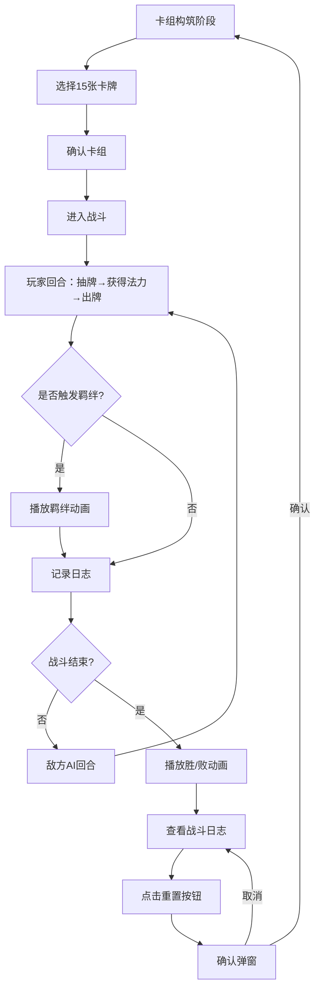

## 1. 产品概述

回合制卡牌对战系统原型验证应用，为卡牌游戏设计者提供脱离游戏引擎的独立前端沙盒，用于快速验证卡牌技能、羁绊关系和战斗数值的核心循环平衡性与趣味性。

- 目标用户：卡牌游戏设计师、游戏策划
- 核心价值：快速原型验证、降低设计成本、直观展示战斗流程

## 2. 核心功能

### 2.1 用户角色

| 角色 | 注册方式 | 核心权限 |
|------|----------|----------|
| 设计者 | 无需注册 | 构筑卡组、模拟战斗、查看日志、重置数据 |

### 2.2 功能模块

1. **卡组构筑模块**：3职业各10张初始卡牌，按职业限制选15张组成卡组
2. **战斗回合模块**：玩家vs敌方AI，回合制战斗，法力值系统，手牌管理
3. **羁绊触发模块**：连续3张同职业卡牌触发职业专属羁绊效果
4. **战斗日志模块**：实时记录行动，战斗结果动画展示
5. **数据重置模块**：清空战斗数据，返回构筑阶段

### 2.3 页面详情

| 页面名称 | 模块名称 | 功能描述 |
|----------|----------|----------|
| 卡组构筑页 | 职业筛选 | 按战士/法师/刺客过滤卡牌列表 |
| 卡组构筑页 | 卡牌展示 | 横向滚动卡牌列表，显示费用/攻击/效果 |
| 卡组构筑页 | 已选卡组 | 高亮边框显示已选卡牌，计数统计，最多15张 |
| 卡组构筑页 | 开始战斗 | 确认卡组后进入战斗场景 |
| 战斗场景页 | 双方状态 | 头像、生命值条、护甲值条展示 |
| 战斗场景页 | 手牌区 | 5张手牌，悬浮上移动效，出牌飞行动画 |
| 战斗场景页 | 法力水晶 | 菱形水晶，当前/最大法力值可视化 |
| 战斗场景页 | 羁绊触发 | 职业图标闪光脉冲动画，文字提示 |
| 战斗场景页 | 操作按钮 | 出牌、结束回合按钮 |
| 战斗场景页 | 日志面板 | 右侧固定280px，毛玻璃效果，逐条滑入 |
| 战斗场景页 | 结果动画 | 胜利金色粒子扩散/失败灰白缩小动画 |
| 全局 | 重置功能 | 红色圆角按钮，0.3秒确认弹窗，淡入效果 |

## 3. 核心流程

用户选择职业并筛选卡牌 → 从30张中选取15张组成卡组 → 开始战斗 → 回合制出牌（玩家→敌方交替） → 触发羁绊效果 → 战斗结束（胜利/失败） → 查看战斗日志 → 重置返回构筑阶段

## 4. 用户界面设计

### 4.1 设计风格

- **主题色**：深色主题，背景 #1a1a2e，卡片底色 #16213e，文字浅灰 #e0e0e0
- **职业色**：战士红、法师蓝、刺客绿
- **按钮样式**：统一8px圆角矩形，悬停缩放1.05倍
- **字体**：现代无衬线字体，清晰易读
- **布局风格**：战斗区居中+右侧日志面板固定布局
- **动效风格**：流畅60fps动画，卡牌飞行0.4秒，羁绊脉冲0.5秒

### 4.2 页面设计概览

| 页面名称 | 模块名称 | UI元素 |
|----------|----------|--------|
| 卡组构筑页 | 卡牌列表 | 横向滚动，卡片悬浮上移15px，阴影加深过渡 |
| 卡组构筑页 | 职业筛选标签 | 三个职业按钮，选中高亮 |
| 卡组构筑页 | 卡组计数器 | 显示已选/总数15 |
| 战斗场景页 | 双方面板 | 圆形头像+职业色边框，生命条绿到红渐变，护甲条蓝色 |
| 战斗场景页 | 手牌区 | 5张扇形/横排排列，悬浮上移，出牌飞向敌方缩小消失 |
| 战斗场景页 | 法力水晶 | 菱形图标，填充色从蓝到紫渐变 |
| 战斗场景页 | 日志面板 | 右侧280px宽，半透明毛玻璃#16213e/80，圆角矩形逐条滑入 |
| 战斗场景页 | 结果动画 | 胜利金色粒子扩散，失败灰白缩小至暗圆点 |

### 4.3 响应式

- 桌面端优先，适配宽度 >= 1024px 屏幕
- 战斗区域自适应居中，日志面板固定右侧
- 最小宽度支持1024px，低于此宽度出现水平滚动

### 4.4 动画与交互

- **卡牌悬浮**：上移15px，阴影加深，0.2秒过渡
- **出牌动画**：卡片飞向敌方，缩小消失，0.4秒
- **羁绊触发**：职业图标缩放脉冲0.5秒，中央闪光+文字提示
- **日志滑入**：逐条滑入，间隔不超过0.2秒
- **按钮悬停**：缩放1.05倍，颜色加深
- **胜利动画**：金色粒子从中心向外扩散
- **失败动画**：屏幕渐变为灰白，缩小至中心暗圆点
- **重置确认**：0.3秒淡入弹窗效果
