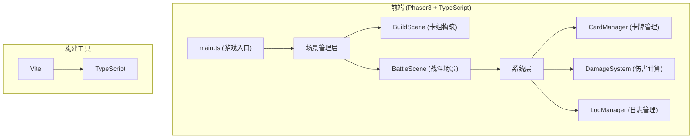

## 1. 架构设计



## 2. 技术描述

- **前端框架**：Phaser 3.x（2D游戏框架）
- **编程语言**：TypeScript（严格模式，target ES2020）
- **构建工具**：Vite 5.x
- **包管理器**：npm
- **运行环境**：浏览器端，无需后端

## 3. 场景与模块定义

| 模块 | 路径 | 职责 |
|------|------|------|
| 游戏入口 | src/main.ts | 初始化Phaser配置，创建Game实例，注册场景 |
| 卡组构筑场景 | src/scenes/BuildScene.ts | 选牌逻辑、UI渲染、卡组构建完成后传递数据 |
| 战斗场景 | src/scenes/BattleScene.ts | 回合流程、手牌出牌、法力值计算、羁绊检测、UI渲染 |
| 卡牌管理系统 | src/systems/CardManager.ts | 30张卡牌静态数据、按职业过滤、随机抽牌 |
| 伤害计算系统 | src/systems/DamageSystem.ts | 攻击力计算、护甲减伤、真实伤害、羁绊加成 |
| 日志管理系统 | src/systems/LogManager.ts | 行动记录存储、添加/清空方法、通知UI刷新 |

## 4. 数据模型

### 4.1 卡牌数据结构

```typescript
interface Card {
  id: string;
  name: string;
  class: 'warrior' | 'mage' | 'assassin';
  cost: number;      // 1-10
  attack: number;    // 0-20
  effect: string;    // 效果描述
  effectType: 'damage' | 'draw' | 'armor' | 'buff' | 'true_damage';
  effectValue: number;
}
```

### 4.2 战斗状态

```typescript
interface BattleState {
  playerHealth: number;
  playerArmor: number;
  playerMana: number;
  playerMaxMana: number;
  playerDeck: Card[];
  playerHand: Card[];
  
  enemyHealth: number;
  enemyArmor: number;
  enemyClass: 'warrior' | 'mage' | 'assassin';
  
  turn: 'player' | 'enemy';
  turnCount: number;
  consecutiveClassCount: number;
  lastClassPlayed: string | null;
  
  gameOver: boolean;
  winner: 'player' | 'enemy' | null;
}
```

### 4.3 日志条目

```typescript
interface LogEntry {
  id: number;
  type: 'play' | 'damage' | 'armor' | 'synergy' | 'turn' | 'result';
  message: string;
  timestamp: number;
}
```

### 4.4 羁绊效果

```typescript
interface SynergyEffect {
  class: 'warrior' | 'mage' | 'assassin';
  name: string;
  description: string;
  // 战士：全队攻击力+2持续一回合
  // 法师：下张牌法力消耗-1
  // 刺客：对敌方造成4点真实伤害
}
```

## 5. 文件组织结构

```
project-root/
├── package.json
├── vite.config.js
├── tsconfig.json
├── index.html
└── src/
    ├── main.ts
    ├── scenes/
    │   ├── BuildScene.ts
    │   └── BattleScene.ts
    └── systems/
        ├── CardManager.ts
        ├── DamageSystem.ts
        └── LogManager.ts
```

## 6. 核心算法与流程

### 6.1 伤害计算流程

1. 基础伤害 = 卡牌攻击力
2. 应用羁绊加成（如战士羁绊+2攻击）
3. 检查是否为真实伤害（无视护甲）
4. 普通伤害：先扣护甲，再扣生命
5. 记录伤害数值到日志

### 6.2 羁绊检测流程

1. 玩家打出卡牌后，检查卡牌职业
2. 若与上一张职业相同，连续计数+1
3. 若不同，重置连续计数为1
4. 当连续计数达到3时，触发对应职业羁绊效果
5. 播放羁绊动画，记录日志
6. 重置连续计数

### 6.3 回合流程

1. 玩家回合开始：
   - 法力值回复（+1，上限10）
   - 抽牌（手牌上限5）
   - 等待玩家操作
2. 玩家出牌：
   - 扣除法力值
   - 执行卡牌效果
   - 检测羁绊
   - 记录日志
3. 结束回合：
   - 切换到敌方回合
4. 敌方AI回合：
   - AI简单策略出牌
   - 执行效果
   - 记录日志
   - 切换回玩家回合

### 6.4 敌方AI策略

- 随机选择可用卡牌（法力值足够）
- 优先打出高费卡牌
- 每回合最多打出合理数量卡牌

## 7. 性能优化

- 使用Phaser3内置渲染器确保60fps动画
- 卡牌对象池复用，减少GC压力
- 日志面板虚拟滚动（如需要）
- 动画使用requestAnimationFrame
- 粒子效果控制粒子数量

## 8. 开发与运行

- 安装依赖：`npm install`
- 开发运行：`npm run dev`
- 生产构建：`npm run build`
