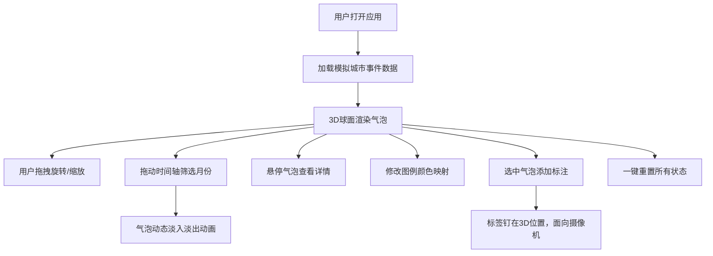

## 1. 产品概述

基于WebGL的3D交互式城市事件数据可视化平台，用于数据新闻和社会调查报道中展示不同城市的人口流动和事件热度随时间的变化趋势。

- 目标用户：数据记者、社会调查设计师、数据分析师
- 核心价值：通过沉浸式3D球面气泡图提供直观的时空数据探索体验，填补静态图表与低交互工具的空白

## 2. 核心功能

### 2.1 功能模块

1. **3D球面气泡场景**：在3D球体上以气泡形式呈现城市事件数据
2. **时间轴过滤**：按月筛选2024年1月至12月的数据，气泡动态淡入淡出
3. **交互悬停**：鼠标悬停显示气泡发光效果和信息卡片
4. **图例与颜色自定义**：5种事件类型对应颜色，可实时修改
5. **标注系统**：在选中气泡位置添加可拖拽的自定义文本标签
6. **一键重置**：重置视角、时间轴和所有标注

### 2.2 页面详情

| 页面名称 | 模块名称 | 功能描述 |
|-----------|-------------|---------------------|
| 主页面 | 3D场景区 | Canvas渲染的3D球面气泡图，支持拖拽旋转、滚轮缩放 |
| 主页面 | 左侧图例面板 | 显示事件类型颜色图例，支持颜色修改、添加标注 |
| 主页面 | 底部时间轴 | 水平滑块按月筛选数据范围，动态更新气泡可见性 |
| 主页面 | 悬停信息卡片 | HTML覆盖层显示气泡详情，跟随3D位置投影 |

## 3. 核心流程

用户打开应用后加载模拟城市数据，在3D球面上查看各城市事件气泡。可通过拖拽旋转视角、滚轮缩放观察细节，拖动底部时间轴按月筛选数据，观察事件随时间的动态变化。悬停气泡查看详细信息，通过左侧图例修改颜色映射，在感兴趣的气泡位置添加自定义标注，最后可一键重置所有状态。

## 4. 用户界面设计

### 4.1 设计风格

- **主背景色**：#0a0a1a（深空灰）
- **气泡颜色**：5种高饱和度纯色 #ff6b6b、#48cae4、#f9ca24、#6c5ce7、#00b894
- **图例面板**：磨砂玻璃效果 rgba(255,255,255,0.08)，1px边框 rgba(255,255,255,0.15)，圆角12px
- **信息卡片**：黑色半透明 rgba(0,0,0,0.8)，圆角8px，白色文字14px
- **时间轴**：轨道6px浅灰，滑块圆形白色带阴影
- **标注标签**：白色半透明圆角背景

### 4.2 页面设计概览

| 页面名称 | 模块名称 | UI元素 |
|-----------|-------------|-------------|
| 主页面 | 3D场景 | 全屏Canvas，半径8单位的球坐标系，气泡Mesh带发光材质 |
| 主页面 | 左侧图例 | 固定定位20px边距，磨砂玻璃面板，颜色圆点+类型名称，颜色选择器，标注输入框 |
| 主页面 | 底部时间轴 | 固定定位底部，水平滑块，月份刻度标签，0.1秒缓动 |
| 主页面 | 悬停卡片 | 绝对定位跟随气泡投影，偏移10px，显示城市名/类型/数量/事件名 |

### 4.3 响应式设计

- 桌面端（≥768px）：左侧固定图例面板，底部时间轴，3D场景自适应
- 移动端（<768px）：侧边栏隐藏，图例转为顶部横向图标栏，主场景填充剩余高度

### 4.4 3D场景指导

- **环境与氛围**：深空背景，微弱环境光+方向光，营造科技感数据可视化氛围
- **光照设置**：AmbientLight强度0.3，DirectionalLight强度0.8，PointLight用于气泡发光效果
- **相机设置**：初始位置(0,0,15)，PerspectiveCamera视场角60°，OrbitControls支持拖拽旋转和滚轮缩放
- **交互与动画**：气泡悬停放大1.2倍+漂浮动画，时间轴切换时0.5秒淡入淡出
- **性能优化**：20个气泡+2个标注帧率≥45fps，使用Geometry复用、材质批量更新
