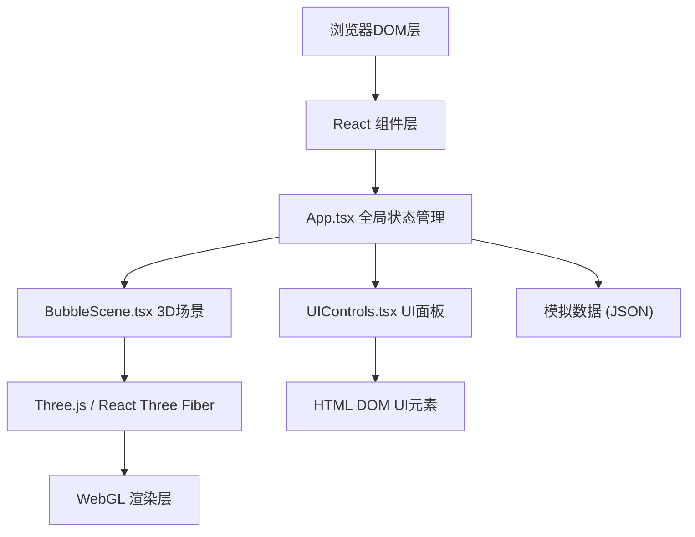
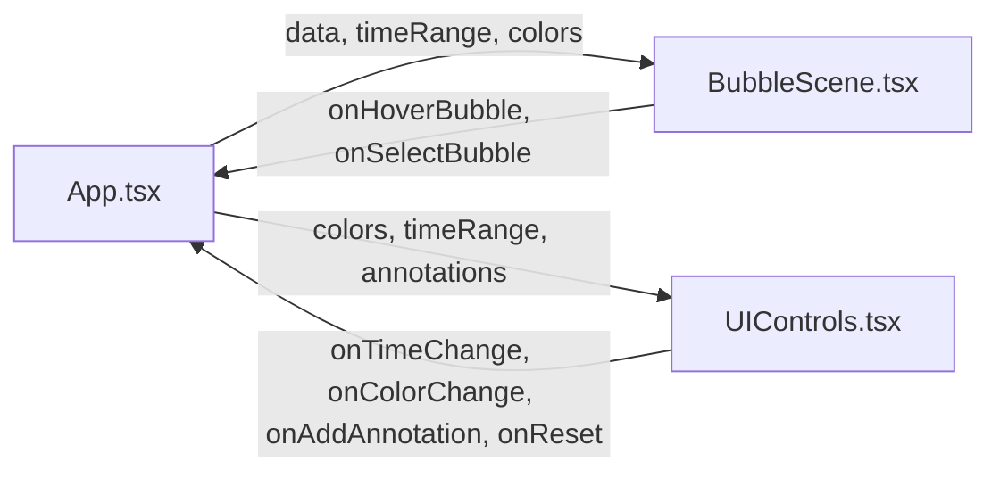

## 1. 架构设计



## 2. 技术描述

- **前端框架**：React@18 + TypeScript@5
- **构建工具**：Vite@5，开发服务器端口3000
- **3D渲染**：Three.js + @react-three/fiber + @react-three/drei
- **样式方案**：内联CSS + CSS Modules（原生style属性）
- **工具库**：uuid（生成标注唯一ID）

## 3. 路由定义

| 路由 | 用途 |
|-------|---------|
| / | 主页面，3D气泡可视化场景 |

## 4. 类型定义

```typescript
// 城市事件数据类型
interface CityEvent {
  id: string;
  cityName: string;
  latitude: number;
  longitude: number;
  population: number;
  eventType: EventType;
  eventCount: number;
  eventName: string;
  timestamp: string; // "2024-MM"
}

// 事件类型枚举
type EventType = 'protest' | 'festival' | 'disaster' | 'economy' | 'traffic';

// 颜色映射
type ColorMap = Record<EventType, string>;

// 标注类型
interface Annotation {
  id: string;
  text: string;
  cityEventId: string;
  position: { x: number; y: number; z: number };
}

// 时间范围
type TimeRange = number; // 0-11 代表 2024-01 到 2024-12
```

## 5. 数据模型

### 5.1 数据流图



### 5.2 文件结构与调用关系

```
project/
├── package.json              # 项目依赖配置
├── vite.config.js            # Vite构建配置（端口3000）
├── tsconfig.json             # TypeScript严格模式配置
├── index.html                # 入口页面（黑色背景，无滚动条）
└── src/
    ├── main.tsx              # React入口
    ├── App.tsx               # 主组件：整合场景+UI，管理全局状态
    │                         # 数据流向：加载JSON → 传给BubbleScene
    │                         #           监听时间轴和标注事件
    ├── BubbleScene.tsx       # 3D场景组件：Canvas + OrbitControls
    │                         # 数据流向：接收App的数据和过滤后的时间范围
    │                         #           → 更新气泡可见性和大小
    ├── UIControls.tsx        # UI面板组件：时间轴+图例+标注
    │                         # 数据流向：用户操作 → 回调App更新状态
    ├── types.ts              # TypeScript类型定义
    ├── mockData.json         # 约20个城市的模拟事件数据
    └── utils/
        └── geoUtils.ts       # 经纬度→3D坐标转换工具
```

### 5.3 核心组件职责

| 组件 | 职责 | 关键Props/State |
|------|------|-----------------|
| App.tsx | 全局状态管理、数据加载、事件协调 | data, timeRange, colorMap, annotations, hoveredBubble |
| BubbleScene.tsx | 3D场景渲染、气泡Mesh管理、悬停交互、投影坐标计算 | data, timeRange, colorMap, onHover, annotations |
| UIControls.tsx | 时间轴滑块、图例面板、标注输入、重置按钮 | colorMap, timeRange, annotations, onTimeChange, onColorChange, onAddAnnotation, onReset |
