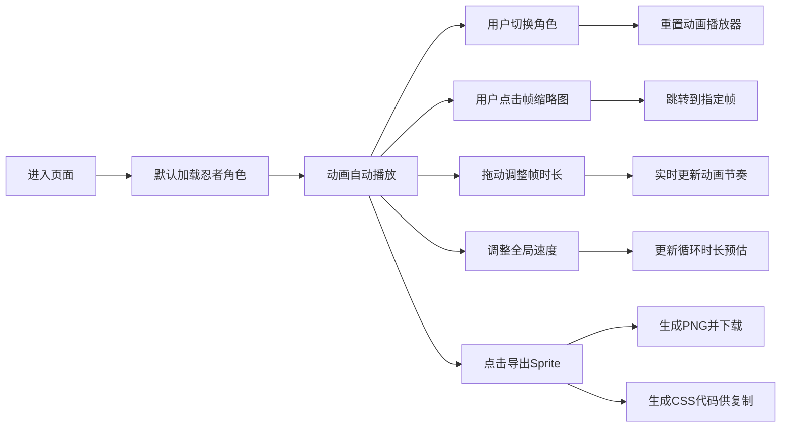

## 1. 产品概述

像素风格角色行走动画帧查看器与序列生成工具，为游戏开发者和像素艺术家提供专业的动画帧编辑、预览与导出能力。

- 核心价值：帮助用户可视化预览像素角色动画，精确调整每帧时长，高效导出游戏可用的Sprite Sheet资源
- 目标用户：独立游戏开发者、像素艺术家、动画设计师

## 2. 核心功能

### 2.1 用户角色

| 角色 | 注册方式 | 核心权限 |
|------|----------|----------|
| 普通用户 | 无需注册 | 使用所有编辑、预览、导出功能 |

### 2.2 功能模块

1. **角色选择**：3个预设角色（忍者、骑士、机器人）切换
2. **动画播放器**：播放/暂停/重置，实时预览动画效果
3. **帧编辑器**：按状态分类展示帧缩略图，支持帧时长调整
4. **速度控制**：全局动画速度倍率调节
5. **Sprite导出**：生成拼接图片与CSS代码

### 2.3 页面详情

| 页面名称 | 模块名称 | 功能描述 |
|----------|----------|----------|
| 主页面 | 角色选择区 | 顶部3个角色卡片，磨砂玻璃效果，点击切换角色 |
| 主页面 | 帧编辑区 | 左侧40%宽度，三行展示idle/walk/run状态帧，支持选中和拖动调整时长 |
| 主页面 | 动画播放区 | 右侧60%宽度，Canvas绘制动画，播放控制按钮，速度滑块 |
| 主页面 | 导出功能区 | Sprite Sheet导出按钮，CSS代码预览与复制 |

## 3. 核心流程

## 4. 用户界面设计

### 4.1 设计风格

- 主色调：深色背景 `#1a202c`，文字 `#e2e8f0`
- 角色强调色：忍者深蓝 `#1a365d`，骑士银灰 `#a0aec0`，机器人亮绿 `#48bb78`
- 选中高亮：亮黄色 `#ffd700`
- 按钮风格：圆角，悬停 `scale(1.03)` 放大，点击 `scale(0.97)` 回弹
- 字体：采用等宽像素风格字体，增强复古游戏氛围
- 布局：卡片式布局，磨砂玻璃效果的角色选择卡

### 4.2 页面设计概述

| 页面名称 | 模块名称 | UI元素 |
|----------|----------|--------|
| 主页面 | 角色选择区 | 3张水平排列卡片，8px圆角，磨砂玻璃效果，选中时边框变色 |
| 主页面 | 帧编辑区 | 三行帧缩略图（32x32像素），间距4px，选中帧亮黄边框，帧淡入动画 |
| 主页面 | 动画播放区 | Canvas棋盘格背景，角色居中绘制，播放/暂停/重置按钮 |
| 主页面 | 速度控制区 | 滑块（0.5x-3x，步进0.1x），实时显示倍率和循环时长 |
| 主页面 | 导出功能区 | "导出Sprite"按钮，textarea显示CSS代码 |

### 4.3 响应式

- 桌面端优先设计，主内容区左右分栏（40% + 60%）
- 触控设备优化帧缩略图点击区域

## 5. 非功能性需求

- 性能：使用 `requestAnimationFrame` 确保60fps流畅播放
- 内存：总内存占用不超过50MB
- 反馈：所有交互元素提供悬停和点击动画反馈
- 兼容性：支持现代浏览器（Chrome、Firefox、Safari、Edge）
