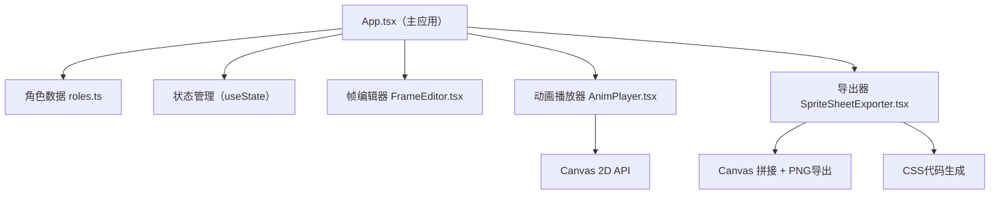

## 1. 架构设计



## 2. 技术描述

- 前端框架：React 18 + TypeScript
- 构建工具：Vite 5
- 状态管理：React useState（轻量级场景，无需额外状态管理库）
- 图形渲染：HTML5 Canvas 2D API
- 导出功能：原生 Canvas API 拼接 + pixel-art-encoder 库辅助
- 样式方案：原生 CSS（按用户要求，不使用Tailwind）

## 3. 类型定义

```typescript
// 像素帧数据 - 32x32 像素数组，每个元素为颜色索引或RGBA值
type PixelFrame = number[][];

// 动画状态
type AnimationState = 'idle' | 'walk' | 'run';

// 单帧配置
interface FrameConfig {
  duration: number; // 停留时间 0.1-1秒
}

// 角色状态动画
interface RoleAnimation {
  frames: PixelFrame[];
  frameConfigs: FrameConfig[];
}

// 角色数据
interface Role {
  id: string;
  name: string;
  primaryColor: string;
  animations: Record<AnimationState, RoleAnimation>;
}

// 播放器状态
interface PlayerState {
  isPlaying: boolean;
  currentState: AnimationState;
  currentFrameIndex: number;
  playbackSpeed: number; // 0.5x - 3x
}
```

## 4. 目录结构

```
e:\solo\SoloAutoDemo\tasks\auto31\
├── package.json
├── vite.config.js
├── tsconfig.json
├── index.html
├── src/
│   ├── App.tsx
│   ├── main.tsx
│   ├── index.css
│   ├── data/
│   │   └── roles.ts
│   └── modules/
│       ├── animation/
│       │   ├── AnimPlayer.tsx
│       │   └── FrameEditor.tsx
│       └── export/
│           └── SpriteSheetExporter.tsx
```

## 5. 核心实现要点

### 5.1 动画播放器（AnimPlayer.tsx）

- 使用 `useRef` 管理 Canvas 和 RAF ID，避免重绘闪烁
- `requestAnimationFrame` 循环，累积时间计算当前帧
- 棋盘格背景绘制：交替绘制 8x8 像素的浅灰和白色方块
- 角色居中绘制：`(canvasWidth - frameWidth) / 2` 计算偏移

### 5.2 帧编辑器（FrameEditor.tsx）

- 水平拖动调整帧时长：`mousedown` 记录起始X，`mousemove` 计算偏移量
- 每帧缩略图使用独立 Canvas 预渲染，提升滚动性能
- CSS `fadeIn` 动画：`opacity: 0 → 1`，时长 0.15 秒

### 5.3 Sprite导出器（SpriteSheetExporter.tsx）

- 垂直拼接规则：每行4帧，按 idle → walk → run 顺序
- 不足4帧用透明像素填充
- CSS代码生成：每个状态的每帧对应一个 `.sprite-{role}-{state}-{index}` 类
- `background-position` 计算公式：`-32 * columnIndex px -32 * rowIndex px`

### 5.4 性能优化

- Canvas 绘制时仅重绘变化区域（dirty rectangle）
- 角色数据使用 `useMemo` 缓存，避免重复计算
- 帧缩略图使用离屏 Canvas 预渲染，复用绘制结果
- 拖动调整时长时使用 `requestAnimationFrame` 节流

## 6. 依赖清单

- `react`: ^18.2.0
- `react-dom`: ^18.2.0
- `typescript`: ^5.3.0
- `vite`: ^5.0.0
- `@vitejs/plugin-react`: ^4.2.0
- `pixel-art-encoder`: ^1.2.0
