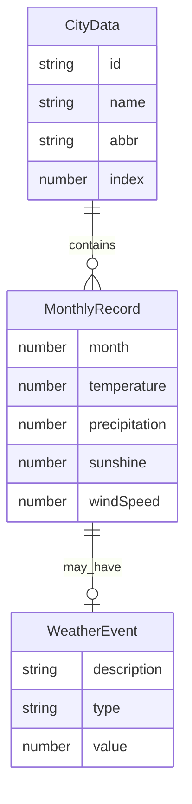

## 1. 架构设计

```mermaid
graph TB
    subgraph "前端层"
        "index.html" --> "main.tsx"
        "main.tsx" --> "App.tsx"
        "App.tsx" --> "ControlPanel.tsx"
        "App.tsx" --> "ClimateScene.tsx"
        "ClimateScene.tsx" --> "CurveRenderer.tsx"
        "ClimateScene.tsx" --> "BarRenderer.tsx"
        "CurveRenderer.tsx" --> "colorUtils.ts"
        "BarRenderer.tsx" --> "colorUtils.ts"
        "CityDataLoader.ts" --> "cities.json"
    end
    subgraph "数据层"
        "cities.json" --> "CityDataLoader.ts"
        "CityDataLoader.ts" --> "DataTypes.ts"
    end
    subgraph "状态管理"
        "App.tsx" --> "Zustand Store"
        "Zustand Store" --> "ControlPanel.tsx"
        "Zustand Store" --> "ClimateScene.tsx"
    end
```

**数据流向**：
1. `cities.json` → `CityDataLoader.ts` 解析为 `CityData[]` → `App.tsx` 存储
2. 用户交互(`ControlPanel.tsx`) → 更新Zustand状态 → `ClimateScene.tsx` 响应
3. `ClimateScene.tsx` 根据模式调用 `CurveRenderer.tsx` 或 `BarRenderer.tsx`
4. 渲染器读取颜色工具 `colorUtils.ts` 和类型定义 `DataTypes.ts`

## 2. 技术说明

- **前端**：React 18 + TypeScript + Vite + Tailwind CSS
- **3D渲染**：Three.js + @react-three/fiber + @react-three/drei + @react-three/postprocessing
- **数据处理**：D3 (d3-scale, d3-shape, d3-interpolate)
- **状态管理**：Zustand
- **构建工具**：Vite
- **后端**：无（纯前端，数据为模拟JSON）
- **数据库**：无（使用本地JSON文件）

## 3. 路由定义

| 路由 | 用途 |
|------|------|
| / | 主场景页，包含3D可视化和控制面板 |

## 4. 文件结构与职责

```
project/
├── package.json                    # 依赖与脚本
├── vite.config.js                  # Vite构建配置
├── tsconfig.json                   # TypeScript配置(严格模式, ES2020)
├── index.html                      # 入口页面
├── public/
│   └── data/
│       └── cities.json             # 8个城市12个月气候模拟数据
├── src/
│   ├── main.tsx                    # React入口
│   ├── App.tsx                     # 主应用组件，状态管理
│   ├── types/
│   │   └── DataTypes.ts            # CityData, MonthlyRecord, WeatherEvent接口
│   ├── data/
│   │   └── CityDataLoader.ts       # 加载解析城市JSON数据
│   ├── scene/
│   │   └── ClimateScene.tsx        # 3D场景管理(光照, 相机, 地板)
│   ├── components/
│   │   ├── CurveRenderer.tsx       # 曲线渲染(Catmull-Rom, 半透明管状)
│   │   ├── BarRenderer.tsx         # 柱状图渲染(渐变, 并排)
│   │   └── ControlPanel.tsx        # 侧边控制面板
│   ├── utils/
│   │   └── colorUtils.ts           # 色相环颜色生成工具
│   └── store/
│       └── useClimateStore.ts      # Zustand状态管理
```

## 5. 数据模型

### 5.1 数据模型定义



### 5.2 类型定义

- `CityData`: `{ id, name, abbr, index, records: MonthlyRecord[] }`
- `MonthlyRecord`: `{ month, temperature, precipitation, sunshine, windSpeed, event?: WeatherEvent }`
- `WeatherEvent`: `{ description, type, value }`
- `CompareMode`: `'curve' | 'bar'`
- `WeatherField`: `'temperature' | 'precipitation' | 'sunshine' | 'windSpeed'`
- `ClimateState`: `{ selectedCities, compareMode, weatherField, currentMonth, detailCard }`
