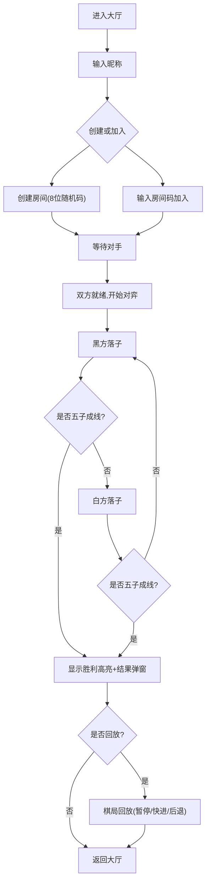

## 1. 产品概述

联机双人即时对战五子棋应用，支持玩家通过房间码创建/加入房间进行实时对弈，提供棋局回放与胜负统计功能。目标用户为休闲娱乐玩家，核心价值在于流畅的实时对弈体验与完整的棋局复盘能力。

## 2. 核心功能

### 2.1 用户角色

| 角色 | 注册方式 | 核心权限 |
|------|----------|----------|
| 玩家 | 输入昵称即可 | 创建/加入房间、对弈、聊天、回放 |

### 2.2 功能模块

1. **大厅页面**：昵称输入、房间列表展示、创建房间、加入房间、提示消息
2. **游戏页面**：15x15棋盘对弈、落子动画与音效、计时器、聊天面板、胜利判定与高亮、结果弹窗、棋局回放

### 2.3 页面详情

| 页面名称 | 模块名称 | 功能描述 |
|----------|----------|----------|
| 大厅页面 | 昵称输入区 | 输入玩家昵称，显示在导航栏 |
| 大厅页面 | 房间列表 | 展示未开始的房间（卡片式，每页最多10个），显示房间ID、创建者昵称、状态 |
| 大厅页面 | 创建房间 | 点击按钮生成8位随机房间码并创建房间 |
| 大厅页面 | 加入房间 | 输入房间码加入已存在房间 |
| 大厅页面 | 提示消息 | 创建成功/加入失败时弹出3秒自动消失提示 |
| 游戏页面 | 棋盘组件 | 15x15网格，木质色背景，黑白棋子带特效，点击落子带缩放动画和音效 |
| 游戏页面 | 计时器 | 每方15分钟限时，超时判负，当前回合蓝色、对方灰色 |
| 游戏页面 | 聊天面板 | 右侧240px面板，消息自动滚动，显示昵称/时间/内容，最多100字 |
| 游戏页面 | 胜利高亮 | 五子成线时红色闪烁标记获胜棋子（闪烁3次，间隔0.5s） |
| 游戏页面 | 结果弹窗 | 显示胜者信息、获胜时间，提供回放选项 |
| 游戏页面 | 棋局回放 | 自动重播整局，每步0.5s间隔，带序号标注和音效，支持暂停/快进/后退 |

## 3. 核心流程

用户进入大厅 → 输入昵称 → 创建/加入房间 → 进入游戏页面 → 轮流落子 → 五子成线判定 → 显示结果弹窗 → 可选回放

## 4. 界面设计

### 4.1 设计风格

- 主色调：深灰 #1a202c，搭配浅灰 #e2e8f0 文字
- 强调色：按钮渐变从 #3182ce 到 #2b6cb0
- 棋盘：木质色 #f5d4a8，网格线 #ccc
- 胜利高亮：红色 #e53e3e
- 导航栏：半透明玻璃模糊效果 rgba(255,255,255,0.1) + backdrop-filter: blur(10px)
- 按钮风格：圆角8px，渐变背景，hover亮度+10%，点击缩放0.95
- 字体：游戏标题使用粗体衬线字体，UI文字使用无衬线字体
- 布局：导航栏顶部固定，大厅卡片式网格布局，游戏页面棋盘+聊天横向排列

### 4.2 页面设计概览

| 页面名称 | 模块名称 | UI元素 |
|----------|----------|--------|
| 大厅页面 | 导航栏 | 玻璃模糊背景，左侧应用名，右侧玩家昵称 |
| 大厅页面 | 昵称输入 | 输入框+确认按钮，居中布局 |
| 大厅页面 | 房间列表 | 卡片网格，每卡片含房间信息+操作按钮，最多10个/页 |
| 大厅页面 | 创建房间 | 渐变圆角按钮，点击后生成房间码 |
| 大厅页面 | 加入房间 | 输入框+按钮组合 |
| 游戏页面 | 导航栏 | 同大厅风格 |
| 游戏页面 | 棋盘区 | 15x15网格，木质背景，黑白棋子带光效 |
| 游戏页面 | 信息栏 | 双方昵称/棋色/时间，当前回合蓝色高亮 |
| 游戏页面 | 聊天面板 | 白色圆角面板240px，消息列表+输入框 |
| 游戏页面 | 结果弹窗 | 半透明遮罩+居中卡片，胜者信息+回放按钮 |
| 游戏页面 | 回放控制 | 暂停/播放、快进2x、后退按钮栏 |

### 4.3 响应式设计

- 桌面端优先，宽度小于768px时自动堆叠为纵向布局
- 移动端聊天面板置于棋盘下方
- 棋盘在移动端适当缩放以适应屏幕

### 4.4 动效设计

- 落子动画：缩放0→1.2→1，持续0.3s
- 胜利闪烁：红色高亮闪烁3次，间隔0.5s
- 按钮/棋子/弹窗交互：transition 0.2s ease
- 提示消息：淡入淡出，3秒自动消失
