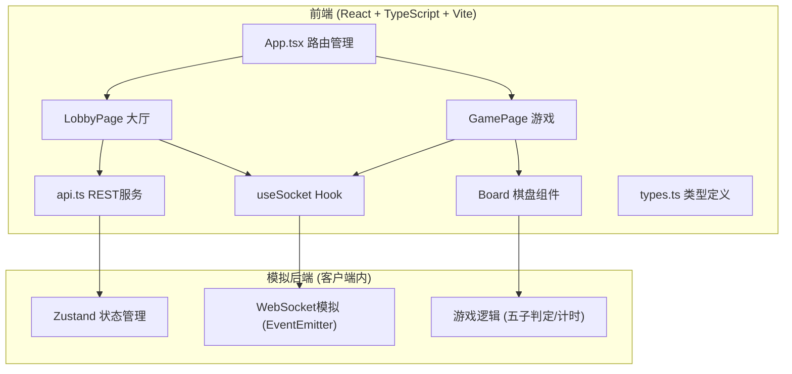
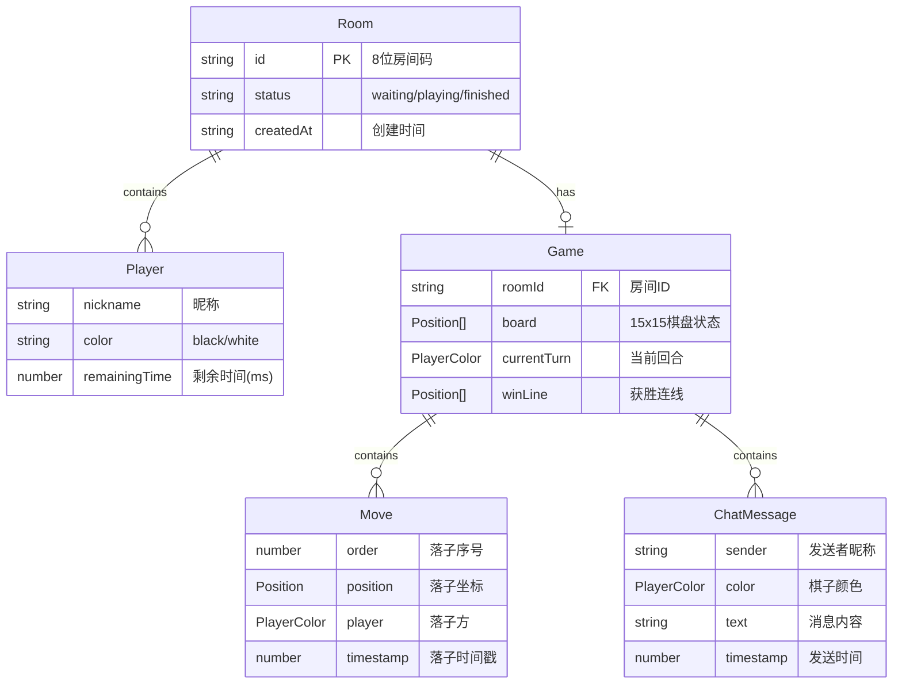

## 1. 架构设计



## 2. 技术说明

- 前端：React@18 + TypeScript + Vite + TailwindCSS
- 初始化工具：vite-init (react-ts模板)
- 状态管理：Zustand
- WebSocket模拟：客户端内使用EventEmitter模式模拟实时通信（无需后端服务器）
- 路由：react-router-dom
- 音效：Web Audio API（正弦波短促音效）
- 无后端服务器：所有逻辑在客户端内完成，使用Zustand管理全局状态，通过事件系统模拟WebSocket通信

## 3. 路由定义

| 路由 | 用途 |
|------|------|
| / | 大厅页面，展示房间列表，创建/加入房间 |
| /game/:roomId | 游戏页面，棋盘对弈、聊天、回放 |

## 4. API定义（模拟）

```typescript
interface ApiService {
  createRoom(nickname: string): Promise<Room>;
  getRooms(): Promise<Room[]>;
  joinRoom(roomId: string, nickname: string): Promise<Room>;
  getRoom(roomId: string): Promise<Room>;
}

interface WebSocketEvents {
  'move': (data: { roomId: string; position: Position; player: PlayerColor }) => void;
  'chat': (data: { roomId: string; message: ChatMessage }) => void;
  'game-end': (data: { roomId: string; winner: PlayerColor; winLine: Position[] }) => void;
  'timeout': (data: { roomId: string; loser: PlayerColor }) => void;
  'player-joined': (data: { roomId: string; player: Player }) => void;
}
```

## 5. 数据模型

### 5.1 数据模型定义



### 5.2 核心类型定义

```typescript
type PlayerColor = 'black' | 'white';

interface Position {
  row: number;
  col: number;
}

interface Player {
  nickname: string;
  color: PlayerColor;
  remainingTime: number;
}

interface Room {
  id: string;
  status: 'waiting' | 'playing' | 'finished';
  players: Player[];
  createdAt: number;
}

interface Move {
  order: number;
  position: Position;
  player: PlayerColor;
  timestamp: number;
}

interface ChatMessage {
  sender: string;
  color: PlayerColor;
  text: string;
  timestamp: number;
}

interface GameState {
  board: (PlayerColor | null)[][];
  currentTurn: PlayerColor;
  moves: Move[];
  winLine: Position[] | null;
  winner: PlayerColor | null;
  isFinished: boolean;
}
```
