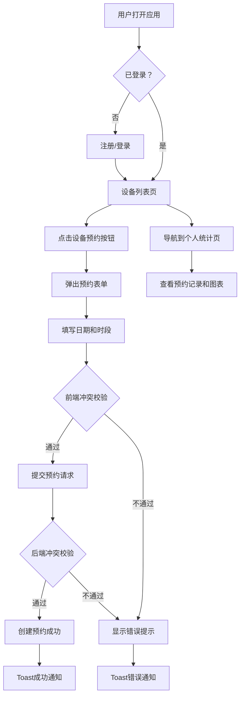

## 1. 产品概述

共享空间设备预约管理系统，面向共享自习室和小型创业团队，解决公共设备（打印机、投影仪、空调等）使用时段冲突和费用分摊不清的问题。通过设备列表查看、时段预约、使用记录追踪和个人使用统计，实现设备使用的有序管理和透明化。

## 2. 核心功能

### 2.1 用户角色

| 角色 | 注册方式 | 核心权限 |
|------|----------|----------|
| 普通用户 | 用户名注册 | 查看设备、预约设备、查看个人统计 |
| 管理员 | 预设账号 | 拥有所有权限，可管理设备 |

### 2.2 功能模块

1. **设备列表页**：展示所有公共设备卡片，包含设备名称、图标、当前状态（空闲/使用中），支持点击预约
2. **预约表单**：模态框弹出，选择日期、起止时间，冲突检测，创建预约
3. **个人统计页**：历史预约记录、使用时长柱状图、设备使用比例饼图

### 2.3 页面详情

| 页面名称 | 模块名称 | 功能描述 |
|----------|----------|----------|
| 设备列表页 | 设备卡片网格 | 展示所有设备信息（名称、emoji图标、状态圆点），每张卡片含预约按钮，卡片下方显示最近3个预约标签 |
| 设备列表页 | 预约表单模态框 | 选择设备、日期、起始时间、结束时间（30分钟步长），前端+后端双重冲突校验 |
| 个人统计页 | 预约记录列表 | 展示用户所有历史预约：设备名、日期、时段、时长 |
| 个人统计页 | 使用时长柱状图 | 过去7天/30天使用时长柱状图 |
| 个人统计页 | 设备使用饼图 | 各设备使用比例饼图 |
| 全局 | 登录注册 | 用户名注册/登录，前端模拟JWT token存储 |
| 全局 | Toast通知 | 加载、成功、错误等交互反馈通知 |

## 3. 核心流程

用户注册/登录 → 浏览设备列表 → 选择设备点击预约 → 填写预约表单 → 系统校验冲突 → 创建预约成功 → 查看个人统计

## 4. 用户界面设计

### 4.1 设计风格

- **主色调**：深色主题，背景色 #1a1a2e，卡片背景 #16213e
- **辅助色**：#0f3460（辅助背景）、#e94560（按钮和强调）
- **图表调色盘**：#667eea #764ba2 #f093fb #4facfe #43e97b
- **按钮样式**：圆角按钮，悬停上浮+阴影，点击0.2秒缩放反馈
- **字体**：系统字体栈，标题使用较大字重
- **布局风格**：顶部固定导航栏 + 卡片网格布局
- **图标**：使用emoji图标（🖨️📽️❄️☕🔊）

### 4.2 页面设计概览

| 页面名称 | 模块名称 | UI元素 |
|----------|----------|--------|
| 全局 | 导航栏 | 高度60px，毛玻璃效果，左侧Logo+导航链接，右侧用户名+登出，移动端汉堡菜单 |
| 设备列表页 | 设备卡片 | 网格4列布局，emoji图标+设备名+状态圆点+预约按钮，悬停上浮6px+阴影，点击涟漪效果 |
| 设备列表页 | 预约标签 | 卡片底部小标签展示最近3个预约时段 |
| 设备列表页 | 预约模态框 | 背景模糊遮罩，居中表单，聚焦边框高亮动画 |
| 个人统计页 | 记录列表 | 表格形式，深色行交替背景 |
| 个人统计页 | 柱状图 | Recharts渲染，明亮主题色 |
| 个人统计页 | 饼图 | Recharts渲染，图表调色盘配色 |

### 4.3 响应式设计

- **桌面端**（≥1200px）：设备卡片4列，导航栏完整展示
- **平板端**（768px-1199px）：设备卡片2列
- **移动端**（<768px）：设备卡片1列，导航栏折叠为汉堡菜单

### 4.4 动效设计

- 卡片悬停：上浮6px + 阴影加深（transition 0.3s ease）
- 按钮点击：0.2秒缩放至0.95恢复（transform: scale）
- 模态框：淡入 + 缩放弹出（opacity + scale transition）
- Toast通知：从顶部滑入，3秒后自动滑出
- 导航栏：毛玻璃背景（backdrop-filter: blur）
