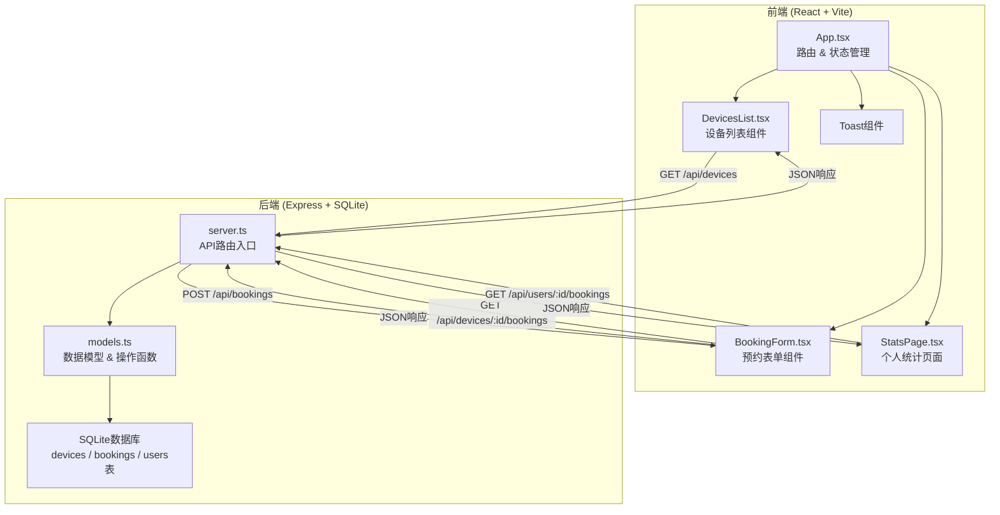
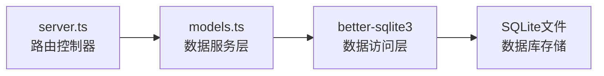
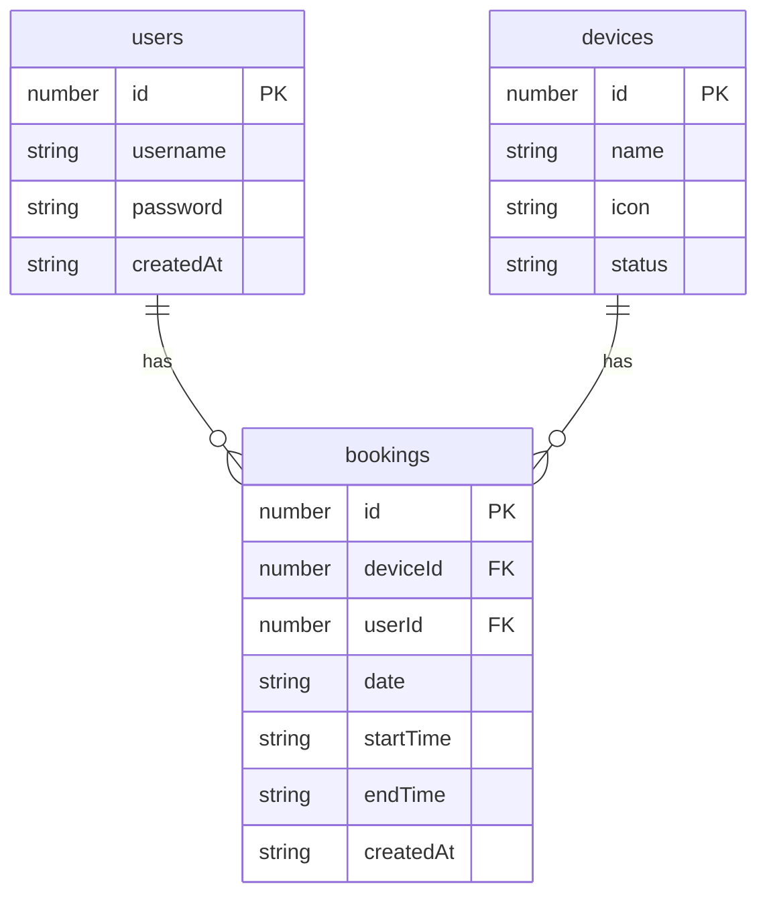

## 1. 架构设计



## 2. 技术说明

- **前端**：React@18 + TypeScript + Tailwind CSS + Vite
- **初始化工具**：vite-init (react-express-ts 模板)
- **后端**：Express@4 + TypeScript (ESM格式)
- **数据库**：SQLite (better-sqlite3)
- **图表库**：Recharts
- **路由**：react-router-dom
- **状态管理**：zustand
- **图标**：lucide-react + emoji

## 3. 路由定义

| 路由 | 用途 |
|------|------|
| `/` | 设备列表页，展示所有设备卡片 |
| `/stats` | 个人统计页，展示预约记录和图表 |
| `/login` | 登录注册页面 |

## 4. API定义

### 4.1 用户相关

```
POST /api/auth/register
  Request: { username: string, password: string }
  Response: { success: boolean, token: string, user: { id: number, username: string } }

POST /api/auth/login
  Request: { username: string, password: string }
  Response: { success: boolean, token: string, user: { id: number, username: string } }
```

### 4.2 设备相关

```
GET /api/devices
  Response: Device[]

GET /api/devices/:id/bookings
  Response: Booking[]
```

### 4.3 预约相关

```
POST /api/bookings
  Request: { deviceId: number, userId: number, date: string, startTime: string, endTime: string }
  Response: { success: boolean, booking?: Booking, error?: string }

GET /api/users/:id/bookings
  Response: BookingWithDevice[]
```

### 4.4 TypeScript类型定义

```typescript
interface Device {
  id: number;
  name: string;
  icon: string;
  status: 'available' | 'in_use';
}

interface Booking {
  id: number;
  deviceId: number;
  userId: number;
  date: string;
  startTime: string;
  endTime: string;
  createdAt: string;
}

interface BookingWithDevice extends Booking {
  deviceName: string;
  deviceIcon: string;
}

interface User {
  id: number;
  username: string;
  password: string;
  createdAt: string;
}
```

## 5. 服务端架构图



## 6. 数据模型

### 6.1 数据模型定义



### 6.2 数据定义语言

```sql
CREATE TABLE IF NOT EXISTS users (
  id INTEGER PRIMARY KEY AUTOINCREMENT,
  username TEXT UNIQUE NOT NULL,
  password TEXT NOT NULL,
  createdAt TEXT DEFAULT (datetime('now'))
);

CREATE TABLE IF NOT EXISTS devices (
  id INTEGER PRIMARY KEY AUTOINCREMENT,
  name TEXT NOT NULL,
  icon TEXT NOT NULL,
  status TEXT DEFAULT 'available'
);

CREATE TABLE IF NOT EXISTS bookings (
  id INTEGER PRIMARY KEY AUTOINCREMENT,
  deviceId INTEGER NOT NULL,
  userId INTEGER NOT NULL,
  date TEXT NOT NULL,
  startTime TEXT NOT NULL,
  endTime TEXT NOT NULL,
  createdAt TEXT DEFAULT (datetime('now')),
  FOREIGN KEY (deviceId) REFERENCES devices(id),
  FOREIGN KEY (userId) REFERENCES users(id)
);

CREATE INDEX IF NOT EXISTS idx_bookings_device_date ON bookings(deviceId, date);
CREATE INDEX IF NOT EXISTS idx_bookings_user ON bookings(userId);

INSERT INTO devices (name, icon, status) VALUES
  ('打印机', '🖨️', 'available'),
  ('投影仪', '📽️', 'available'),
  ('空调', '❄️', 'available'),
  ('咖啡机', '☕', 'available'),
  ('音响', '🔊', 'available');
```
