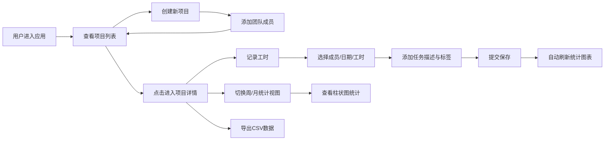

## 1. 产品概述
轻量级团队工时记录与可视化统计应用，专为小型创业团队和远程工作组设计，解决现有项目管理工具功能臃肿或统计维度不足的问题。
- 主要用途：记录项目成员的每日工时，支持自定义标签分类，自动生成可视化统计图表并导出数据
- 目标用户：团队负责人、项目经理、远程工作组

## 2. 核心功能

### 2.1 功能模块
1. **项目管理模块**：创建项目、添加团队成员、项目列表九宫格展示
2. **工时记录模块**：选择成员、日期、输入工时、任务描述、自定义标签
3. **数据统计模块**：周报/月报切换、柱状图可视化、合计工时与平均值
4. **数据导出模块**：CSV格式导出当前视图工时明细

### 2.2 页面详情
| 页面名称 | 模块名称 | 功能描述 |
|----------|----------|----------|
| 项目列表页 | 项目卡片列表 | 九宫格布局展示所有项目卡片，悬停上浮动画，点击进入项目详情 |
| 项目列表页 | 新建项目弹窗 | 输入项目名称，添加成员（昵称+邮箱） |
| 项目详情页 | 工时记录表单 | 选择成员、日期、工时数、任务描述、勾选/新增标签 |
| 项目详情页 | 统计图表区域 | 7天工时柱状图，支持周/月视图切换，渐变填充，悬停详情提示 |
| 项目详情页 | 统计摘要 | 显示合计工时、成员平均工时、CSV导出按钮 |

## 3. 核心流程

## 4. 用户界面设计

### 4.1 设计风格
- **主背景色**：#f0f4f8（浅灰蓝）
- **辅背景色**：#edf2f7
- **侧边导航栏**：#2d3748（深蓝灰）
- **主题强调色**：#3182ce（蓝色边框聚焦）
- **卡片样式**：白色背景、圆角12px、细微阴影、悬停上浮4px（0.2秒过渡）
- **输入框聚焦**：蓝色边框#3182ce，0.1秒柔和过渡
- **标签样式**：彩色小药丸，带叉号删除按钮，10色循环自动分配
- **柱状图**：渐变填充，成员主题色一致，带图例

### 4.2 页面设计概述
| 页面名称 | 模块名称 | UI元素 |
|----------|----------|--------|
| 项目列表页 | 侧边导航 | 深蓝灰色背景，Logo，导航链接，响应式折叠 |
| 项目列表页 | 项目卡片 | 白色圆角卡片，项目名，成员数，悬停上浮阴影动画 |
| 项目详情页 | 工时表单 | 白色卡片，下拉选择器，日期选择器，数字输入，文本域，标签管理 |
| 项目详情页 | 统计区域 | 周/月切换Tab，Recharts柱状图，统计数值摘要，导出按钮 |

### 4.3 响应式设计
- 桌面端（≥768px）：左侧固定导航栏 + 右侧内容区，项目卡片九宫格布局
- 移动端（<768px）：导航栏折叠为顶部导航，卡片改为两列布局
- 触控优化：按钮最小44px，触控区域足够大
